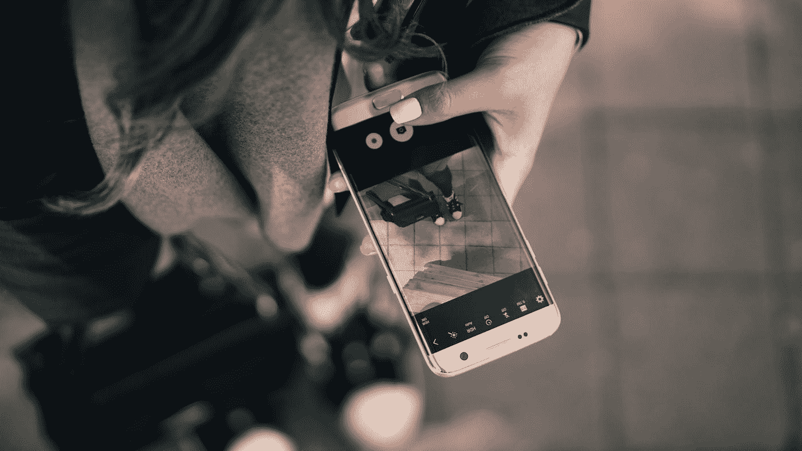

# 如何通过使用单一 App 最终形成习惯

> 原文：<https://medium.com/swlh/how-to-finally-form-habits-by-using-a-single-app-cad6c2f49a02>

Photo by [SHTTEFAN](https://unsplash.com/@shttefan?utm_source=medium&utm_medium=referral) on [Unsplash](https://unsplash.com?utm_source=medium&utm_medium=referral)

> “我们就是我们反复做的事情。因此，优秀不是一种行为，而是一种习惯。”
> ——**威廉姆·杜兰特**

告诉我这听起来是否熟悉。

你决定你想要开始做一件新的事情，或者放弃一件不好的事情。你努力试着启动或停止那东西几天。然后你耗尽了精力…