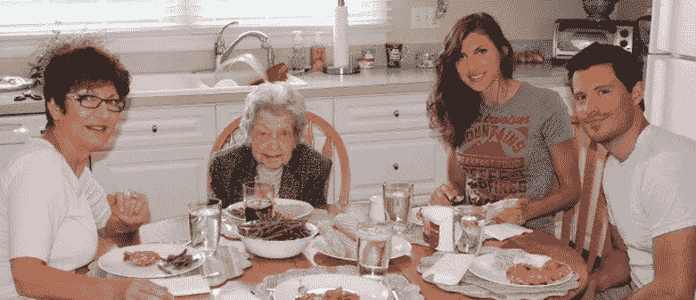
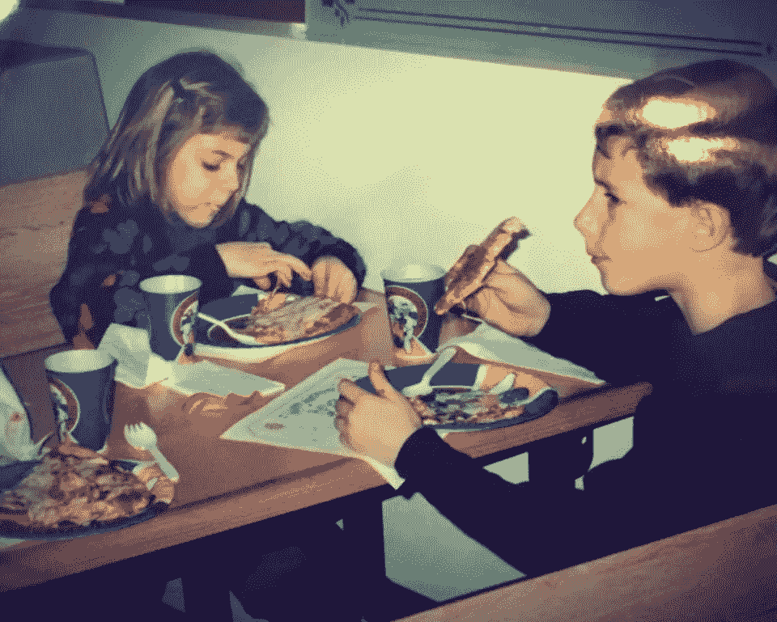
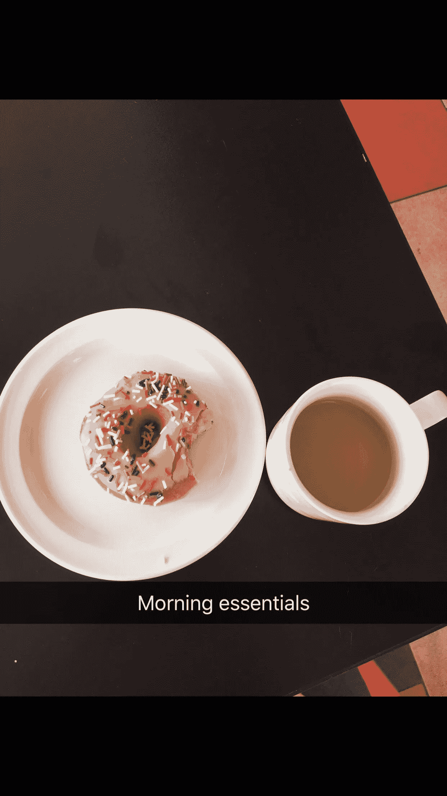
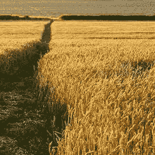
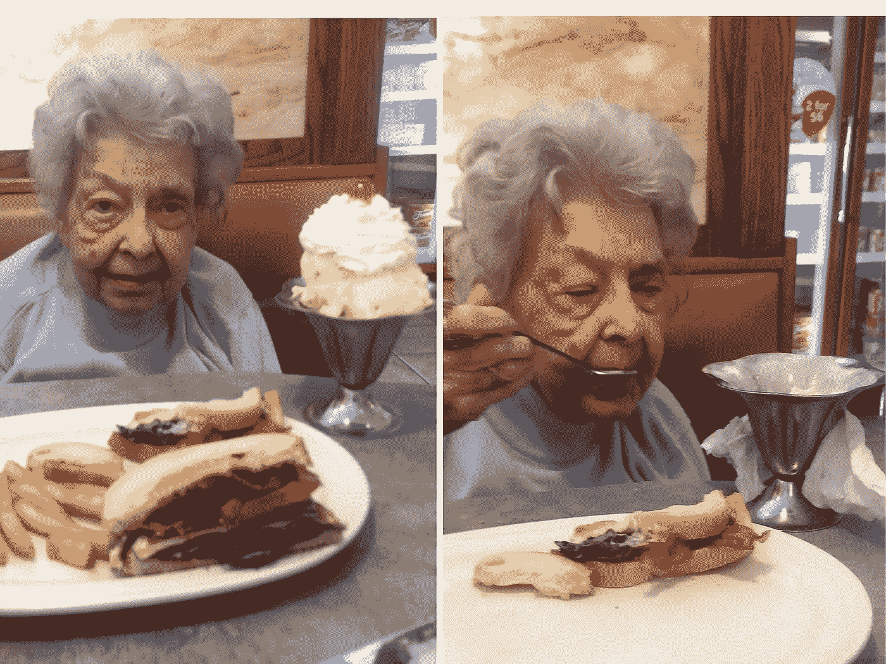

# 如何在食物中找到平静:治疗师的旅程

> 原文：<https://medium.com/swlh/how-to-find-peace-in-food-a-therapists-journey-45ec62c41705>

食物。食物是一个沉重的话题。为什么？因为每个人都吃东西，这给了每个人对食物的看法。这是我们仅有的几个共同点之一。

美食是文化，美食是传统，美食是爱情。

蟹饼和农场新鲜的玉米和青豆是一个家庭传统。“蟹饼和足球……这就是马里兰做的！”

食物很复杂。忽略这一点，食物很简单。人是复杂的。

对我来说，这些年来食物有很多含义:一种逃避，一种力量的来源，一种快乐和舒适的来源，一种沮丧、痛苦和控制的来源。

食物最纯粹的形式是能量。但是你知道，就我所知，食物远不止这些。

包裹在食物里的是我们放在上面的所有人类的东西。好食物，坏食物，垃圾食物，“干净”的食物。我们给食物贴上的标签和评判的数量是荒谬的。我不会在没有对我自己关于食物的包袱拥有所有权的情况下做出这样的声明。我花了几年时间痴迷于食物:计数、贴标签和控制。这是一种很小的生活方式。

然而，在一个不可预测的世界里，有时我们摄入体内的东西似乎是我们唯一的控制来源。

在过去几年从饮食紊乱中恢复过来后，我和食物的关系发生了转变。花了很多年来控制进入我身体的一切，一些思维过程很难停止。我将第一个承认，我仍然反对对过去“恐惧”食物的判断，当我吃一些食物时，我仍然不得不反对我的旧模式。我越努力，事情就变得越容易。我现在吃大多数我曾经认为是“坏”的食物，而不去想它，好家伙，这是一种解放。

有时候我们的周六晚上还是这个样子。比萨饼一直是我丈夫最喜欢的食物，我很高兴它又成为我喜欢的食物。这是我们 5 岁和 8 岁时的照片。

我还在纠结的食物呢？我有意识地消费它们。当我感觉自己面对某种食物变得更加紧张时，我会试着去适应这种紧张。我让我的身体感受它，我重新构建。我发现了食物的价值。以甜甜圈为例。我有意识地思考脂肪和碳水化合物对我们的身体和大脑有多重要。我品尝它的味道和体验，我慢慢地吃。我让自己享受甜甜圈，而不是把它看做一个交易或等式，我注意饱足感。如果我已经吃了一半，不再满足，我让自己把剩下的留到以后。我释放压力，要么全部吃掉，要么一点都不吃。

我品尝食物。这是我喜欢黑巧克力的一个原因。我慢慢地品尝黑巧克力，并搭配咖啡。这是一个神圣的组合。

# 那么，食物与和平有什么关系呢？

我在慢慢地、安静地吃东西中找到了巨大的平静。这与我多年来吃东西的方式截然相反——盲目地、疯狂地、狼吞虎咽地、不品尝、不思考、麻木。情绪化或无意识地吃东西是如此容易。我昨晚刚做过。我不暴饮暴食，也不清洗，但我还是会偶尔情绪化地吃东西。

当我发现自己快吃完爆米花，却不记得吃过时，我会试着给自己一点同情。我不会因为无意识地吃东西而责备自己，相反，我会变得好奇。是我没注意吗？我焦虑吗？我是在自我安慰吗？有时候答案是肯定的。这没关系。

# 想给你的一天带来片刻的宁静，但不知道在何时何地？

下次你坐下来吃饭的时候，试着用心吃饭，哪怕只吃几口。

我的实践是从早餐开始的。我正试图将这一点扩展到我的所有食物中，但有时生活的日程安排需要匆忙吃饭或与他人一起吃饭(这是一件很好的事情)，很难找到正念的安静。

我是一个习惯性动物，每天早餐都吃相对相同的东西；一大碗燕麦片，里面有半个香蕉丁、肉桂和海盐。我用一大杯牛奶把它吞下去。我有点古怪，喜欢混合我的牛奶(一半杏仁，一半牛奶)。

当我吃东西的时候，我试着放慢速度，关掉所有其他的东西。我关掉电视、音乐、放下电话等等。当我咬下那口燕麦片时，我首先注意到我的感官体验；质地，温度，舌头上的感觉，还有味道。

从那以后，我会更深入地思考我在吃什么。

我想到了田野里的燕麦。我想象着《角斗士》中拉塞尔·克罗平静地走过麦田，用手轻轻触摸麦穗的场景。我想到辛勤工作的农民收获的燕麦，脱壳的过程以及在田地和我的碗之间发生的一切。我想到了所有投入到把这些燕麦送到我肚子里的人——加工厂的工人，货架上储存燕麦的杂货商。我开始了从场地到盘子的心路历程，感谢每个人所扮演的角色。我惊叹于燕麦是如何从种子开始，并最终在我的碗里享受和维持我的奇迹。

对于香蕉和牛奶，我也经历了这个过程。我特别喜欢牛奶。我想起了我住在加州时去过的杏仁树林。我想到了杏仁的神奇礼物，以及 8 盎司杏仁牛奶中加入了多少水。从一个牛奶场沿着街道长大，提供了一个简单的奶牛和过程的视觉。我喜欢奶牛，回忆起我在街边的栅栏前抚摸可爱的奶牛鼻子的时光。我感谢奶牛为我提供了这个过程的奇迹。

有时我会想到食物和我爱的人之间的联系。我经常想起我的祖母，想起她对奶牛的了解和热爱，想起她对冰淇淋和奶昔的执着。

我知道这看起来会是一个漫长的过程，但是我们的大脑在几毫秒内就能经历这个视觉图像。

这个过程的美妙之处在于，它是我们都可以做的事情。它很快，很容易获得，甚至没有人知道你在做什么！食物是什么并不重要。

你可以这样做，当你从麦当劳买了一个汉堡，疯狂地开车下班去看你孩子的棒球比赛。只需要关掉收音机，放慢节奏，哪怕只是几口。想起田里的牛，做面包的小麦，番茄酱的奇迹。

当你这样做的时候，你可能会注意到一个转变开始发生了。对我来说，我发现自己在说“谢谢”，因为我们的食物真的很棒。有那么多只手参与把汉堡放到你盘子里的过程，有那么多奇迹。

好奇你会发现什么，或者在忙碌的一天中需要一分钟的安宁？慢点。细细品味。思考并感谢。