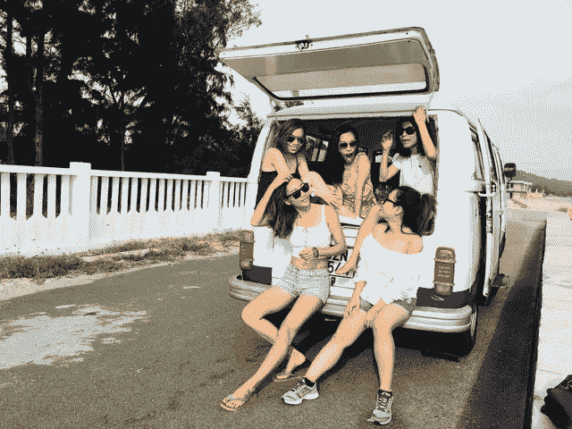

# 作为一名外籍人士，如何找到你的“Moai”？

> 原文：<https://medium.com/swlh/how-to-find-your-moai-as-an-expat-e437cef2754a>

## 放弃国籍

## 移居国外系列—第 1 集

你听说过“摩埃”这个词吗？这是什么意思？这和外派有什么关系？

# 1.体验新的文化

移居国外是一次奇妙的冒险！我们离开我们的祖国，满怀希望、梦想、幻想，当然还有许多期望。他们中的一些人可能是对的，另一些人就不那么对了。而这正是我们可能会经历现在流行的“**文化冲击**”的时候。

最初的兴奋阶段被称为“T2 旅游阶段”，几乎一切都是阳光和彩虹，随后可能是戏剧性的暴跌。一种深深的**失落感**开始袭来。你想念你的朋友、家人、习惯，你可能会意识到你平常的行为在新的文化中被误解了。你感觉自己的身份被剥夺了，因为当地人送回来的你的形象并不反映你通常是谁。

当你进入一个不熟悉的环境时，你的旧习惯会被连根拔起，这反过来会导致一个非常令人不安的不足。这可能会导致心理上的不确定性，在一个未知的文化中，似乎没有人会以你通常的方式回应，这真的很难面对。

# 2.找到你的“摩艾”

解决这个令人痛苦的缺点的方法可能是找到你的“摩艾”。这是什么？

在日本，有一个岛叫[冲绳](https://www.visitokinawa.jp/about-okinawa)，神仙之地。该岛以其居民的长寿而闻名。也有人说，他们没有压力和焦虑，不像其他日本人那样多，显然也比我们西方人少得多。

其中一个不可估量的成分是他们的“摩埃”。一个强大而充满关爱的社交网络，由无论身处何种艰难阶段都相互支持的朋友组成。

# 3.我的建议

我们很可能受到冲绳摩埃岛的启发，开始寻找一些关心我们的朋友和不做评判的朋友来分享我们的故事和感受。和几个人建立一个健康的、相互支持的社交团体，包括一些当地人，以更好地了解他们的文化，这可能是一种温和的、变革性的方式，帮助你很好地适应环境，按照你自己的节奏生活。

# 收场白

我出生在巴黎，在国际化和多元文化的环境中长大。几十年后，我搬到了伦敦，我必须说，我在伦敦没有经历任何文化冲击，有时会有一些不足之处，但没有什么感觉压倒一切或痛苦。然而，几年前搬回巴黎时，我感到极度的震惊，我觉得自己很不称职，在我所谓的“祖国”完全是个陌生人。你并不孤单，你可能会以一种非线性的方式感受到这些奇怪的情绪。

 [## 移居——多彩生活设计

### 移居国外，大起大落。如何做好准备，适应新的文化，拥抱未知的环境？致所有人…

polychromatic-lifedesign.com](https://polychromatic-lifedesign.com/expat/)  [## 事件[即将到来和过去] -多彩生活设计

### 即将举行面向所有人的互动活动，包括外籍人士、个人、经理和员工。一个具体的主题，充分阐述了…

polychromatic-lifedesign.com](https://polychromatic-lifedesign.com/events/)