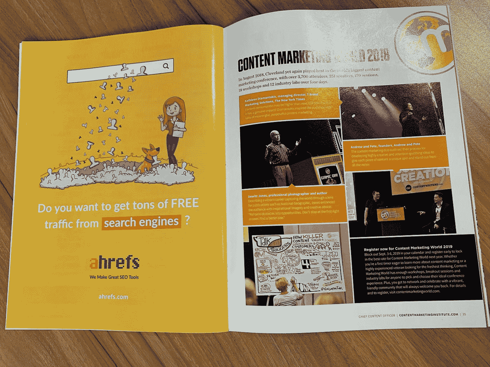
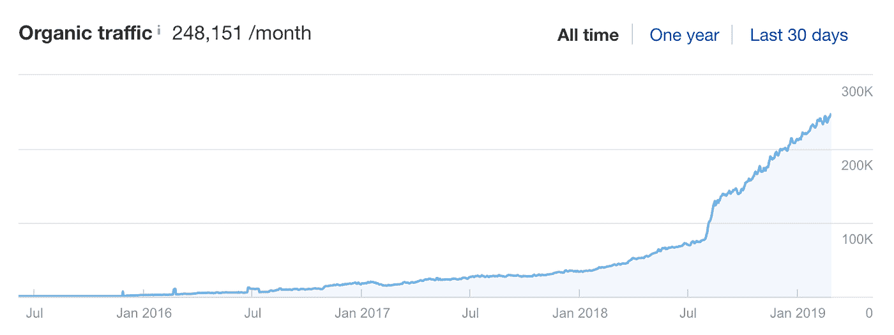
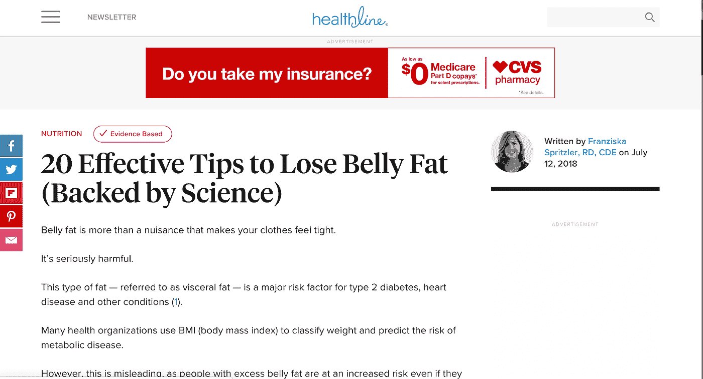
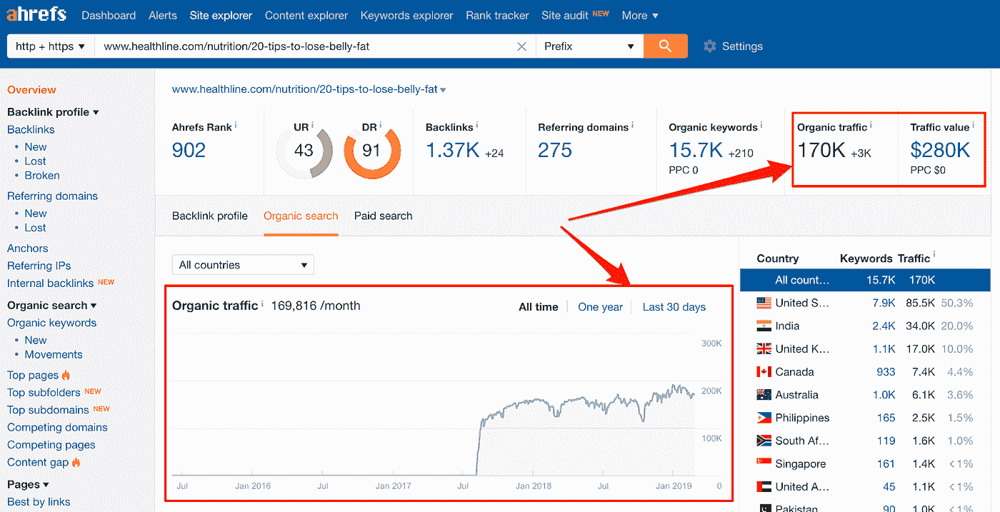
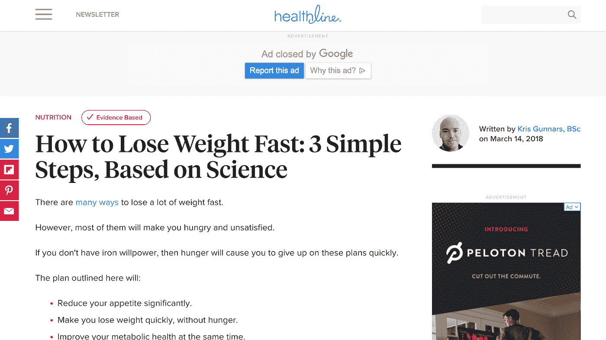
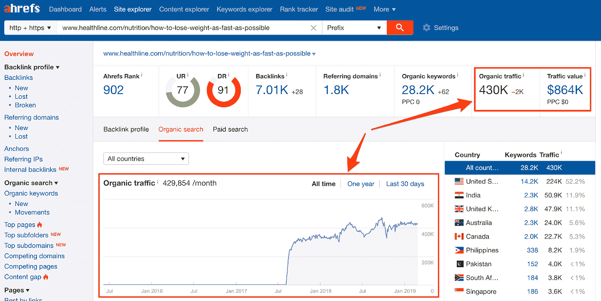

# 如何利用“营销飞轮”创造全天候客户

> 原文：<https://medium.com/swlh/how-to-generate-customers-24-7-with-the-marketing-flywheel-ee523341336a>

> “你一直以来最喜欢的营销活动是什么？”

这是一个简单的问题。

但是我没有答案。

我的大脑像一副扑克牌一样在过去的竞选活动中穿梭。几秒钟就像几分钟一样过去了，因为我想到了我见过的例子。

然而，我们 SaaS 公司、我们的竞争对手或外部行业的营销活动都不突出。

偶尔，我会被邀请在播客上发言。我习惯回答关于 SEO，内容营销，营销团队建设的问题。

然而，在这个特殊的时刻，我却陷入了尴尬的空白:*什么样的 CMO 跟不上营销活动的趋势？！*

慢慢地，我明白了我大脑失灵的原因:我不是一个“营销活动的家伙”，我是一个“营销系统的家伙。”

为了得到一个答案，我考虑命名一些随机的运动，但是那将是不诚实的。所以，我冒着被视为无聊的风险，说我没有。

然而，后来我意识到我对营销活动的冷漠需要一个解释:

## **为什么我将资源从一次性营销活动中转移出来**

当我开始在 Ahrefs 的 CMO 工作时，[我是一个致力于实现许多结果的营销团队。](/swlh/how-we-achieve-65-yoy-growth-by-ignoring-conventional-startup-advice-24a3eef619c1)

因为克隆我自己不是一个选项，我花了一些时间研究竞选选项。幸运的是，我的收件箱收到了每周的邀请:

*   与其他 SaaS 公司进行联合促销。
*   与博客作者合作制作内容。
*   在行业杂志上刊登广告。
*   赞助行业会议。
*   参加“搜索引擎优化行业奖”竞赛。

因为当我加入这个团队时，Ahrefs 已经在 SEO 社区中声名狼藉，所以行业领导者渴望建立合作伙伴关系。

你猜怎么着？我都试过了。

除了“搜索引擎优化行业奖”谢谢你们，但是没有你们的认可我们也做得很好。 \ *(ツ)* /

然而，我很快意识到，这些一次性的活动只产生了流量、线索和销售额的暂时飙升。

加倍我的成绩需要加倍我的竞选努力——对于像我这样的“懒惰营销者”来说，这是一场噩梦。

本质上，我是“那个不停吃棉花糖的孩子”参考消息:从最初的研究中得出的结论已经被证明是错误的。

我陷入了一个循环，获得小收益的即时满足，换取持续不断的新线索的延迟满足。

我参加的每一次营销活动都从我热衷于构建的东西上拿走了资源:一个可重复的营销系统，它将带来越来越多的回报。

因此，我决定放弃营销活动，转而关注内容和搜索引擎优化。Ahrefs 将“言行一致”,将我们的大部分营销资源投入到创建文章中，这些文章将在谷歌上对我们的潜在客户正在搜索的各种主题进行排名。

是否有过我认为进展缓慢的时刻？是的，但我坚持了下来。事情在 6 个月后才开始好转，但在两年的努力工作后彻底失败了:

如果你是一个特别精明的营销人员，你可能会在看到我的截图时翻白眼。我知道，我知道——网站流量并不代表真正的成功。

但是，博客内容恰好是 Ahrefs 的[第二大获客渠道](/ahrefs-marketing/how-we-grew-traffic-to-ahrefs-blog-by-1136-and-got-thousands-of-paying-customers-1fbd7e6b145a?source=user_profile---------8------------------)。这有两个原因:

1.  我们的内容在谷歌中排名很高，因为大量搜索与我们的产品高度相关。
2.  每篇文章都是伪装的“销售页面”，向读者展示如何在我们产品的帮助下解决他们正在寻找的问题。

我们的内容营销策略是我听过营销人员[兰德·菲什金](https://moz.com/blog/building-a-marketing-flywheel-whiteboard-friday)描述为*的营销飞轮的一个稍微简化和稍微精炼的版本。*

也就是说，我想明确一点:建立一个声誉好的博客，为你的企业带来大量的搜索流量并不容易。

你甚至会质疑自己的理智，因为在最初的日子里，你注意到付出了巨大的努力却没有得到什么结果。然而，如果你坚持下去，你最终会达到一个临界点。

这个过程被称为“营销飞轮”，因为一旦“轮子”开始旋转，它就会以最小的努力继续下去。如果你愿意，你甚至可以让轮子转得更快！

大约 6 年前，这个概念进入了我的视野。无意中发现了兰德·菲什金的一个视频，被吸引住了。

# **Ahrefs 的营销飞轮**

我们的博客策略是这样运作的:

1.  确定客户在谷歌搜索什么，与我们解决的问题相关。*是的，我们使用我们自己的 SEO 工具包。*
2.  发表一篇关于如何解决特定问题的文章，同时展示我们的产品是理想的解决方案。
3.  推广那篇文章，直到它开始在谷歌上排名。
4.  接受谷歌源源不断的访问者；所有这些人在阅读了我们的产品后都有可能成为顾客。
5.  享受口碑宣传，因为我们“受过教育”的客户告诉其他人我们的产品如何解决他们的问题。
6.  产生泡沫，冲洗，然后重复。

一个*单品，*花费我们 10 到 20 个小时生产，每个月可以交付几十到几百个潜在客户——无限期。

持续执行这 6 个步骤的过程将自动产生稳定的销售线索流。假设你已经将你的产品或服务定位为*最佳解决方案*，那么很大一部分潜在客户将会成为客户。

下面是一篇来自减肥行业的文章的极端例子:

[根据 Ahrefs](https://ahrefs.com/) 的数据，这篇文章每个月从谷歌获得超过 **17 万访客**。从一篇关于腹部脂肪的文章来看，这几乎是 2M 游客一年的总数。

想象一下，如果他们的文章以一种特定的健身产品为特色，他们将获得多少额外的客户！

你想听更疯狂的吗？

那甚至不是他们最受欢迎的文章；据 Ahrefs 称，这个网站每月吸引超过 40 万名访客:

这相当于每年有近 500 万游客，谁知道有多少顾客呢！

将这种复合投资回报率与一次性活动(印刷广告、播客采访和赞助播客)的有限投资回报率相比较，将你的大部分资源投资于何处就成了一个显而易见的问题。

这就是为什么在过去的 4 年里，我们如此努力地将 Ahrefs 的博客从每月[1.5 万的访问量增长到每月](/ahrefs-marketing/how-we-grew-traffic-to-ahrefs-blog-by-1136-and-got-thousands-of-paying-customers-1fbd7e6b145a)25 万的访问量。

我们通过 SEO、内容营销、客户教育和战略性产品推广的结合，创造了自己的“营销飞轮”。

酷的是，你不需要一个庞大的营销团队来复制这些结果。上图中描绘的结果是由不超过 3 个人在任何给定的时间在我们的博客上完成的。

# **这不是火箭科学，但也不是简单的**

*准备好创造自己的永久*营销飞轮了吗？**

*虽然对于“懒惰的营销人员”来说没有更好的策略，但我必须提醒你:这个概念在理论上很简单，但在执行上很有挑战性。*

*编写展示你的产品和服务的教育内容很容易。一个更具挑战性的任务是让这些文章在任何相关搜索查询中排在谷歌的最前面*

*换句话说，你必须[学点 SEO](https://ahrefs.com/blog/) 。幸运的是，学习基础知识的在线资源并不缺乏。好消息是什么？*

*不需要太多的教育就能获得一些“轻而易举的胜利”。*

*很有可能，你的大多数竞争对手对 SEO 一无所知。即使实施非常基本的步骤，也可能为您提供强大的竞争优势。*

***但是，我想听听你的意见……***

*你的营销团队是依靠一次性的营销活动，还是建立一个永久的*营销飞轮*？*

*如果没有，阻碍你开始的最大因素是什么？*

*请在下面的评论里告诉我。*

*//*

> *感谢阅读。如果你喜欢这篇文章，请随意鼓掌👏按钮几次(👏👏👏👏)帮别人找:)*

*更多深入的营销文章，[请访问 Ahrefs 博客](https://ahrefs.com/blog/)。*

*//*