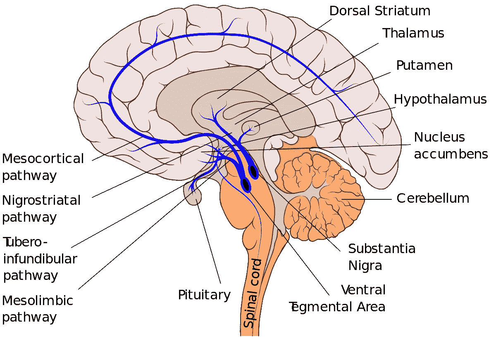
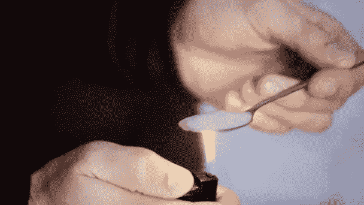
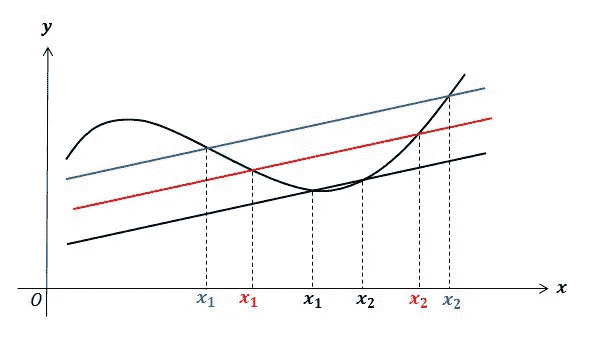
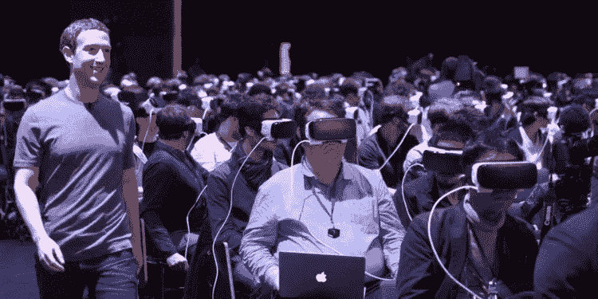

# 如何沉迷于实现目标？

> 原文：<https://medium.com/swlh/how-to-get-addicted-to-crack-417bc08c07cb>

通过欺骗你愚蠢的人类大脑来启动你的目标和习惯。

听着，琳达。我明白了。说服自己做一些你应该做，但不想做的事情，是很难的。

你想多去健身房，多读书，吃得更好，工作更努力，但是你太他妈的固执了。

当然，你可能会让自己去一会儿。你神奇地在某天早上醒来，精神焕发，准备好迎接这个世界。你去跑步，写一篇令人讨厌的 Instagram 帖子，感觉一阵积极。

Literally me. From: 8/25/15

给它几天，你又回到了老套路。

这是一个循环，很难打破。老实说，你永远不会。因为你不应该这么做。该死的，这是暗淡的，但让我解释一下。

## 周期

人类是动物，令人兴奋吧？动物生活在地球上(holy-sh*t)。地球每天围绕地轴旋转，每年围绕太阳旋转。

这些旋转是周期性的，因为我们(作为动物)除了我们可爱的地球母亲之外不知道任何事情，我们自然也是周期性的。

这些循环的好处是，它们可以形成积极的例行公事，为我们的生存服务。另一方面，它们也会导致我们陷入难以置信的、令人沮丧的、不可能打破的窠臼。

那么这对培养新习惯意味着什么呢？这意味着为了成功，你需要和你的周期一起工作，而不是和它们作对。

但是怎么做呢？你必须通过欺骗性的奖励和重复，而不是纯粹的破坏，来欺骗你简单的人脑做出改变。

## 利用您的奖励途径

人类的大脑运行在一个奖励系统上。每次你有所成就，吸毒，做爱，或者吃美食，你的大脑都会因为这些活动而奖励你。

这发生在所谓的[中脑边缘多巴胺系统](https://www.drugabuse.gov/publications/teaching-packets/understanding-drug-abuse-addiction/section-i/4-reward-pathway)，本质上是一种释放神经递质多巴胺的途径，以奖励一种行为，并告诉大脑的其他部分记住并重复最初的行为。

A spoonful of sugar helps the medicine go down.

不幸的是，正是这个系统也让我们上瘾，因为可卡因和海洛因等药物直接奖励我们的大脑，并使系统短路。不过这也不全是坏事，因为你也可以利用系统的力量来形成新的积极习惯。

# 奖励

减肥，写书，考个好学校。这些都是有着丰厚回报的崇高目标，但与完成这些目标所需的实际工作却相去甚远。我们需要小胜的满足感来让我们继续前进，而这些遥远的目标包含的内容如此之少，以至于不必要的难以实现。

Photo by [christopher lemercier](https://unsplash.com/@elevantarts?utm_source=medium&utm_medium=referral) on [Unsplash](https://unsplash.com?utm_source=medium&utm_medium=referral)

在陈述你的目标时，你不仅要看到大目标，还要把它分成小块，这样你就可以一路庆祝“小胜利”了。

小小的胜利会刺激你大脑中多巴胺的释放，给你带来你渴望的放松和满足感。

对于那些没有直接回报的事情，你会失去多巴胺，因此更有可能在实现目标之前就筋疲力尽。

不要依赖最终的(也是巨大的)奖励，你需要在中间找到奖励自己的方法。这可以采取多种形式:**直接**、**间接**、**社交**，以及**切向**。

## 直接奖励

直接奖励与你努力的目标直接相关。如果你想减肥，经常称体重。将你的大目标分成小部分，享受一路上的小胜利。

Photo by [Jake Hills](https://unsplash.com/@jakehills?utm_source=medium&utm_medium=referral) on [Unsplash](https://unsplash.com?utm_source=medium&utm_medium=referral)

这是最简单的方法，就是把一个更大的目标分解成更容易实现的部分。既然大多数人已经知道这样做，我就不赘述了。

## 附带的报酬

切向奖励稍微复杂一点，我举个例子。当你想减肥或变得更健康时，你需要吃得更好，多锻炼。

这种情况下的间接回报不是最终减肥的长期目标，而是你今天锻炼后的即时感受。这是你的目标的结果，而不是你所寻求的具体利益。

Cue the repressed calculus memories.

通过注意你在锻炼的日子和不锻炼的日子感觉的不同，你会立刻意识到锻炼也能让你现在感觉良好。

这是一种间接的回报，是你正在努力实现的长期目标的直接积极的副作用。它们无处不在，但你需要知道去寻找它们。

一旦你找到了它们，专注于它们而不是你的长期目标。对自己说:如果我今天不去健身房，我以后会更没精力。用这些无关紧要的短期奖励来驱使你去*想要*承担痛苦的活动。

## 奖励叠加(间接奖励)

除了使用直接和间接奖励，你可能还需要叠加间接奖励来保持动力。在某些情况下，这些可能类似于间接奖励，但它们不是自动的，你必须插入它们。

Photo by [Aperture Vintage](https://unsplash.com/@aperturevintage?utm_source=medium&utm_medium=referral) on [Unsplash](https://unsplash.com?utm_source=medium&utm_medium=referral)

坚持锻炼的例子，你可以在锻炼后享受美味(但健康)的蛋白质奶昔和热桑拿浴。这两件事实际上都在某种程度上有助于你的目标，但除非你付诸实践，否则它们都不会自然发生。

Photo by [Hayley Seibel](https://unsplash.com/@seibelhayley?utm_source=medium&utm_medium=referral) on [Unsplash](https://unsplash.com?utm_source=medium&utm_medium=referral)

这里的重点是真正享受其中的乐趣。老实说，你正在和固执的自己达成协议，让自己度过难关，努力实现目标。当你真的不想起床时，你能给自己提供什么让你起床？

理想情况下，这些是你剥夺自己所有其他时间的事情，除了直接在做了你真的不想做的事情之后。此外，这些东西不应该从目标本身带走。所以，不要承诺在锻炼后给自己一杯奶昔，而是选择一杯蛋白奶昔。

这就是奖励叠加的概念。把你讨厌的东西和你喜欢的东西放在一起，就能得到你想要的结果。

## 社会奖励

人类是群居动物，这就是为什么社交媒体如此重要。这种奖励可以通过两种不同的方式帮助你实现目标:**数字**和**物理。**要想取得成功，利用两者的结合非常重要。

**数码**:观看人们做你正在做的事情的视频。围绕你感兴趣的话题加入 Subreddits 和脸书小组。在全球范围内与他人互动，收集知识和支持。是的，甚至是令人讨厌的，通过帖子和媒体文章与世界分享你的目标和愿望。

Creepy, I know.

当你在挑战中挣扎时，所有这些都能给你一些归属感。孤立是绝对的杀手，在你的问题中感到孤独会立即摧毁你的生产力。在网上获得陌生人的帮助。

身体:找一个和你同路的 irl 伙伴一起走(除非你在为马拉松训练，那就跑步吧)。这可能是你的伴侣、朋友，甚至是在附近组成团体的陌生人。有人亲自让你承担责任，分担痛苦，只会让回报更加甜蜜。

# 重复

如果你只记得这篇文章中的一个概念，就让它成为这个吧。回报是巨大的，但除非你真的在持续做你应该做的事情，否则它们毫无意义。由于打破循环的整个想法，这对于人们来说通常是最困难的部分。

沃伦·巴菲特曾经说过:

> 习惯的锁链轻到感觉不到，直到重到无法挣脱。

当形成一个新习惯时，你绝对要每天都做。起初，这很容易。你自然会对回报感兴趣，这个概念本身会驱使你去完成它。然而，在第四或第五天，你又跳回到你当前的现实中，用你的新习惯来应付它变得很困难。

Photo by [Kaley Dykstra](https://unsplash.com/@kaleyloved?utm_source=medium&utm_medium=referral) on [Unsplash](https://unsplash.com?utm_source=medium&utm_medium=referral)

工作很艰难，你没有睡好，一个朋友来看你，所有正常的事情都会发生，而且会彻底摧毁你已经取得的进步。当你遇到这些障碍时，推动自己去做你每天都想做的事情会非常困难，但是你必须这样做。

这里的关键在于这样一种谬论，即做到这一点是“极其困难的”。不一定非要这样。你给自己每天需要做的事情赋予了一个价值，这让事情变得很困难。我们倾向于把我们每天的进步看成要么全部要么没有。离今天的目标还差一英寸就是失败，何必呢？

> 做点什么，不管多小，都比什么都不做重要得多。

如果你的目标是每天去健身房，但今天你没有多余的时间去，那就在你的客厅里做 20 个俯卧撑。

只要你做了一件事，不管多小，你还是做了一件事。这仍然是锻炼，而不是在健身房锻炼一个小时，但这是值得骄傲的事情。

Photo by [Emma Matthews](https://unsplash.com/@emmamatthews?utm_source=medium&utm_medium=referral) on [Unsplash](https://unsplash.com?utm_source=medium&utm_medium=referral)

为什么要这么做？为什么要做这么小，看似无足轻重的事情？因为你的大脑并不在乎。它仍然算数。做一些事情会在你循环的大脑中固化，你会在锻炼的领域中做一些事情。单身。日。

第二天，当你有时间的时候，你会更有可能记得去锻炼，然后更有可能因为害怕打破锁链而真的去锻炼。

## 备份计划

当你为实现一个长期目标而计划你的日常贡献时，确保不仅有一个理想的和具体的可实现的，而且还有备用计划。

如果你打算每天写一章，接受这个事实，总有一天你会对一页感到满意。如果你打算一天跑 5 英里，知道有些日子你只需要绕着街区跑一圈就可以了，你应该感到高兴。

# 现在都在一起

好了，现在你知道了不同类型的奖励和重复的力量，那么你如何开始把它应用到你的目标中呢？

1.  **明确陈述你的长期目标**，即减掉 x 磅，写本书，或者考上医学院。
2.  将你的目标分成可衡量的小块，随着你的进步吃那些美味的**直接奖励****。**
3.  确定你在旅途中自然会遇到的积极的**间接奖励**，并关注它们。
4.  在你现有的奖励和不受欢迎的(但必要的)活动的基础上增加间接奖励，作为那些真正艰难日子的安全保障。
5.  不管情况如何，每天重复你的贡献，尽你最大的努力追求理想，但是如果必要的话，少接受一些。
6.  **利润**。

[Blake Bailey](https://www.linkedin.com/in/blakekbailey/) 是一名企业家，社交发现初创公司 [VENN](https://projectvenn.com) 的创始人， [Process Street](https://process.st) 的客户成功负责人，也是各种规模公司的战略顾问。在下面的评论中分享你对这篇文章如何改进的想法和观点，或者你对这个话题的看法。感谢阅读！