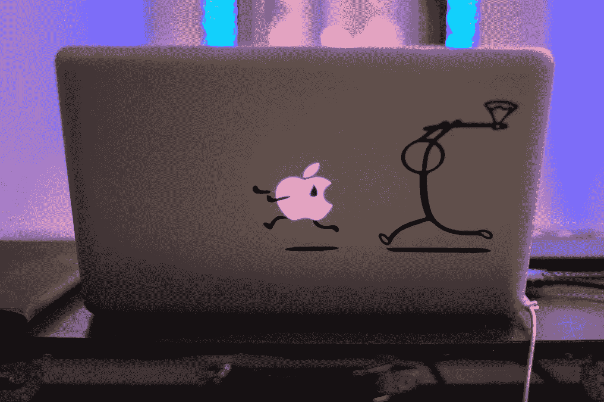

# 如何更聪明地工作，而不是更努力..

> 原文：<https://medium.com/swlh/how-to-get-better-results-with-the-backwards-law-61e6f8ce2d71>

一个人越努力，成功就越少。

我打赌没人告诉过你。这与一个人在当今社会的成长方式是完全矛盾的。人们被教导要更加努力，这是达到最佳状态的唯一途径。但这并不完全正确。

> “我们越是努力用我们的意识去做某事，我们就越不会成功。熟练程度…