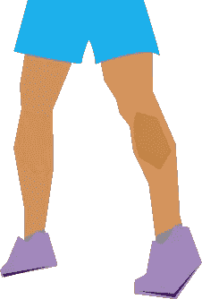
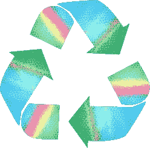
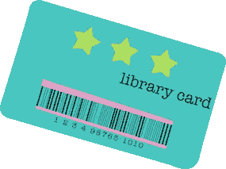

# 作为一名破产的千禧一代，如何在旧金山生存:

> 原文：<https://medium.com/swlh/how-to-get-by-in-sf-dbbb71a44107>

与我所有的非技术人员团结一致。其中有些是苛刻的…但却是必要的。

**1。找一套父母一起住**，最好是免费的。他们不一定是出生时就给你的人，事实上，试着寻找那些也能在你选择的领域为你找到工作的父母。没有什么比交换条件更能说明无条件的爱了，对吧？提示:如果你找不到合适的安排，许多人会找几个室友代替。

2.停止每天早上买咖啡。认真。理想情况下，醒来时没有任何物质，但如果没有——停止打盹，提前五分钟醒来，自己做该死的咖啡。你可能会用星巴克的杯子发表声明，但不管怎样，这可能不是你想做的。*建议:乔氏商店早上 8 点开门。去样品区买一杯乔，并对他们给你的迷你杯感到满意。如果你喜欢的话，还有免费的奶精和糖。还有免费的食物样品？嘣，早餐。*

3.另外，不要在外面吃饭。不，你买不起 13 美元的阿艾碗或 15 美元的苏什里托。不要为了钱，为了预算。*两个字:备餐。它会改变你的生活。*

4.如果你要去优步或者 Lyft 或者其他类似的地方，最好是单程出城。像其他人一样把你的破屁股放在市政债券上，或者更好，买辆自行车。我听说它在。试着忍受这些山，也许几个月后你就可以做小牛模特赚点钱了。

**5。扼杀一个行业。**召集你的千禧一代朋友开会，一起发誓永远不踏进电影院或提供普通食物的实体餐馆。你的朋友会认为你很前卫——你真的是在展望未来，也就是你的财务未来。

**6。你需要学会侧推。最好是一个你不用给国税局分一杯羹的工作。⁴:我不是说现在就去苹果公司，但是也许可以考虑在城市大学上一门珠宝制作课，然后在旅游区卖那些珠宝。当然，只收现金。远离海特和阿什伯里。那块领土已经被占领了。**

7.是时候加入减少、再利用、回收运动了。⁶ 也许这样做是出于道德原因，如果你对此不感兴趣，那么这样做是为了省钱。很简单:停止购买你不需要的东西，尽可能长时间地使用你已经拥有的东西。给你一个想法，你可以把酒瓶变成花瓶——但是一旦你达到一定的阈值，你应该开始回收它们，因为我们生活在地震区——你知道，有人可能会过来，开始问你很多关于周六晚上选择的问题。

*建议:看看很多很多博客，上面有很酷的循环项目和操作指南。*

8.**停止购买你知道不会穿的衣服。苏珊，你永远也不会穿那件露脐上衣，因为你知道吗，你一生中 80%的时间都是在商务-职业环境中度过的，现在我们谈到了这个话题，如果你没有明确自己的人生目标，你只会买休闲裤和羊毛衫。查看一下你当地的旧货店，寻找一些酷的、便宜的、可持续的东西。记住，质量重于数量。**

9.**住在城市真的需要为娱乐买单**？从每次你走在街上的互动现实生活雷区，到市政网上引人入胜的看人——这一切都在你身边发生。放开网飞。Spotify 可以留下来。⁷:如果你还有有线电视，我需要你重新评估你的生活。

*亲提示:访问你的* [*本地图书馆*](https://sfpl.org/) *寻找有趣、酷、免费的资源。有这么多，真的。就像一个聪明的 aardvark⁸曾经说过的，“当你有一张借书证时，找乐子并不难。”*

10.停止消费，开始创造。真的，在一个鞋盒公寓里，这是有意义的:这不是物质上的拥有，而是你在生活中积累的经验。走出去，创造回忆。迷失在金门公园或湾区无数自然逃避之一。获得灵感。写一首诗。拿起一把尤克里里琴。试试解释性舞蹈什么的。记住，你在这个国家最好的地方之一，也许是整个该死的世界。你也为此付出了一大笔钱。所以走出去，充分利用它。

看，为了避免你被贴上脱离现实、缺乏理性的千禧一代的标签，潮流正迅速转向反对所有“一次性”物品。每天拿着一个外带咖啡杯出现也是对财务鲁莽的尖叫——但是，嘿，也许你对此很感兴趣。

*所以“杯”有点大方……记住，都是透视好吗？*

好的，当然，有时候共乘比乘坐公共交通工具更便宜。一些拼车应用程序也可以做到这一点。我听到了，但你听到了吗？

*⁴This 是个笑话，国税局。我纳税。实际上是相当多。爱你，CA。*

*⁶Bonus 指出，如果你把垃圾和腐烂包括在内。*

⁷Not 从中获得回扣。虽然现在我们在这个问题上，嗯，你不会说也许这个大声喊出来是值得一个免费的年度订阅？提前感谢@Spotify。

*⁸Do 我需要包含一个链接吗？* [*亚瑟。*](https://www.youtube.com/watch?v=MuLZKsFho5A)