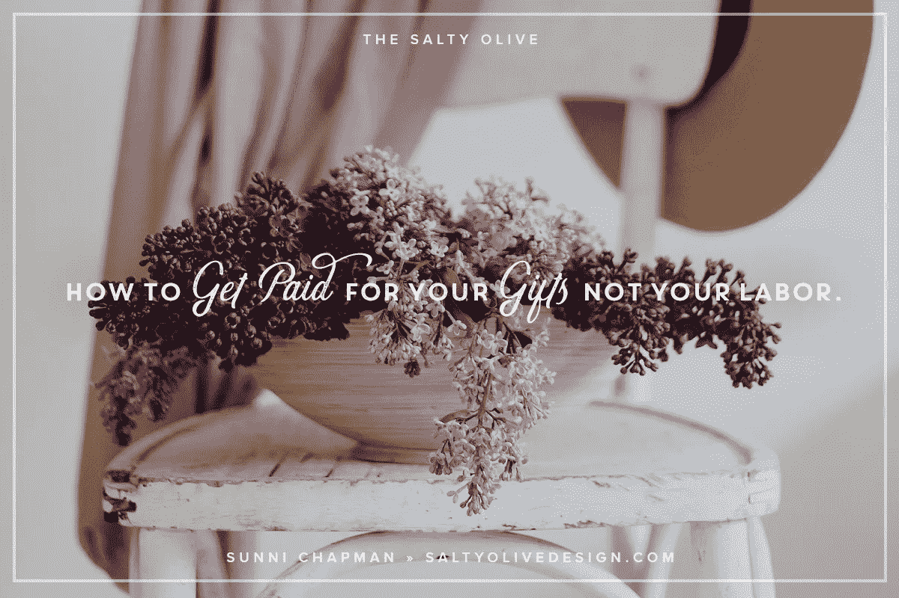

# 如何为你的礼物而不是劳动获得报酬？

> 原文：<https://medium.com/swlh/how-to-get-paid-for-your-gifts-not-your-labor-ca4b60d5ffdf>

20 年前，当我刚开始做生意时，我给自己做了第一张名片。我 21 岁，有一个 2 岁的孩子，我刚从一家不得不关门的公司的第一份真正的设计工作中被解雇。

尽管我很害怕，我还是决定自己出发。卡片的正面是我的公司名称，当时是贝拉·菲奥雷艺术公司