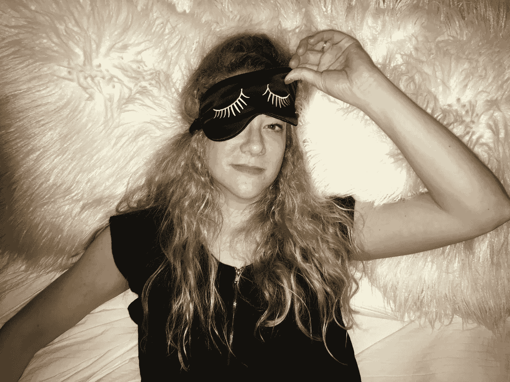

# 围绝经期如何获得高质量的睡眠

> 原文：<https://medium.com/swlh/how-to-get-quality-sleep-when-youre-in-perimenopause-105e95290f17>

当闹钟在早上 6 点响起时，我醒来时又湿又冷，我的睡衣滑落到身体两侧。当我醒来时，我在脑海中回忆了前一天晚上的事情。我在晚上 9:30 睡着了，在我的夜间养生之后:拉莫三嗪(完全披露，用于双相 II)，褪黑激素，和一种非处方夜间睡眠辅助药物。另外，我最喜欢的两个部分:“维生素 D 糖果”和 Oikos 三零酸奶希望…