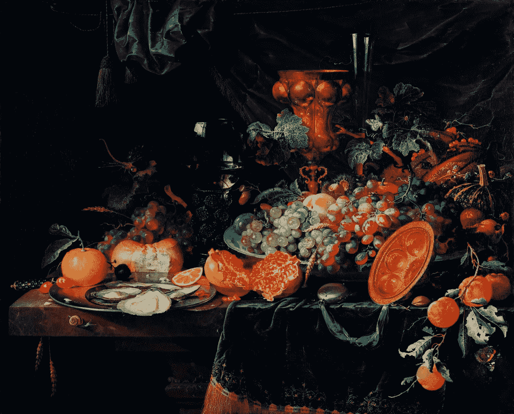

# 如何从与平面设计师的合作中获得最大收益

> 原文：<https://medium.com/swlh/how-to-get-the-most-out-of-working-with-a-graphic-designer-2fcfa6c47d32>

Fruits and oysters by [Abraham Mignon](https://www.rawpixel.com/search/Abraham%20Mignon?sort=curated&page=1) (1660–1679)

*这篇文章是为与平面设计师一起工作的小企业主准备的，所以我强烈推荐你看看我之前的文章* [*如何与平面设计师*](https://blog.usejournal.com/how-to-speak-graphic-designer-bd8fc1419f51) *。我分解了理解“Designerese”(不要@我)的一些基本术语，并且不会在这里花费时间来分解它们。先不说免责声明，我们继续。*