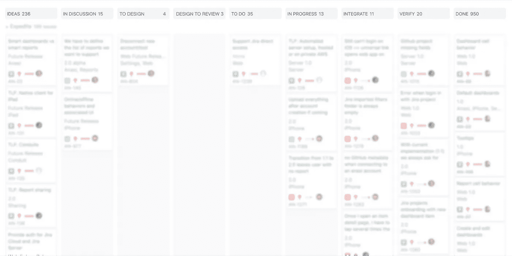

# 如何让你的工程团队参与产品工作

> 原文：<https://medium.com/swlh/how-to-get-your-engineering-team-involved-in-product-efforts-6e89e7168897>

在 Anaxi，我们没有产品经理。看起来很奇怪？我们不是唯一这样做的人…例如，苹果公司也是如此。但是在我们的例子中，这个角色分散在我们的远程工程团队中。在这篇文章中，我将详细说明我们为什么这样做，以及我们是如何做的。老实说，有许多事情我们仍在迭代，完善我们的流程将是一项持续的努力，正如每个公司都应该做的那样。请注意，我们的流程适用于任何工程团队，无论是在同一个办公室还是远程工作。

# 为什么你希望你的开发团队参与你的产品定义工作

在我们的特定案例中，我们的目标客户是开发人员和工程经理(以及后来的产品经理)。所以我们的工程团队也恰好代表我们自己的客户。按理说，他们应该对什么有价值，什么没什么价值有深刻的见解，大概比一个自以为能理解受众的非技术产品经理还要深刻。

然而，这并不意味着如果你的听众不是工程师，你就不应该关心这个。的确，工程师有很多产品知识和见解可以分享。这并不奇怪:他们在职业生涯中一直在制造产品！让他们参与进来会提高围绕你的产品定义工作的讨论的质量，从而提高你的产品的整体质量。

让你的团队参与进来会让他们更关心产品。更多的关心，更多的动力，更高的生产力——所有这些加起来就是更高质量的工作。所有这些都在底线上产生了巨大的差异。

我希望我已经说服了你为什么应该考虑让你的工程团队参与进来。我相信有很多其他方法可以做到这一点，但让我来介绍一下我们在 Anaxi 的 9 种方法(有些甚至是从以前在苹果公司的工作中获得的灵感)。

# 1)异步通信是指书面通信

工程团队内部的协作是异步的。他们使用的每个工具都支持异步通信。这是有充分理由的。工程师最大的生产力损失来自[中断(计划内或计划外)](https://community.anaxi.com/post/top-12-things-that-destroy-developer-productivity-1547676088977x340870609785323500)。你永远也不想有意识地选择牺牲团队的生产力。这会给你的团队传递一个信息，他们的工作并不重要，这会破坏剩下的生产力。

那么如何异步实现产品参与呢？你需要支持书面交流。在 Anaxi，我们的交流中心是门票。一切都写在票里。

票证描述保持其创建时的状态，以便其他团队成员可以理解对话。当一个行动计划被决定时，它会被写在评论中，并被添加到描述中，但是在“原始描述”下面，作为一个单独的部分，被命名为“行动计划”这使得团队可以避免通过整个讨论来得出结论，但是如果他们愿意，他们可以访问完整的历史。

对我们来说，口头交谈或轻松的交谈都被认为是非正式的。如果在这些讨论中就该主题取得了任何进展，则应在票证中以备注的形式报告一份摘要。

这很重要，因为这意味着任何人都可以投入并参与辩论。工程团队不认为自己是产品团队的承包商，因为他们正在开发他们可以影响的功能。

# 2)向客户和他们的反馈展示你的团队

这里没有什么新东西。所以，我不会反复强调这一点。没有一个人，不管他们有多优秀，能够考虑到产品客户的所有用例及需求。通过接触客户和他们的反馈，您的团队可以了解客户的需求和痛点，否则他们可能不会意识到，因为他们不会在相同的环境中使用产品。

你希望你对产品的辩论是定性的，因此你希望每个参与者都与你的客户接触，以便从他们自己的信念后退一步。反馈打开了思维，你希望开放的思维进行富有成效的辩论。这并不意味着你应该达成共识。让我说清楚，你永远不应该走向共识。但是，你需要开放的心态去倾听你队友的争论。

# 3)让您的团队创建票证

这可能不直观，实际上，可能是最难实现的。其背后的原因是，当您创建票证时，您已经有了自己的方式来查看如何在票证中实现此功能。如果你的产品经理开了罚单，你可能没有意识到，但这实际上会对你的团队产生不利影响。不可避免的是，你的产品经理(PM)做这件事的方式不是你的团队会做的方式。结果是失去了重点，生产力，甚至可能是实施质量。理解另一个人的观点总是比理解你自己的观点要花更多的时间，更不用说如何从另一个人的观点出发来处理问题了。

另一个原因是，如果您的项目经理或经理创建了标签，这意味着与团队的承包商关系，这不会鼓励团队真正参与或被激励。他们可能不会告诉你，但我向你保证他们感觉到了。

现在，让您的团队创建票证并不是一件容易的事情。他们会说他们更喜欢你去做，因为对他们来说这是更多的工作。不要屈服。回报真的很值。他们会更加投入。

# 4)票据描述应只关注要解决的问题

如果你把解决方案放在描述中，它不会邀请人们参与进来，它会立刻结束争论。所以，相反，你应该把注意力集中在你试图解决的问题上。如果你心中有一个解决方案，把它作为第一条评论，并邀请其他人参与进来。

如果你认为他们可能对这件事有意见，不要犹豫在评论中提到他们，让他们参与讨论。

# 5)在设计工作之前讨论特性

在 Anaxi，工作流程的开始看起来是这样的:*想法* > *在讨论* > *到设计*。

当我们想在接下来的几周内解决这些问题时，问题就会从*想法*变成*讨论*。一旦行动计划达成一致，它将进入*设计*。在讨论中，工程师和设计师都被邀请参加*中的讨论。*

我们尝试在每个阶段设定优先级。这意味着优先级可能会从一个阶段到另一个阶段发生变化。例如，在讨论中处于*高位的东西，因为它是我们希望在接下来的几周内处理的东西，一旦被讨论，将被转移到*以设计*并在那里具有较低的优先级，因为设计师可能会在此之前专注于完成一个里程碑。*

# 6)将设计工作流程纳入工程项目

在*设计*之后，我们还有*设计审核* > *特征验证* > *进行中* > *整合* > *验证* …所以，你可以看到设计工作流程是整个工程的一部分。没有分离。这很重要，因为您希望您的工程团队参与设计过程，而您的设计师参与实施阶段。

# 7)与工程团队一起进行设计评审

为了让工程团队参与到设计过程中，我们举行设计评审，讨论所有处于*设计评审*状态的标签。目前，我们一直通过设计师分享屏幕进行视频通话，这些设计师主持会议并展示他们的作品。我们邀请并欢迎工程师们加入进来，发表他们的意见。

在会议之前，我们在 [Figma](http://figma.com/) 中写下我们的评论，这是一个非常棒的协作设计工具，因为它可以帮助设计师准备设计评审。

# 8)让团队展示他们开发的新功能

你希望你的工程团队为他们的产品感到骄傲。让他们参与进来非常重要。一个非常好的方法是让他们在你的每周全体会议上向整个团队展示他们的工作(如果你有每周例会的话)。

事实上，如果他们对自己所做的工作感到自豪，他们会很乐意展示出来。但如果他们不是，他们可能会对展示自己的作品感到有点羞愧。你可以肯定的是，下一次，他们会尝试更多地参与进来，这样他们就不会再尴尬了！

# 9)向您的团队通报所产生的影响

您的工程团队不能负责收集每个已开发特性的影响指标。这需要一定的纪律和大量的努力。因此，您仍然需要一些与产品相关的实体来完成这项工作，这些实体可以是数据团队或产品所有者。

在不知道所做工作的影响的情况下，问题就出现了，工作是否有意义。所以，这部分是绝对必要的。不要低估它的重要性。

—

# 一点结论

你读过康威定律吗？上面写着:

> 设计系统的组织……被限制生产这些组织的通信结构的复制品

即使你有一个专门的产品经理，让你的工程团队参与进来也会在很多你可以考虑的方面使组织和它的产品受益。所以好好想想吧！

如果你能想到其他方法，请告诉我。我们一直在努力改进我们的流程，所以我非常感兴趣！

# 在你走之前…

你觉得这篇文章有趣吗？请按住👏说“谢谢”并帮助别人找到它！
如果您对关于**我们在** [**Airbyte**](http://airbyte.io) **用我们所有的知识**打造世界级组织的旅程的文章感兴趣，请订阅我们的时事通讯！

在 Twitter[上关注我](http://twitter.com/JeanLafleur)保持联系。谢谢大家！

*原载于 2019 年 1 月 25 日*[*anaxi.com*](https://anaxi.com/blog/2019/01/25/how-to-get-your-engineering-team-involved-in-product-efforts/)*。*

## 这篇文章发表在[的《创业》(The Startup](https://medium.com/swlh) )上，这是 Medium 最大的创业刊物，拥有+415，678 名读者。

## 在这里订阅接收[我们的头条新闻](http://growthsupply.com/the-startup-newsletter/)。

