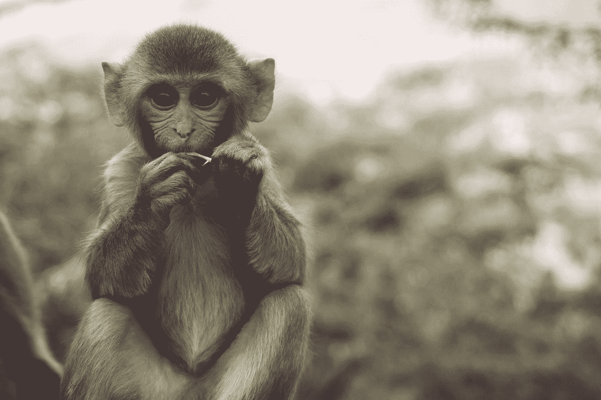

# 如何用#猴子第一公式让你的注意力回来

> 原文：<https://medium.com/swlh/how-to-get-your-focus-back-with-the-monkeyfirst-formula-e5581865658b>

Photo by [Patrick Beznoska](https://unsplash.com/@patrick_beznoska?utm_source=medium&utm_medium=referral) on [Unsplash](https://unsplash.com?utm_source=medium&utm_medium=referral)

快速回答这个问题:现在你工作中最具挑战性的任务是什么？

也许是找出编码问题的某种解决方案，或者你一直在为你的商业模式而困惑，或者你需要决定是雇佣还是解雇一名员工。

也许对你来说，这是“有点混乱”，问题和挑战是相互关联和相互影响的。不清楚首先需要做什么。

不久前，我偶然发现了一家名为[【X】](https://x.company/)的公司，它是谷歌背后的法律实体 Alphabet Inc .的一部分。

x 是谷歌的一个研究部门，致力于社会的长期大规模变化。他们的项目通常被称为“登月计划”，指的是 20 世纪 60 年代，美国总统约翰·肯尼迪宣布，到这个十年结束时，美国将成功地把人送上月球。

在撰写本文时，X 正在深度投资于增强现实(AR)、自动驾驶汽车、提供互联网接入的气球以及能源和生命科学领域的各种项目。

尽管这听起来很酷，但这篇文章不是关于 X 的项目，而是关于贯穿他们工作的一个核心理念。

## 艰难事物的艰难之处在于

想象一个 10 英尺高的基座，在基座上有一只猴子(随便你选，我选黑猩猩)。猴子会站立，会挥手，最重要的是，*它会背诵莎士比亚*。你公司的工作就是让这一切发生。在 X，他们通过说 **#MonkeyFirst** 来接近这样的想法——他们的意思是这样的:**这个任务最难的部分是什么？然后他们开始这项任务。**

X 公司的“月球拍摄队长”，一个名叫阿斯特罗·泰勒的人，在本文中由[商业内幕](https://www.businessinsider.com/monkeyfirst-google-x-productivity-success-2017-10?IR=T:)解释

> 泰勒认为，正确的答案是训练猴子。错误的答案是建造基座。这是因为训练猴子比建造基座要难得多——在 X，必须先做最难的事情。

通常，当面对一个大项目时，我们会从简单的事情开始:为猴子建造基座。我们首先为项目创建一个文件夹结构，或者设计我们要写的论文的扉页。我们认为我们需要写详细的商业计划，甚至在我们有一个客户之前，相信我，有些公司在他们做成一单生意之前就花了几个月去找办公室。

我们关注这些小收获，因为它们提供了一种进步感。这些小小的成就让事情看起来好像在向前发展。有时，他们是必要的，以推动我们成为一个积极的头脑。我不是说它们没用或不好:但是当你的目标是在基座上有一只会说话的猴子时，不要把你 90%的资源花在建造基座上。你最终会得到一个漂亮的基座、一只尖叫的猴子和不太受欢迎的顾客(利益相关者、追随者、父母、老师……)。

这意味着:停下你正在做的事情，想想猴子。你的项目最难的部分是什么？

我发现，将“先做最难的事情”的想法融入其中，可以让注意力重新回到个人和职业的生产力上。

当我开始一个新项目时，即使是我以前做过的事情，我也会问自己:最难的部分是什么？哪些任务需要最长的时间，需要最多的脑力或者需要一段时间的学习？

这有两个好处:它帮助我提高对项目后期复杂任务的认识，但更重要的是，它告诉我需要关注什么。

## 一个例子

比如我想为音乐人建立一个社交平台。遵循#MonkeyFirst 原则，我们可以考虑项目最复杂的方面。

也许是建立和运营一个社交平台(如果你以前做过，你可能知道实现这个的步骤)。这可能是这样一个平台的货币化。或者，这可能是一个触及正确受众的问题。

我认为开始时最重要的问题是找出我的项目如何提供价值？。如果你不知道你提供什么价值和服务，你就不应该花时间在商业模型画布上，或者在你所在的地区寻找豪华的阁楼办公室。

> 你的第一只猴子是:顾客想要什么？有哪些方式可以提供？

稍后，你可能会遇到另一只猴子(“我如何才能为乐队建立一个虚拟实时虚拟现实排练空间”？)然后，当然，你需要关注这只猴子。

不仅个人项目如此。在开始一个大项目之前，和你的团队谈谈，让每个人贡献他们的专业意见:最难的任务是什么？如果可能的话，先把注意力放在这个任务上。

从更小的方面来说，讨论障碍是一个好的 Scrum 工作流程的一部分，在这里思考“我现在最大的挑战是什么”也有助于将注意力集中到可能导致问题的点上。定期要求你的团队重新评估猴子的状态:它的进展如何？因为在 X 处，#MonkeyFirst 也用于发现项目是否可行。你可能有一个合理的想法，但是在对会说话的猴子进行了几周的研究后，发现问题确实比最初预计的要大。也许这只猴子将永远不能说话。

> 最好在花上几个月或几年时间建造世界上最好的基座之前找到答案。

现在去找你的猴子吧。

感谢阅读，很高兴听到你的经历。点击“鼓掌”按钮，让我知道你觉得这很有帮助。

## 这篇文章发表在 [The Startup](https://medium.com/swlh) 上，这是 Medium 最大的创业刊物，拥有+445，678 名读者。

## 订阅接收[我们的头条](https://growthsupply.com/the-startup-newsletter/)。

