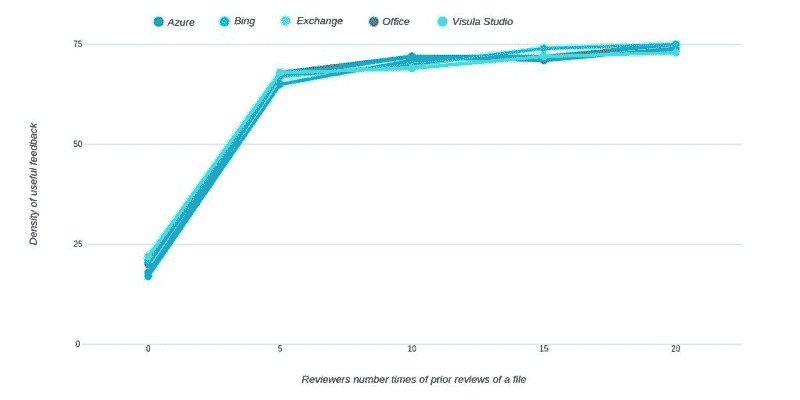

# 如何给出好的代码评审反馈

> 原文：<https://medium.com/swlh/how-to-give-great-code-review-feedback-doctor-mckayla-44665a2b86c6>

代码评审是一种有益的工程实践，可以确保高质量和可维护的代码，并在团队成员之间传播知识。但是，团队从代码评审中获得的价值和好处随着代码评审反馈的价值和有用性而起伏。在本文中，我将向您展示如何给出优秀的代码评审反馈。这些发现得到了微软数百个高绩效工程团队的研究和经验的支持。

How to give great code review feedback

这篇文章是[大型代码评审博客文章系列](https://www.michaelagreiler.com/code-review-blog-post-series/)的一部分，你可能想看看它向你展示了[代码评审最佳实践](https://www.michaelagreiler.com/code-review-best-practices/)、[代码评审如何在微软](https://www.michaelagreiler.com/code-reviews-at-microsoft-how-to-code-review-at-a-large-software-company/)和[谷歌](https://www.michaelagreiler.com/code-reviews-at-google/)工作，以及[代码评审陷阱](https://www.michaelagreiler.com/code-review-pitfalls-slow-down/)。如果你对代码评审感兴趣，一定要看看我的[独家代码评审电子书](https://www.michaelagreiler.com/code-review-e-book/)。

# 代码评审是关于代码的问题和质量

在代码审查中，一个开发人员最近的代码更改会被其他开发人员检查和讨论。这种代码审查的焦点和目标是发现代码的问题，并确保代码是高质量的。尽管代码审查提供了更广泛的好处，比如知识传播、学习和指导，但是记住这两个主要目标是很重要的。

一些团队害怕，一些团队经历了代码评审的主要缺点:降低的代码速度。这意味着团队的生产力降低了，因为代码审查减慢了团队的速度。

但这是为什么呢？

[速度降低的原因可能是多方面的](https://www.michaelagreiler.com/code-review-pitfalls-slow-down/)，但通常与反馈等待时间长和响应时间慢有关。如果再加上[无意义的代码评审反馈](https://www.michaelagreiler.com/code-review-pitfalls-slow-down/)，代码评审将成为所有参与者的噩梦。但是团队可以通过实现[经过验证的最佳实践](https://www.michaelagreiler.com/code-review-best-practices/)来轻松地避开那些[代码审查陷阱](https://www.michaelagreiler.com/code-review-pitfalls-slow-down/)。

在本文中，我将重点关注使代码评审对您的团队有益和有价值的反馈类型。

# 微软的代码审查研究

在微软，我已经[进行了几项研究](https://www.michaelagreiler.com/publications/)来理解代码审查。其中之一是，我们分析了超过 200 万条代码评审评论，以[了解哪些代码评审反馈是有价值的](https://www.michaelagreiler.com/wp-content/uploads/2019/02/Characteristics-Of-Useful-Comments.pdf)，哪些是浪费时间。但是让我们从代码评审中寻找什么开始。

# 你应该在代码评审中寻找什么？

让我们假设你刚刚被要求审查一些代码。代码作者向您发送了几个代码文件，其中简要描述了她或他所实现的变更的目的和类型。所以，现在你看代码。您在找什么？

*   功能缺陷
*   逻辑上的问题
*   缺少验证(例如，边缘情况)
*   API 的使用
*   设计模式
*   建筑问题
*   易测性
*   可读性
*   安全性
*   命名规格
*   团队编码风格
*   证明文件
*   最佳实践的使用
*   特定语言问题
*   不推荐使用的方法的使用
*   性能(例如，解决方案的复杂性)
*   替代解决方案…

哇，太多了。为了以系统的方式寻找所有这些问题，使用代码审查清单是一个好主意，您可以快速检查以确保您没有忘记任何东西。我将为代码评审写一份完整且更详细的清单，作为代码评审博客系列文章的一部分。所以，请确保[订阅我的邮件列表](https://www.michaelagreiler.com/code-review-e-book/)，邮件一出来，我就给你发邮件。

现在，你看到了所有这些问题，你问自己，但是**哪些是最值得寻找的问题？**

# 哪个代码评审反馈最有价值？

让我们收拾一下，让我们再次想象你实际上是如何开始代码审查的。

可能一旦你打开评论，你会浏览所有的文件，并开始定位自己。哪里发生了什么变化？代码的哪些部分受到影响？变化的中心在哪里？

当您熟悉这一变化时，您会注意到一些问题:注释和变量中的拼写错误、缺少注释、与样式相关的问题，如缩进。即使这些都是相关且有益的问题，也不要被这些问题所困扰。事实是，这些是有价值的和相关的，但不应该是代码审查的主要目的。我一会儿再解释。

那么，你还在找什么？

# 关于缺陷、遗漏验证和最佳实践的反馈是最有价值的

是的，最有价值的代码评审反馈是关于代码的实际问题。所有开发人员都认为这种类型的反馈是最有用和最有益的。但是，在研究中，我们也看到这些问题只占所有代码评审反馈的一小部分。

在下图中，您可以看到在代码评审中讨论了哪些类型的问题，以及从代码评审作者的角度来看，它们的感知价值是什么。那么我们看到了什么？

Types of code review feedback and its usefulness

我们看到代码评审中最有价值的注释解决了以下问题:

*   **功能缺陷。**这是显而易见的。最高等级的代码评审反馈是当评审者在系统中发现功能缺陷时。但是，代码审查并不是发现功能缺陷的最佳工具。事实上，所有评论中只有极小一部分是关于功能缺陷的。然而，如果找到了，代码审查的回报显然是巨大的。
*   **缺失验证和边角案例。**代码审查反馈显示了已经被遗忘的验证场景、没有被覆盖的逻辑问题或角落案例，这也是开发人员非常重视的。这种反馈围绕着寻找当前实现可能失败的边缘情况和替代场景。
*   **最佳实践和编码惯例。代码评审对于确保一致的、可维护的和可理解的代码库非常有益。因此，指出并识别不遵循编码约定或最佳实践的代码的反馈也非常重要。**
*   **API 使用和设计模式**。其他高价值的代码评审反馈集中在如何正确使用 API 或第三方库，以及缺失或错误实现的设计模式。

# 代码评审反馈可能是一把双刃剑

代码评审中讨论的一些问题并不像发现缺陷那样容易揭示它们的价值。根据具体的反馈和环境，这些评论要么是有价值的，要么是浪费每个人的时间。也许你已经猜到了。但是我们讨论的是编码风格、编码约定和注释的问题。这样的问题通常被称为挑剔的问题。

文档、编码风格和编码惯例。解决缺失或过时的文档，突出注释中的错别字，或者指出命名不当的变量，是您在代码评审期间经常会得到的反馈。但这真的有价值吗？

有时，这种反馈的价值对于代码审查人员来说并不是立即可见的。发现一个错别字也没什么大不了的，不是吗？嗯，这类评论的真正价值来自于时间的复合效应。快速解决这些问题可以确保代码库随着时间的推移保持可理解和可维护。

尽管如此，他们还是会给人“吹毛求疵”的感觉，而且这个词已经有了负面的含义。因此，团队应该确保整个团队都理解这些评论的价值。

另一方面，重要的是避免对缩进或编码风格等问题进行冗长和重复的讨论。这无疑降低了团队的生产力。为了确保团队保持高效，让我们确定一个风格惯例，然后继续前进！

# 不通过是超出代码评审目的的反馈

大多数关注当前代码评审范围的反馈被认为是有价值的。但是，代码审查的范围并不是所有在代码变更的文件中可见的代码。这也没有超出代码更改的目的。正因为如此，对于大多数开发人员来说，开发当前实现范围之外的新问题被认为是**无用的**。

*   *另类实现。*即使改进代码的替代解决方案被认为是有价值的，讨论对当前代码没有明显好处的替代实现也不利于团队的生产力。
*   现有的技术债务和重构:类似地，开始强调旧的技术债务或潜在的重构机会超出了常规代码评审的范围。这些问题应该单独讨论。
*   *规划和未来工作。*另一种无用的反馈类型是强调未来工作或当前开发周期未计划的工作的意见。如果您看到这样的问题，请在诸如 backlogs 或 issue tracker 之类的工具中做笔记，因为它们对您的团队非常有价值。然后，在适当的场合讨论它们。
*   *提问只是为了理解实现*。尽管代码评审是学习和在团队中传播知识的非凡工具，但是仅仅为了理解代码而提问并不是代码评审的目的。不要忘记，代码评审作者的主要目标是让代码获得批准，这样她或他就可以继续前进了。

[禁忌是代码评审中超出评审目的的讨论。让我们保持快速集中的复习。点击发微博](https://twitter.com/intent/tweet?url=https://www.michaelagreiler.com/great-code-review-feedback/&text=No-gos%20are%20discussions%20in%20code%20reviews%20that%20go%20beyond%20the%20purpose%20of%20this%20review.%20Let%27s%20keep%20reviews%20fast%20and%20focused.&via=mgreiler&related=mgreiler)

# 如果你不理解代码，你应该怎么做？

如果你不理解代码，你会怎么做？你应该如何对你不理解的代码给出有价值的反馈？
好问题。实际上，研究和经验告诉我们，如果你不理解代码，你就不能给出有价值的反馈。至少不是很多。

如果是这样的话，你必须首先更好地理解潜在的问题。你为什么不理解代码？你是团队的新成员吗？作为软件工程师，你的经验有限吗？你以前没用过代码库吗？新写的代码是不是看不懂的一塌糊涂？

如果最后一个是真的，你所有的问题都是有效的，应该是代码评审的一部分。但是很可能，你可以添加的不仅仅是问题。很可能，你添加了如何改进代码的反馈，为什么它是不可理解的，等等。

# 如果你不熟悉代码库，你应该怎么做？

如果你以前没有在这个代码库中工作过，你可能很难理解代码评审中发生了什么。解决这个问题的一个好方法是问一个同事，她或他是否能向你介绍代码并解释它。这里重要的事情是不要使用代码评审来询问关于代码库的随机问题。

的确，学习和传播知识是代码评审的两个实质性的好处。然而，这些应该是进行焦点驱动代码评审的副作用。而重点应该是检查代码是否正确，是否高质量。

这是，除非，代码评审被明确地设定为一种教导你的方式。如果是这样的话，这应该已经明确传达给你了。但是，如果您被添加到“正常的”代码审查中，最好只是观察和学习其他人在做什么。随着时间的推移，您将更好地理解代码库，了解团队惯例和最佳实践，并有可能向代码评审添加有价值的反馈。

代码评审是在你的团队中学习和传播知识的极好工具。但是，不要仅仅为了熟悉代码库而提问。点击发微博

# 经验较少的开发人员给出的反馈价值较低

不，不只是你。这也不是初级开发人员的错。这是事实。我们的研究结果表明，经验水平对开发人员给出有用反馈的能力有很大影响。刚进入一个组织的代码评审员——与他们的资历无关——在大约三个月的时间里给出的反馈价值要低得多。之后，我们可以看到他们的反馈值在一年的时间里是如何增加和稳定的。

# 你必须熟悉代码才能给出有价值的反馈

多项代码评审研究表明，最有用的代码评审反馈来自于之前已经修改或评审过被评审代码的开发人员。好消息是，以前编辑一次文件就足够了。这意味着，在我们的研究中，我们没有发现修改过一次代码的开发人员和修改过数百次代码的开发人员之间的反馈有显著差异，如下图所示。

Density of useful feedback vs. number of times a reviewer reviewed the file before

# 领域专家可以提升你的代码评审价值

然而，来自其他团队的领域专家或者跨团队的评审人员可以为您的代码评审增加巨大的价值。你可能会选择添加安全专家、大数据专家或可用性专家，即使他们不像你自己的团队那样熟悉你的代码库。

这里的好处是，他们带来了这种特定的专业知识和外部观点。他们在代码评审中的目的也是不同的。他们可能不会寻找设计最佳实践和团队约定，但是会检查代码中的问题，例如，安全性。

# 像你希望自己被对待一样对待别人

代码审查是一项非常社会化的活动。在人们积极致力于反馈文化的公司和团队中，这是一种高度赞赏和高度重视的工程实践。不幸的是，并非所有地方都是如此。在一些团队中，代码审查被错误地用作展示权力或优势的手段，甚至是进行权力斗争。这没什么帮助。

如果你想从代码评审中获益，思考如何给出建设性的反馈是明智的。指出某样东西质量不高是不够的。如果你批评一位同事的代码[，请确保以尊重的方式这样做](https://www.michaelagreiler.com/code-review-best-practices/)，并始终包括具体的改进方法。

另一方面，在代码评审中添加太多对代码片段的赞美是没有必要的。在微软的代码评审研究中，我们看到，代码评审作者不重视赞扬他们代码的评论。

为什么？嗯，这又一次归结到代码审查的焦点和目标。通常，每个评论都是一个小的工作项。拥有更多，即使只是赞美，也不会增加价值。这只会加重处理评论的任务。

指出好的工作，肯定有助于团队精神，是一个很好的激励因素。但是同样，在不同的环境中这样做比在代码评审的环境中更好，比如会议，或者休息时间。

# 影响反馈价值的外部环境

还有一些事情会影响您从代码评审中获得多少价值。在我们的研究中，我们看到开发人员很难审查非代码文件，比如配置或构建文件。另一方面，开发人员对源代码文件给出了最有用的反馈。

另一个对代码评审反馈有很大影响的因素是被评审文件的*数量*。接受审查的变更集越大，您收到的代码审查反馈就越少。保持小规模的代码评审有很多好处，并且是最有价值的代码评审最佳实践之一。

总之，好的和有价值的代码评审反馈是对代码评审目标的反馈:检查当前代码变更是否正确和高质量。无助于实现这一目标的讨论应该发生在代码评审过程之外。因为好的代码评审反馈也是及时给出的反馈，可以帮助代码作者快速获得代码变更的批准。

# 代码审查清单和更多代码审查见解

如果您想获得更多的代码评审见解，请务必订阅我的邮件列表。这样我就能让你了解每一篇新文章。目前，我正在做一个具体的代码审查清单，它可以帮助你关注最相关的问题。另外，看看我专门为我的订户准备的[代码审查电子书](https://www.michaelagreiler.com/code-review-e-book/)。

最后，让我们[在 twitter](https://twitter.com/mgreiler/) 上讨论和连线。

*原载于 2019 年 6 月 19 日*[*【https://www.michaelagreiler.com】*](https://www.michaelagreiler.com/great-code-review-feedback/)*。*