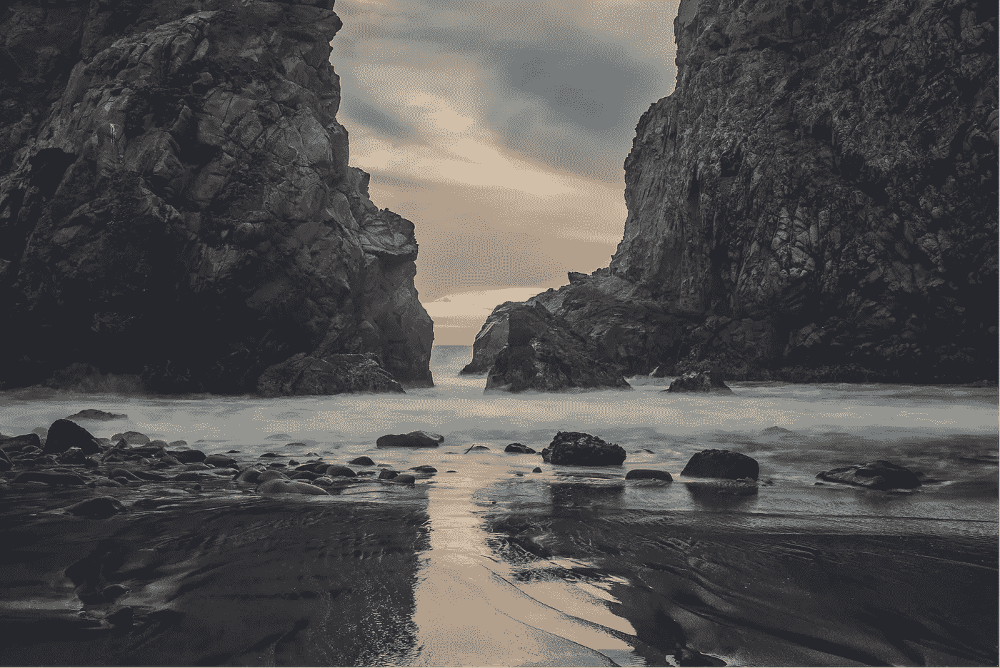

# 如何在一个坎坷的世界里给自己平静

> 原文：<https://medium.com/swlh/how-to-give-yourself-peace-in-a-rough-world-ddc7fbd7c952>

## 我们必须努力培育和平

Photo by [Kace Rodriguez](https://unsplash.com/photos/p3OzJuT_Dks?utm_source=unsplash&utm_medium=referral&utm_content=creditCopyText)on [Unsplash](https://unsplash.com/collections/352320/blogfotos?utm_source=unsplash&utm_medium=referral&utm_content=creditCopyText)

> “**和平**不能靠武力维持；只有通过理解才能达到。”“黑暗不能驱逐黑暗；只有光能做到。仇恨不能驱逐仇恨；只有爱能做到这一点。”~马丁·路德·金…