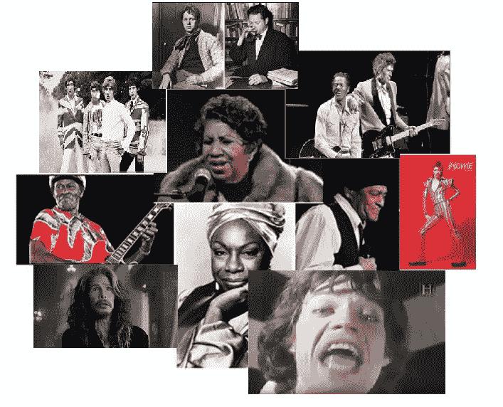

# 如何优雅地老去

> 原文：<https://medium.com/swlh/how-to-grow-old-with-grace-bcc52f4a73e3>

## 60 年代和 70 年代的音乐偶像为婴儿潮一代指明了道路

Aretha Franklin, Dylan Thomas, Keith Richards with Chuck Barry, David Bowie, Al Jarreau, Mick Jagger, Nina Simone, Steven Tyler, Chuck Berry, The Who

## 作者莎伦·图诺伊

从童年到少年，我的太多音乐偶像都过早地死去了。六十年代中期充斥着突然的损失:萨姆·库克，塔米·特雷尔，奥蒂斯·瑞丁。对我来说更痛苦的是在 70 年代早期的一个 9 个月的时间里又有三个人:吉米·亨德里克斯，詹妮斯…