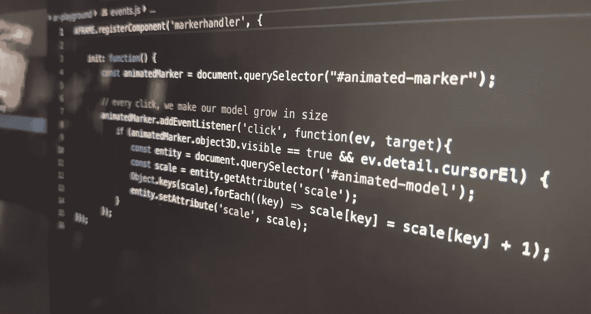

# 如何处理 AR.js 上的点击事件

> 原文：<https://medium.com/swlh/how-to-handle-click-events-on-ar-js-f397ea5994d>

## 更新版本——在网站上显示 AR 内容很好，但添加用户交互打开了一个全新的机会世界。

这是关于 AR.js 的系列文章的一部分，以下是迄今为止撰写的文章列表:

*   [ar . js——在网络上实现跨浏览器增强现实的最简单方式](/@nicolcarpignoli/ar-js-the-simplest-way-to-get-cross-browser-augmented-reality-on-the-web-10cbc721debc)
*   [如何只用二维码在网上交付 AR](/@nicolcarpignoli/how-to-deliver-ar-on-the-web-only-with-a-qr-code-139bb90e82f1)
*   [如何处理 AR.js 上的点击事件](/@nicolcarpignoli/how-to-handle-click-events-on-ar-js-f397ea5994d)
*   [提高你的 AR.js 表现的 10 个技巧](/@nicolcarpignoli/10-tips-to-enhance-your-ar-js-app-8b44c6faffca)。

关于 AR.js 和 Web AR 的最新消息，可以[关注](https://twitter.com/nicolocarp)我！

> 声明:AR.js v3 已经发布，新的文档可以在[https://ar-js-org.github.io/AR.js-Docs/](https://ar-js-org.github.io/AR.js-Docs/)找到。如果您发现本教程有问题，可以在那里了解更多信息。

在过去的文章[中，我写了关于 AR.js](/@nicolcarpignoli/ar-js-the-simplest-way-to-get-cross-browser-augmented-reality-on-the-web-10cbc721debc) 和[我们可以仅使用二维码](/@nicolcarpignoli/how-to-deliver-ar-on-the-web-only-with-a-qr-code-139bb90e82f1)来交付 AR 内容的方式。但是如何与我们已经展示给用户的 3D 物体互动呢？这将为这项奇妙的技术打开一个新的应用世界。

在 [AR.js Github 资源库](https://github.com/jeromeetienne/AR.js/blob/master/README.md)上的简短搜索显示了几个与事件相关的问题，其中大部分尚未解决。AR.js 构建在 [aframe](https://aframe.io/) 的顶部，不容易理解如何处理 3D 对象上的简单事件，即点击事件。

我试图收集我发现的所有工作提示，并把它们组织到这篇文章中，文章附有一个完整的用户交互点击的工作示例。

所以，我们开始吧！

## 创建 HTML 入口点

与往常一样，AR.js 应用程序从一个定义标记、模型等的 HTML 文件开始。在这个文件中，为了处理事件，我们需要定义元素的附加属性。下面我们来详细看看。

*   在第 11 行，我们导入了一个用于设置事件处理程序的外部 Javascript 文件。稍后我们将详细了解它
*   在第 21 行，我们的标记被定义了附加属性:`markerhandler`被用作注册的组件名，而`emitevents`和`cursor`定义了发出事件的可能性，特别是基于鼠标/触摸的事件
*   定义一个`id`或者添加一个非常具体的 CSS 类是很重要的，以便以后检索我们的标记和实体元素。

让我们看看我们的`events.js`文件看起来怎么样

代码非常简单:我们注册我们的组件，在初始化时，我们通过“点击”添加一个事件监听器。

在第 10 行，我添加了一个额外的检查:事实上，如果没有这个检查，事件会触发多次，一次是标记事件，一次是实体事件。通过这种检查，我们只有在标记元素`cursorEl`可见并且是与事件相关联的元素时才响应事件。

请注意，这种方法并不完美，也不是“生产就绪”。

*   点击/触摸在屏幕的中心非常明显，而在角落则不明显
*   点击不太靠谱。无论如何，它对于简单的交互非常有用，比如切换 3D 模型的点击或者开始视频的点击，或者类似的事情。

如果你必须让一个有点击功能的应用程序拥有核心功能，请注意这个限制。

[这里【a-frame 官方文档对处理 3D 模型上的点击的复杂性以及为什么实现这一点如此具有挑战性做了很好的解释。](https://aframe.io/docs/0.9.0/components/cursor.html)

无论如何，用这种方法你可以给你的 AR.js 应用添加基本的交互，大多数时候这就足够了！一旦进入事件监听器，你可以做任何你想做的事情；每次点击我都会让 3D 模型变大。你肯定可以做一些比这更有趣、更有用的事情:)

> ***Chialab*** *是一家设计公司。通过开发战略、设计、软件和内容，我们在品牌和人之间建立了令人兴奋的关系。*
> 
> [*https://www . chialab . I*](https://chialab.it)*t .*