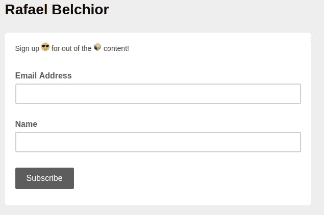

# 如何对高层计划进行持续改进

> 原文：<https://medium.com/swlh/how-to-high-level-plan-to-continuously-improve-1a8d78aad7e4>

5 月 4 日，我 23 岁了。

Photo by [Estée Janssens](https://unsplash.com/@esteejanssens?utm_source=medium&utm_medium=referral) on [Unsplash](https://unsplash.com?utm_source=medium&utm_medium=referral)

在我这 23 年的生活中，我一直在学习一些东西。如果我能把我学到的大多数浓缩起来，有一件事是肯定的:

> 如果你不为你的目标奋斗，没有人会。长期目标通常是最难完成的，但也是最有回报的。

你如何帮助别人，包括你自己，前进？一言以蔽之，要想有所成就，就要尽早开始定位自己**。**

**总而言之，我认为每个人都需要在一年内写一份目标清单。这份清单将指导你作为一名专业人士和一个人的发展——这就是为什么你应该建立一份现实的、多样的和严肃的清单。这也是一次自省的**练习。****

**如果你不知道从哪里开始，你可以从我的列表中获得一些灵感。**

****

****Bonus tip: You can organise your work and your To-Do list using** [**Trello**](https://trello.com/rafaelapb/recommend)**.****

****24 岁之前我要做的 24 个挑战****

*   **[开始一个有社会影响的项目](https://hackernoon.com/engineer-invest-2019-ac0794469c31)(即将推出)🐺**
*   **以优异成绩完成我的理学硕士学位**
*   **开始读博@ Técnico 里斯本**
*   **2019/2020 冬季学期讲座**
*   **2019/2020 年夏季学期讲座**
*   **为 [It 基础设施管理和行政](https://fenix.tecnico.ulisboa.pt/disciplinas/AGISIT/2018-2019/1-semestre)课程撰写初稿。**
*   **写我的书的初稿**
*   **发表一篇或多篇科学论文**
*   **作为自由职业者销售我的第一个产品**
*   **与区块链创业公司合作**
*   **[作为导师，成功完成我们提出的 Hyperledger 项目](https://wiki.hyperledger.org/display/INTERN/Hyperledger+Fabric+Based+Access+Control)**
*   **每月读一本书**
*   **[每月写一篇文章](/@rafaelbelchior)**
*   **将我月收入的 10%投资于股市，逐渐增加到 20%。**
*   **向慈善机构捐款**
*   **在医院做志愿者**
*   **去参加国际音乐节**
*   **去参加葡萄牙音乐节**
*   **睡在沙滩上**
*   **晚上，在阿连特霍通过 Lactea 观看**
*   **连续禁食三天**
*   **完成全程马拉松**
*   **跑 10 公里的小道**
*   **开始冥想**

**期待分享这个列表的一些更新😀**

****挑战自我。做令人惊奇的事情。****

**确保与需要一些动力的人分享这个故事！**

*****欢呼*** ，*不停摇摆*💪**

********

## **这篇文章发表在 [The Startup](https://medium.com/swlh) 上，这是 Medium 最大的创业刊物，拥有+446，678 名读者。**

## **订阅接收[我们的头条](https://growthsupply.com/the-startup-newsletter/)。**

****