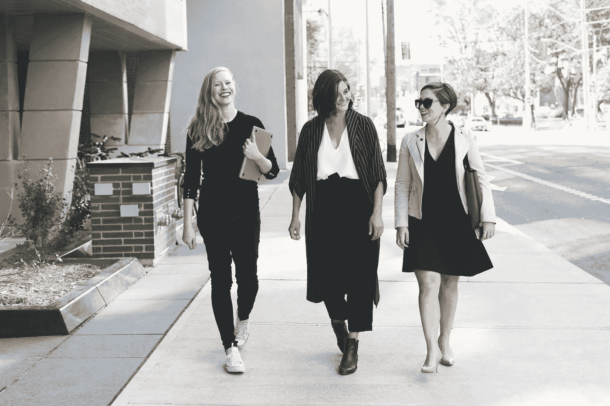

# 如何举行步行会议(以及为什么)

> 原文：<https://medium.com/swlh/how-to-hold-walking-meetings-and-why-8e91804b36b4>

Originally published on [**JOTFORM.COM**](https://www.jotform.com/blog/walking-meetings/)

“所有真正伟大的思想都是在行走中产生的”——弗里德里希·尼采，格言 34

空气清新。

阳光灿烂。

我很高兴能在外面。

我刚刚花了几个小时，埋头解决一个意想不到的产品开发问题。