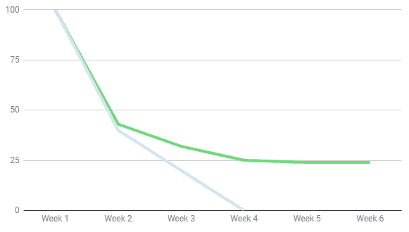

# 如何识别和找到产品与市场的契合度

> 原文：<https://medium.com/swlh/how-to-identify-and-find-product-market-fit-bdf56edaa65c>

你们都听说过创业过程中的神话时刻——产品与市场的契合。很少有创业公司能做到这一点，那些做到的人也无法具体解释他们是如何做到这一点的。最重要的是，专家们有不同的定义，并声称它对每个创业公司都是独特的。无论如何，我们都同意的一件事是，如果你到达了，你会神奇地知道。那么，你到底是如何找到一个你不知道它长什么样，也没有人能提供地图的东西呢？

在产品与市场匹配的道路上，从想法到牵引确实非常困难，往往会有许多弯路，许多人永远无法到达目的地。正因为如此，我想启发这个主题，并通过定义你在寻找什么以及实现目标的道路，让在这个阶段挣扎的科技企业家更容易一些。

# 定义

产品-市场匹配的概念是由风投老手安迪·拉赫勒夫(Andy Rachleff)首先提出的。他把它定义为当一家拥有某种技术的初创公司设法找到合适的市场时(T3)。当这种情况发生时，绝望的客户会从初创公司手中夺走产品。但是自从有了这个第一个定义之后，许多聪明人都加入了他们的观点和解释。

下一位发言人是马克·安德森，他将对此发表自己的看法。他在 2007 年说，产品-市场匹配是指“客户购买产品的速度和你生产产品的速度一样快，或者使用量的增长速度和你增加服务器的速度一样快”，正如他在他的著名文章《唯一重要的事情》中所写的那样。

2009 年，也被称为“增长黑客”创始人的肖恩·埃利斯写道，他借助一项调查确定了产品与市场的契合度。他问一个产品的用户，但是如果这个产品不再可用，他们会很失望。**如果至少 40 %的用户说他们会非常失望，这可能意味着你的产品适合市场。**此外，他补充道,“不可否认，这个门槛有点武断，但我是在比较了近 100 家初创公司的结果后定义的。那些努力获得牵引力的人总是低于 40%，而大多数获得强大牵引力的人都超过 40%。”

Brian Balfour 最近做了一点补充，他用参与度指标来描述它。首先，他说当你有一条**保持曲线**变平，而不是在一段时间后下降到零，这可能意味着产品适合市场。其次，这些指标还需要证明你有**顶线增长**，例如在收入或活跃用户数量方面。第三，Brian Balfour 寻找一个指标来显示用户重复执行相关任务时**有意义的使用**，例如，每天或每月多次。

# 措施

好吧，谢谢你的建议，伟大的专家，但是我怎么知道我是否成功了呢？为了让产品-市场的概念适合一个可达到的目标，我认为**你应该衡量 2-3 个指标的组合，以确定你已经达到的目标，或者知道你离目标还有多远**。确切地说，选择哪一个取决于你的业务和它的模式，但它应该在这三个领域中的任何一个。

**1。第一个与所有初创公司相关的指标是肖恩·埃利斯的调查。**确切的问题应该是“如果您不能再使用该产品，您会有什么感受？”替代选项有:非常失望、有点失望、不失望(它真的没那么有用)和不适用我不再使用这个产品了。

如果你有一个产品，你希望用户在第一个月至少活跃两次，你应该在用户第二次使用该产品的第二天给他们发邮件。如果你不期望有那么高的频率，在他们第一次使用后，提出这个问题。一旦你发布了你的产品，就很容易开始这样做。某些 CRM 可以通过 API 或代码片段连接，因此您可以自动处理这些电子邮件，如 Zoho CRM、Hubspot 和 Intercom。

2.接下来，你将能够**衡量参与度指标，这是产品市场契合度的更好指标，因为只有真正热爱你的产品的用户才会强烈使用它**。衡量敬业度对每个创业公司来说都是非常独特的。试着思考一个完美的用户应该如何使用产品，并以此为基准。例如:他们是否应该每周登录一次？你建议他们每月采取多少行动？然而，这里最重要的指标通常是保留率。您希望看到您添加的用户在相当长的时间内保持用户状态。你的保留曲线应该看起来像图中的绿线，而不是蓝线。

3.如果你提供的产品不常用，比如旅游服务或者电子商务，你应该考虑你的 LTV/CAC 比率。如果你想绝对确定的话，这个比率也可以用来进一步确认你的产品与市场的契合度。它的计算方法是将用户的终身价值除以获得他们的成本。计算这两个值有不同的方法，但请尽量遵循以下规则:

LTV =预期生命周期(或者如果你的产品很少被购买，这里用 1)月 x 每个用户每月平均收入——直接成本

CAC =广告成本和销售时间/新客户数量。

**如果你划分 LTV/CAC，你应该至少达到 3，以证明产品符合市场**。如果你达到这个数字，这意味着显然有对你的产品的需求，因为用户比你在他们身上赚的要便宜。如果你没有在营销或销售上花费任何东西，或者只是偶尔为之，你就不应该认为这个指标是产品与市场匹配的可靠证明。

正如你所看到的，增长或新用户并没有作为证明产品市场适应性的指标。如果你有很多新用户，这可能只是对你的服务有很大需求的信号，而不是你满足了它。

# 如何实现产品与市场的契合

所以，你已经发布了你的产品的第一个版本，也许你称它为 alpha，beta 或 MVP(最小可行产品)，但是你如何使用该产品来达到上述目标呢？**如果你正在努力寻找适合市场的产品，这里有一步一步的指导你如何达到目的。**

1.  首先要仔细检查你是否正确地**跟踪了哪个用户在做什么**。这是无法做到的，只有谷歌分析，因为你不能看到谁在做什么活动。你需要在你的数据库中跟踪你的登录用户，一个产品分析工具，比如 Mixpanel 或者一个连接到你的产品的 CRM。
2.  从你的第一批用户开始发送**肖恩·埃利斯的调查**。最好是自动完成这项工作，这样你就可以确保完成了。
3.  当你收到用户的回复时，不管他们的回答是什么，**联系**，询问你是否可以和他们聊聊，这样你就可以学习如何更好地为他们服务。理想情况下，你可以和 5 个用户联系，每个人可以聊一个小时，或者邀请他们吃午饭，或者去他们的办公室。否则，选择至少 15 分钟的通话时间。
4.  根据你从 5 个用户那里得到的反馈，**重新构建你的产品的新版本**。也许你选择了错误的市场，或者你没有满足你选择的市场。正如你的 MVP，这应该是一个不可扩展的原型，尽可能快地建立在一起。你越快推出这个版本——你就能越快从新一批用户那里获得新的反馈来构建另一个更好的版本。千万不要进入“就是这个！”在与真正的用户验证之前，总是期望这是另一个需要改进的蹩脚版本。
5.  当你认为你已经准备好重新开始的时候，**做三次 UX 测试。这不一定要由真正的用户来做，而是由从未见过你的产品的人来做。当你观察的时候，请他们注册，下订单，或者其他任何人们在你的平台上做的活动。不要说一句话，只是观察(我知道，这将是令人沮丧的，但它必须如此)。**
6.  一旦你修复并确认 UX 没问题，发布你的更新并**测量你的新用户群**。
7.  从调查和平台上的活动两方面分析您的数据。**至少有 40 %的人会非常失望吗？你的敬业度指标是否令人满意？**如果你实现了这两个里程碑和/或 LTV/CAC 高于 3，我祝贺你，并建议你进入创业的下一阶段，成长黑客。**如果你在这次迭代中没有达到产品-市场匹配，真的没有必要惊慌，再次迭代，从第 3 步重新开始。**

你肯定会比你想象的迭代更多次，并且在你中头奖之前重复这个循环至少 10 次。因此，**我不能鼓励你尽快度过这个循环**。事实上，这应该是最长 1 个月的循环，但如果可能的话最好更短。只有当你和你的用户一起验证了你的产品特性，你才能开始构建更健壮的版本，这可能需要更多的时间。

我祝贺所有发现他们的产品适合市场的创业公司，但是你应该知道你的工作还没有完成。现在，**你的创业生活的下一个篇章开始了，这意味着跳上油门，专注于** [**增长**](/swlh/how-to-apply-growth-hacking-for-startups-f0b934b77a82) **！**

👉 **[***点击链接访问所有免费资源*** *。*](https://StartupAction.ontraport.com/tl/15/?utm_source=medium&utm_medium=blog&utm_campaign=pmf) *所以不要等了，今天就去抢这些模板和工作表吧！***

https://nextview ventures . com/blog/man-coined-product-market-fit-shares-mental-models-entrepreneurs-traction-47-Andy-rachleff/

https://pmarchive.com/guide_to_startups_part4.html

https://brianbalfour.com/essays/product-market-fit

https://www.youtube.com/watch?v=0LNQxT9LvM0

https://a16z . com/2017/02/18/12-关于产品的事情-市场-适合/

http://www.startup-marketing.com/the-startup-pyramid/

## 这篇文章发表在 [The Startup](https://medium.com/swlh) 上，这是 Medium 最大的创业刊物，拥有+420，678 名读者。

## 在这里订阅接收[我们的头条新闻](https://growthsupply.com/the-startup-newsletter/)。

