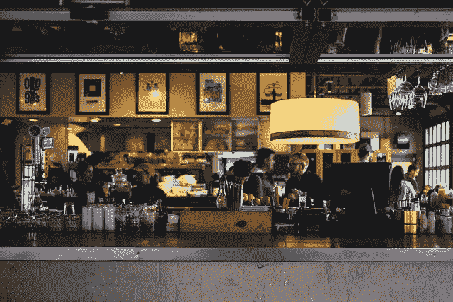
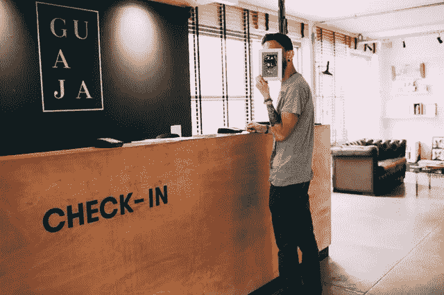
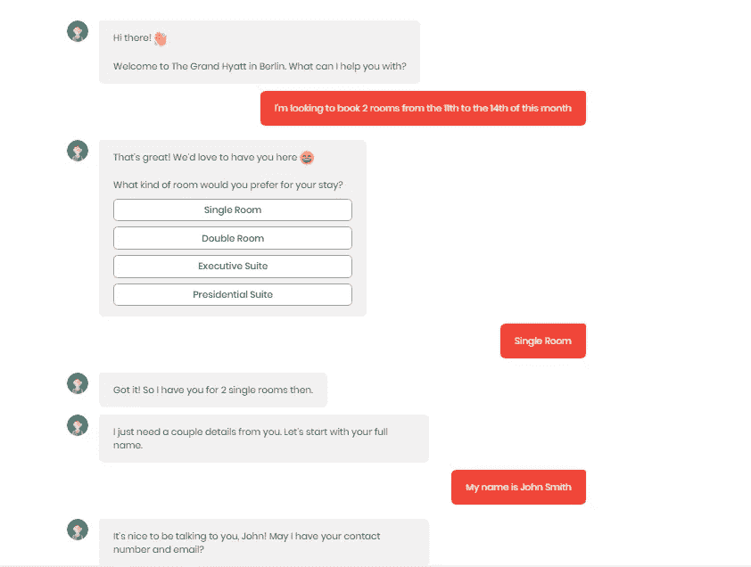

# 如何使用聊天机器人提高酒店业的利润率

> 原文：<https://medium.com/swlh/how-to-improve-revenue-margins-in-hospitality-industry-using-chatbots-d5fd2ae6aeed>

不断变化的顾客期望、不规律的工作时间和高员工流失率是酒店业面临的一些最严重的问题。所有这些问题都阻碍了酒店业的预期增长，并因此降低了客户满意度，对利润率产生了不利影响。

鉴于对现有流程智能自动化的需求不断增长，人工智能已进入传统酒店业，并承诺提高酒店声誉，推动收入增长，并将客户体验提升到一个新的水平。

酒店业的聊天机器人正在改变顾客与酒店互动的方式。这里有一些聊天机器人可以部署在酒店行业的场景，通过提高客户满意度来增加收入和利润。

# 处理酒店预订

对话机器人可以轻松处理与预订相关的查询。这些智能聊天机器人被编程为通过自然语言处理创建模拟对话，并即时回答客户的查询，从而减少周转时间，改善客户体验。

此外，聊天机器人可以用客户/潜在客户的母语与他们交谈，实现人类和您的酒店之间个性化、简洁和高效的互动。聊天机器人是全天候可用的，这意味着人们登陆你的网站，不管他们在一天中的什么时候，他们的问题都可以得到聊天机器人的回答。

# 个性化推荐

人工智能聊天机器人从客户的行为中学习，并可以利用机器学习和特定于业务的算法来提供个性化的建议。在收集了大量顾客数据后，酒店甚至可以预测顾客最有可能选择什么。

聊天机器人可以为酒店客人提供个性化的现场推荐，如餐饮、饮料、酒店内活动、早餐等。基于人工智能的聊天机器人的这种分析能力甚至可以用于评估和识别客户角色，以将他们与酒店提供的相关套餐或服务相匹配。

# 开展营销活动

为了吸引顾客和增加销售额，酒店不断推出新的优惠、交易和套餐。销售团队很难不断联系客户并通知他们这些情况。聊天机器人可以帮助销售团队，通过弹出窗口在他们的网站上推荐这些产品。

因为聊天机器人也可以部署在各种渠道，如脸书、WhatsApp、Telegram 等。，可以通过机器人在所有关注者之间传播关于促销、套餐、折扣等信息。

# 私人礼宾

越来越多的酒店行业已经意识到，深入的客户服务和恰当的客户洞察是增加品牌价值的最佳关键。这就是为什么我们已经开始看到成熟的礼宾机器人的崛起。

聊天机器人可以为客人提供细微的服务和细心的帮助，从而充当客人的私人礼宾。例如，安排水疗服务、预订出租车或航班、协调行李协助、推荐夜生活热点、预订餐厅等任务都可以由聊天机器人轻松完成。一个突出的例子是拉斯维加斯 Cosmopolitan 的时髦人工智能礼宾员 Rose T1。

# 平稳的通信

聊天机器人可以充当客人和酒店员工之间的同步联系点，从而改善酒店内部服务人员和客人之间的整体沟通流程。话虽如此，聊天机器人并不是来取代酒店人员的。相反，聊天机器人将帮助酒店进行泰然自若的信息管理和有效的沟通，这将进一步推动一个更加强大和简化的酒店管理系统来处理日常活动。

通过酒店中的语音聊天机器人，客户可以享受速度和无缝连接，同时轻松访问最重要的联系点，如餐厅、酒店管家和酒店内设施。

在这个数字时代，客户的信息更加灵通，并且可以轻松获得许多选项。不可否认的是，今天的酒店经营者需要适应技术进步，以经营酒店业务，增加利润和收入。

精心制作的聊天机器人有可能填补酒店业客户体验的空白。在 [WotNot](https://wotnot.io/) ，我们与酒店业的知名企业合作开发适合他们业务需求的聊天机器人。更重要的是，我们甚至已经预置了 [***模板***](https://app.wotnot.io/preview/choose-template?url=) ，您可以在网站上实时感受聊天机器人。

那么，你还在等什么？你可以在这里免费体验**wot not 30 天** [。](https://app.wotnot.io/preview/request-demo?url=&themeColor=%23F44336&alignment=right&templateKey=hotel_booking)

Check out the entire conversation [**here**](https://app.wotnot.io/preview/interact?url=&themeColor=%23F44336&alignment=right&templateKey=hotel_booking).

## 这篇文章发表在 [The Startup](https://medium.com/swlh) 上，这是 Medium 最大的创业刊物，拥有+436，678 名读者。

## 在这里订阅接收[我们的头条新闻](https://growthsupply.com/the-startup-newsletter/)。

