# 当制造新产品似乎更容易时，如何改进产品

> 原文：<https://medium.com/swlh/how-to-improve-the-product-when-it-seems-easier-to-make-a-new-one-instead-487aafcdfd84>

我在一家医疗创业公司做兼职设计师。已经花了 150 个小时，相当于 1-2 个月的全职工作。这样的情况已经持续了 1 年。在此期间，我们缓慢但稳步前进。尽管我们只推出了设计内容的一小部分，但一些指标已经有了相当大的改进:

*   现场时间从 2 分钟增加到 20 分钟，即增加了 10 倍。

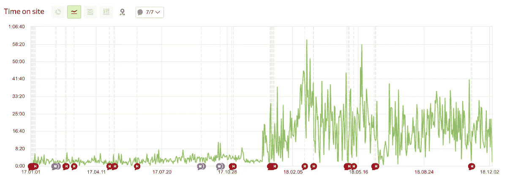

*   页面深度增加了两倍

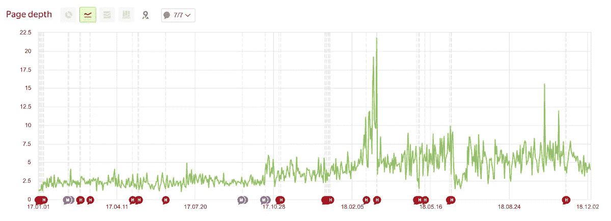

很明显，在一个网站上停留的时间越长并不总是一个好的衡量标准，例如在搜索引擎上。由于我们的服务推荐不同医疗保险公司的项目，人们在购买 1 年医疗服务之前需要时间比较它们的质量。换句话说，这是一个保险项目的传统在线市场，但购买周期较长。

下面是我们如何实现这一结果的故事。

# 问题概述

来自搜索引擎的用户希望购买该程序，但他们不了解其优势或不信任其服务，选择直接从保险公司购买或根本不购买。

以下是我和首席执行官发现的一些原因:

1.  内容和设计的问题

*   很难理解保险计划的好处，尤其是从 MEDO 购买。
*   很难选择和比较节目。
*   该计划包括许多不同的特点，但被设计成一个简单的文本，没有任何风格或视觉元素。
*   颜色很鲜艳，但是重音放错了。
*   购买流程尚不清楚。

2.编程问题

*   过滤器和推荐的程序无法正常工作。
*   装载速度很慢。
*   该网站未针对移动视图进行优化。

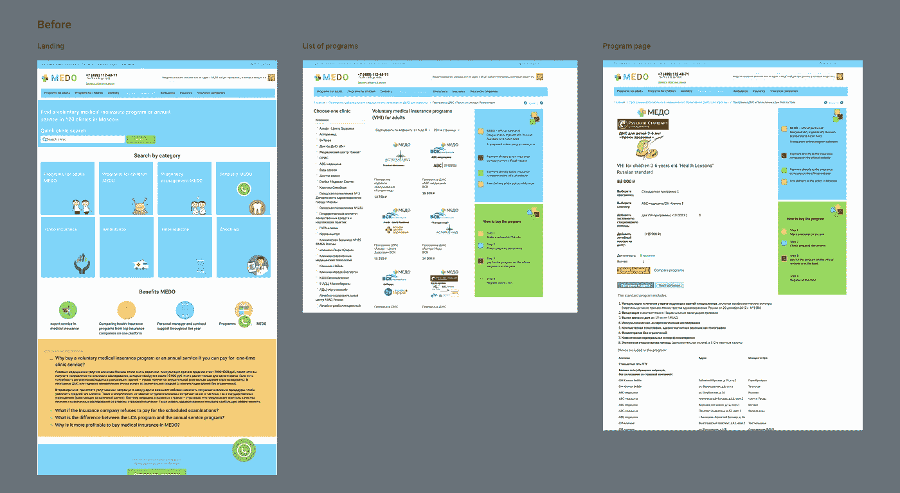

That’s what that project looked like when I joined it

# 做了什么

这是一个兼职项目，已经花了 150 个小时。这段时间我做了什么:

*   客户开发(访谈、[会议录音](https://pp.userapi.com/c849124/v849124740/e2489/Dhw8CFaGAXc.jpg)分析、竞争对手分析)
*   创建设计系统，原型和重新设计。
*   找到开发人员来决定技术堆栈，然后使用堆栈，包括代码审查和测试。
*   寻找搜索引擎优化专家/分析师，并与他一起设置分析。
*   有效且廉价的 B2B 复杂定价可视化。
*   创建登录页面。
*   撰写和编辑项目中的文本。
*   设计自适应和移动版本。

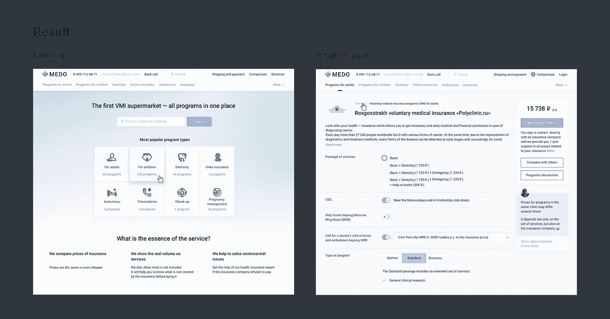

Final version of design

# 工作过程

## 时间和材料，而不是固定价格

我对任务进行了评估，并与首席执行官达成了一致。如果一项任务似乎花费了太多时间，我会建议一个更简单、更便宜的解决方案，或者解释为什么这项任务应该以这种方式完成，以及为什么它对整个项目至关重要。然后在下一篇专栏文章中，我列出了花在这项任务上的实际时间，有时可能会多花一点时间，有时会少一点。它为我们提供了灵活性和更快的性能。

我们还同意额外增加 15%用于讨论和通话。

整整一年，因为一个极其清晰的过程，我们没有任何关于诚信的争论、误解和怀疑。

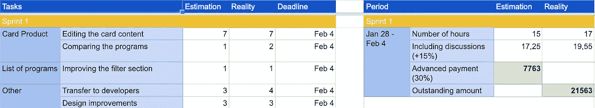

[First sprint report](https://docs.google.com/spreadsheets/d/1vQgvxfUEVcBFSAI3qNXFnntpdGUp7BtN4Fwzppib0r8/edit?usp=sharing) in Google Spreadsheet

## 寻找开发者

我们的服务是在 [CMS](https://en.wikipedia.org/wiki/Content_management_system) 平台上为互联网营销人员提供的。有两个主要选项:

1.  待在同一个 [CMS CS 卡](http://cscard.org/)上，修改发动机。
2.  选择更新更现代的 [CMS Laravel](https://laravel.com/) ，一切从头开始。

我把设计发给不同的网站工作室进行评估，也发给一些开发者寻求独立的建议。我得到了反馈，我们选择了第一个选项。

我如何寻找合适的开发人员:

*   我查了他们的真货。
*   我试图找到真正的评论，但我失败了。
*   我们开始做一个小任务，看看开发人员的表现，截止日期，讨论过程。

我们最终找到了一支优秀的队伍，但在此之前我们已经失败了两次。

## 挑战 1:与自由开发者打交道

第一个团队(开发人员+项目经理)没有在付费时间内完成任务。然后他们开始用一种很常见的伎俩作弊，告诉我们想象中的限制来减少任务的数量。他们也错过了所有的截止日期。在一次独立的代码审查后，我说服首席执行官尽快停止与他们合作，以便节省时间和金钱。

## 挑战#2:与顶级 Upwork 开发者打交道

我希望一个有丰富经验和优秀评论的新开发人员能得到更好的结果。一开始看起来更好。但是，当他开始错过最后期限时，我们巧妙地与他沟通，解释为什么这对我们很重要，他似乎同意了，然后又错过了最后期限。他的表现非常糟糕，在第一次冲刺后，我们就停止了与他的合作。

## 挑战 3:转化率的急剧下降

其中一次释放后，转化率急剧下降。首席执行官想尝试改变按钮的颜色，但我认为这不是一个好策略，因为即使转化率略有增加，找到正确颜色的概率也很低，我们会浪费时间，而不是找到真正的原因。我们分析了[会话记录](https://metrika.yandex.ru/promo/webvisor?ncrnd=8943)并发现了错误:它是在几个网络浏览器中不能正常工作的订单。

## 开始行动:找到优秀的开发人员，并把设计任务交给他们

最后，我们设法找到了一个优秀的开发团队。事实上，他们能够更清楚地解释自己的决定，并提出不同的方案。我开始为他们准备设计。起初我使用 Sketch+Zeplin，但后来将所有项目都转移到 Figma，这样使用起来更方便，花费的时间也更少，例如，在创建组件和颜色&文本样式时。为了保持版本控制，我为同一个项目中的每个新 sprint 创建了新页面。至于任务、缺陷列表和规范，我们使用了概念。

## 文本写作和编辑

我试图让这篇课文更短更清楚。我和 CEO 还分析了用户提出的主要问题，并在 FAQ 和 tips 中给出了答案。

## 分析和搜索引擎优化

这个项目需要有人来做优化，有人向我推荐了一位优秀的专家。他同意帮助我们，我们一起调整了分析的目标，然后开始研究 SEO，这帮助我学到了很多新的东西。

## 不是为了设计而设计

虽然我是一名设计师，但当一个更简单、更便宜的解决方案可能有效地解决这个问题时，我不喜欢使用视觉设计。

该公司需要一种与 B2B 通信的方式。
我建议两种选择:

1.  为他们创建一个附加的用户流，包括一个程序列表和一个联系表单。这是一项漫长而昂贵的任务。
2.  用选项计算器创建一个谷歌电子表格，并将其发送到 B2B。

我们选择了后者，用户可以自己计算费用，而不需要我们花时间去编程和设计网络计算器。客户非常喜欢我们的电子表格，尽管乍一看它很复杂。

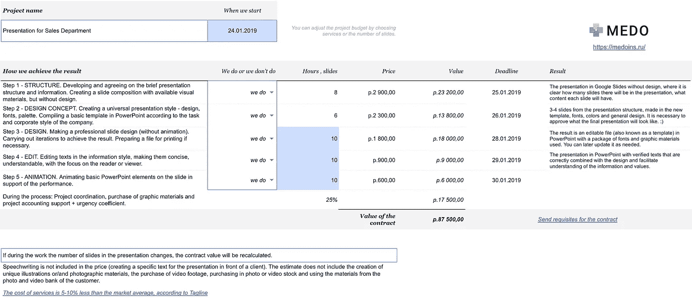

[Sample of spreadsheet](https://docs.google.com/spreadsheets/d/1bir5PLq79eS3UBBHzEyjJve_47I46rqW-_iYJjxOuiY/edit?usp=sharing) with the options calculator for B2B clients

如果你想把自己的图片上传到 Google Spreadsheet，我不建议使用 Google Drive 或者直接添加它们，因为在某些浏览器上图片根本不会出现。我上传图片到社交网络的[，并添加了一个手机链接。工作正常。](http://vk.com)

# 设计过程

## 客户开发

好的一面是，该公司经常与客户沟通。但是他们所有的评论都来自已经购买了该程序的用户——典型的生存偏差。
[会议录音](https://pp.userapi.com/c849124/v849124740/e2489/Dhw8CFaGAXc.jpg)帮助我们减少了对决定不购买的用户的误解。

## 挑战#4:典型图标还是现代 gif？

大多数参观者都在 20 到 30 岁之间，所以我有了用 gif 代替标准图标的想法:这比创建插图更容易，看起来对项目观众来说更有情感和参与性。但是网络分析中缺少一样东西:关于真实顾客的信息。当我向首席执行官询问他们的情况时，我惊讶地得知他们的年龄超过 40 岁，比大多数游客大 10 岁以上。游客喜欢使用这项服务只是出于好奇，他们仍然没有慢性病，也没有真正的购买需求。

> 顾客和访问者可能来自完全不同的受众群体。这取决于项目的类型。

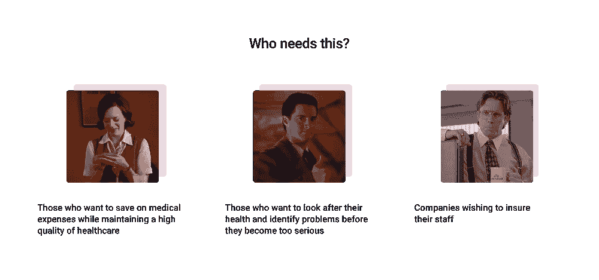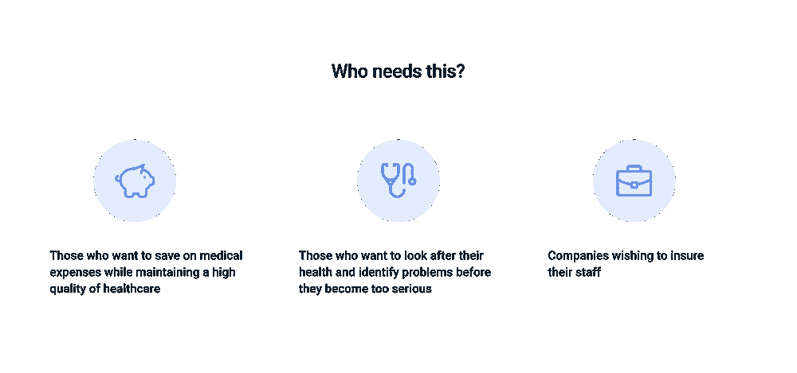

1)view with gifs 2)view with pictograms

我们测试了两个版本，发现用户既不理解也不信任登录页面上的 gif。然后我们选择了标准的象形图。

## 挑战#5:我们有 500 个诊所，150 个保险项目，3-5 套选择…

这项服务包括 500 个诊所，150 个保险项目，每个项目有 3-5 个选项，来自不同的保险公司。最复杂的任务之一是统一它们的设计，使它们清晰易用。我之前重新设计 [Fabuza](https://fabuza.ru/) 的经验对我帮助很大。我还在现代巨大的在线市场中找到了灵感。

我创造了第一个重新设计。CMS 平台有很多局限性，在 CMS 中设计定制模块非常昂贵。正因为如此，我试图改进当前版本，尽可能少地更改它。结果，我错过了几次提高 UX 的机会。我以前使用过跳出框框思考的技巧，但是在那种情况下我没有注意到。我后来意识到，我应该从设计一个概念开始，让它看起来没有限制，然后引入它们。然后我开始在我的工作过程中使用这种技术，并取得了较好的效果。

> 当使用一个非常有限的系统时，最好从重新设计最初的概念开始，然后根据限制来改变它。如果你不这样做，你很可能会浪费时间来考虑各种选择，直到你最终决定上升到一个更高的水平，改变这个概念。

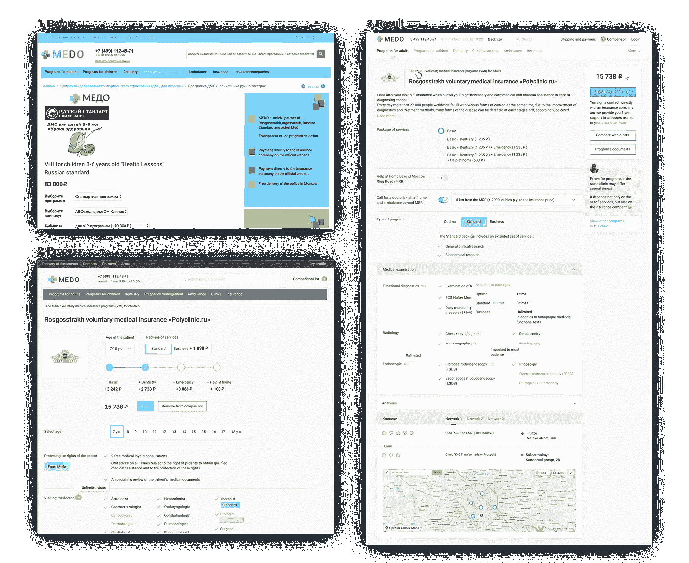

1)The old version 2)First version 3)Second version includes some useful tips from the service.

## 创建登录页面

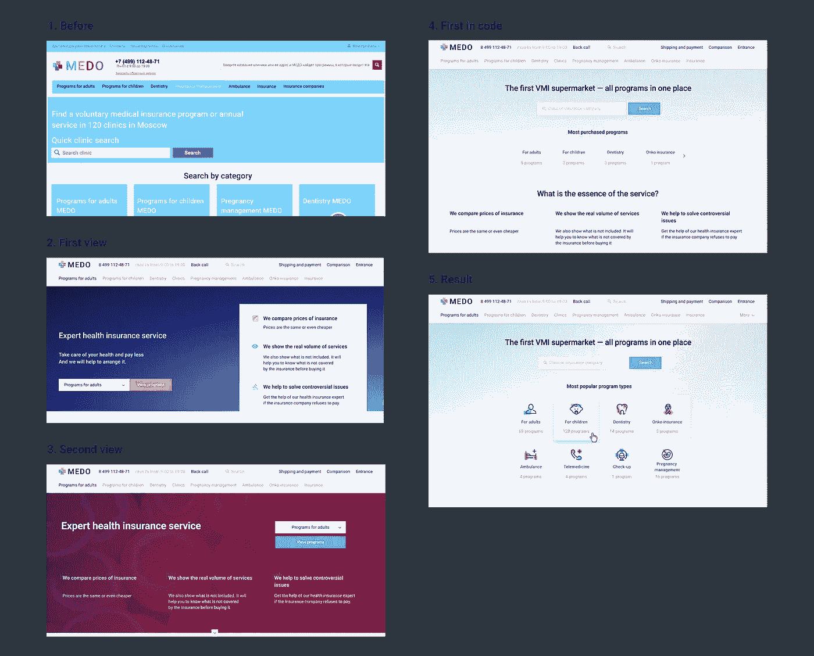

1)The old version 2,3)Iterations for the main page. First mockups 4)First version in code. 5)Users liked the last one because of «bright colours» and pictograms want to click

## 让它在一天内适应并移动

程序在 UX 和文本方面都极其繁重。为了解决这个问题，我添加了中间状态，根据 iOS 指南使页面变亮，并减小了尺寸，但仍保持清晰。

> 花了 1 个工作日将网页版的屏幕调整到手机版。

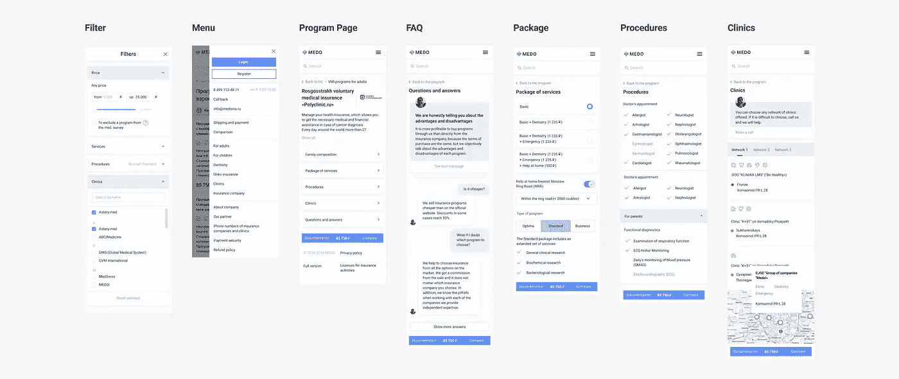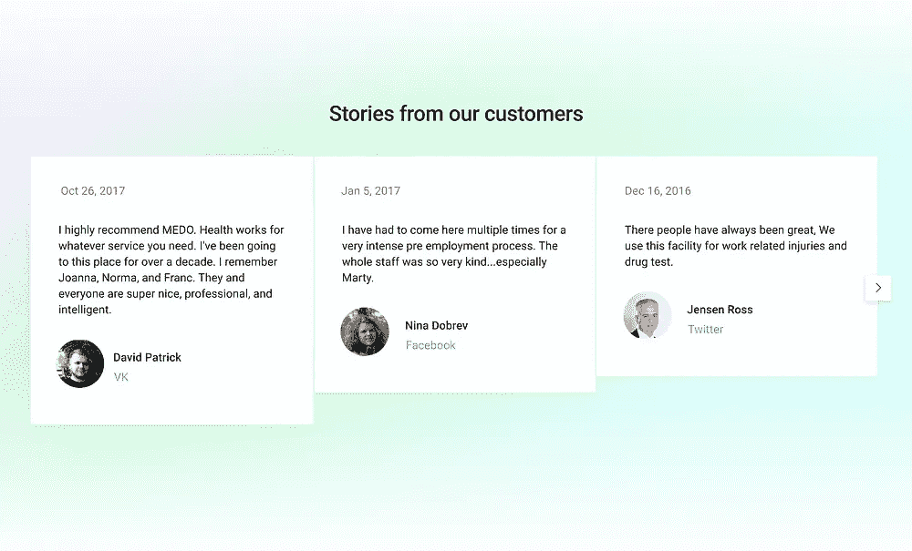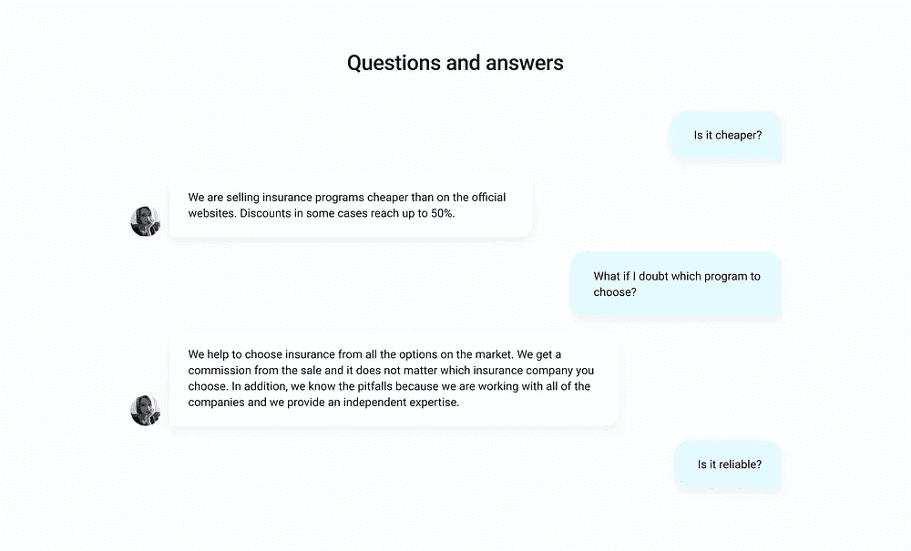

Links to the real user’s review account and chat view for FAQ

# 当前结果

## 我们发布了什么

*   新的登录页面。
*   新的保险计划页面，包含提示、常见问题和我们的服务优势，因为许多客户过去常常直接进入保险计划页面，对服务一无所知。

## 我们还没有发布的内容

*   移动和自适应版本。
*   带有新过滤器的程序列表。
*   交互式计算器显示使用医疗保险与个人就诊相比的优势。
*   评论中使用的真实案例。虽然健康主题过于个人化，但有一些技巧可以让它更像医疗保健和省钱的成功故事。
*   加载速度优化。
*   SEO 优化。

## 我个人和职业的进步

*   管理技能和积极主动的行为。
*   与开发商谈判。
*   对整个产品负责，而不仅仅是我的部分。
*   创建设计系统。
*   用一种风格创建大非正式页面的 UX。
*   提高视觉技能。

**附言**如果你对这个故事有任何疑问，请随时通过[脸书](https://www.facebook.com/whateveryounote)或 [Linkedin](https://www.linkedin.com/in/alexshestakov/) 联系我。

## 这篇文章发表在 [The Startup](https://medium.com/swlh) 上，这是 Medium 最大的创业刊物，拥有+420，678 名读者。

## 订阅接收[我们的头条新闻](https://growthsupply.com/the-startup-newsletter/)。

