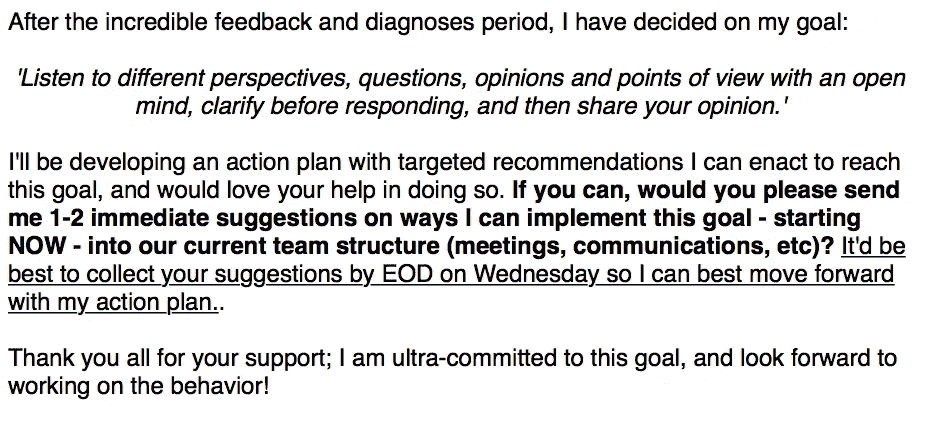
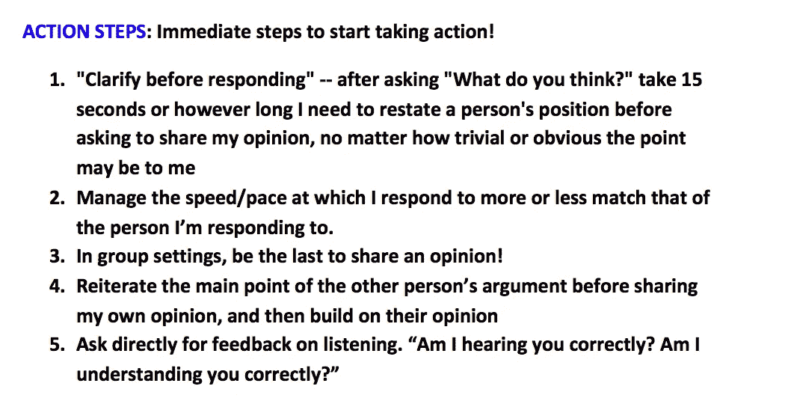
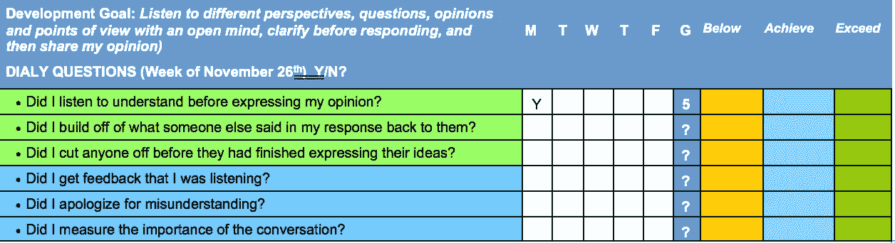

# 根据世界排名第一的执行领导力蔻驰，如何提高你的领导技能

> 原文：<https://medium.com/swlh/how-to-improve-your-leadership-skills-according-to-the-worlds-1-executive-leadership-coach-b6fefec081d1>

Photo by [rawpixel](https://unsplash.com/@rawpixel?utm_source=medium&utm_medium=referral) on [Unsplash](https://unsplash.com?utm_source=medium&utm_medium=referral)

## 利用马歇尔·戈德史密斯以利益相关者为中心的辅导提高领导能力

房间里散发着新鲜采摘的蓝莓和刚榨的自制橙汁的味道。我进行了 360 度的头部旋转来扫描这些简单的美食，但我什么也没看到。相反，我看到了在过去的 30 分钟里弥漫整个房间的气味的真正罪魁祸首。一个“焦橙色”和一个“天蓝色”的干擦记号笔，这是最近用来在教室前面的白板上写“剩余 5 分钟”的。

我刚把铅笔头在一个有小“d”的泡泡里画完圈，就听到教授大喊:“时间到！”

我把扫描仪举到面前，吹了一阵强劲的气流，清除了所有的橡皮擦碎屑，然后把它交给了我的教授。当其他八个学生交试卷时，我们的教授问我们对刚刚进行的测试有什么想法或评论。

在西北大学凯洛格管理学院攻读管理学硕士项目期间，我曾担任高管领导团队的职业发展主管。有一天，在我们正常上课前一个小时，领导团队被邀请与凯洛格商学院领导力开发主管保罗·科罗纳教授一起，就组成一个组织的不同人格类型的重要性进行讨论。

我们刚刚完成的测试是迈尔斯-布里格斯类型指标，这是一份心理问卷，揭示了人们对如何感知世界和做出决定的偏好。这是一种自我反思、自省和发人深省的自我评估，迫使应试者深入挖掘他们的经历，以分析他们在不同场景下更喜欢如何行动。

在进行考试之前，Corona 教授向我们解释了这对像我们这样的领导者学习和理解我们如何最好地工作以给彼此增加最大价值并满足我们项目中其他 70 名学生的需求是多么重要以及为什么如此重要。他概述了世界顶级组织的领导者如何为自己填写这些报告，并接收员工的结果，以便他们可以为自己的团队构建理想的工作环境。这一切对我来说都很有意义，但我有一些东西要添加到对话中。

就在科罗纳教授问我们是否对考试及其好处有任何问题或意见时，我的手像美国法老一样从起跑门里伸出来。我说，

> “我觉得在参加这次考试时，我在选择真实反映我自己经历的答案和真实反映我希望在经历中被人如何看待的答案之间挣扎。
> 
> 我不确定我提供的答案是我实际上是怎么做的，还是我想让别人认为我是怎么做的。
> 
> 那么，如果说，我的两三个同学根据他们看到我在不同场景中的表现来帮我做这个测试并回答，这个测试不是更有益吗？"

他看着我，半带微笑，微微歪着头。

> “这是一个有效的观点，约旦。”

我很惊讶他知道我的名字，但后来我意识到我的姓名牌在我桌子的前面。

> “但是，你如何才能让一个 5000 人组织的领导者鼓起勇气，谦逊地要求其他人评估他或她的领导技能，你如何才能让他或她的同事有信心给他或她坦诚的反馈，而不会太害怕被责骂或解雇？”

麦克风掉落。

我不知道如何回应，所以我只是摇摇头，耸耸肩，给了他一个我自己的微笑。

当会议结束时，该去上我们预定的商业战略课了，科罗纳教授大声要求我留下来和他谈一会儿。

现在，随着年龄的增长，当一个学生被要求课后留下来和老师说话时，会遭到其他学生的大声“哦哦哦”的回应。我小时候从未经历过这种情况，因为我是一个完美的小天使，但我在脑海中想象着这种场景。他的语气与我做的关于下课后被告知留下的噩梦相吻合。

但是，我可能做错了什么呢？我问了一个问题，他给了我一个答案。我想多了。我收拾好背包，在房间里的其他人都走空后走近他。

> "乔丹，你问的问题真不错。"

他笑着说。我松了一口气。我是清白的。

> “谢谢。”

我说。

> “我只是觉得，如果有一些反馈和责任，自我评估可以更好地为人们服务。尤其是在领导者的情况下，衡量一个好的领导者不就是基于他们如何让周围的人感受和表现吗？”

他又笑了。

> "你听说过马歇尔·戈德史密斯这个名字吗？"

他问。

> “没有。”
> 
> "你听说过以利益相关者为中心的辅导吗？"
> 
> “没有。”
> 
> “你听说过高管领导力培训吗？”
> 
> “算是吧。”

我终于认出了他的一个问题。

> “嗯，乔丹，马歇尔·戈德史密斯是一位组织心理学家，纽约时报的畅销书作家，世界上排名第一的执行领导蔻驰，以及以利益相关者为中心的教练的创始人。
> 
> 他有一个和你现在思考的方式相似的想法，并把它应用到世界上成千上万的最好的领导者身上。他认为，如果领导者自己被他或她生活中的关键利益相关者评估，那么领导力是可以量化的。这个过程已经证明了结果，并使马歇尔，连同首席执行官的何教练和教练，他教他的方法，数百万美元在过去二十年。
> 
> 我认为你应该认真考虑一下这个领域，因为你提出的问题和你对领导力的思考方式远远领先于你这个年龄和职业生涯中这个水平的人。"

我当时 22 岁。

一晃一年过去了，在与保罗保持联系，阅读了马歇尔·戈德史密斯的书籍，如*让你在这里的东西不会让你在那里*和*触发*，并报名参加了一个项目，学习以利益相关者为中心的辅导(SCC)技术和流程后，我成为了美国最年轻的以蔻驰为中心的马歇尔·戈德史密斯认证利益相关者。

# **简而言之，马歇尔戈德史密斯以利益相关方为中心的辅导流程**

在我获得培训认证的第一天，我走进了加利福尼亚州玛丽娜·德尔瑞的一家酒店会议室，迎接我的是新鲜采摘的蓝莓和刚榨的自制橙汁，我一年前在教室里和科罗纳教授一起闻到了这种味道。

站在教室前面的是克里斯·科菲(Chris Coffey)，他身高约 6 英尺 4 英寸，宽肩膀，长腿，灰色卷发，笑容满面，是马歇尔戈德史密斯公司的业务联合创始人之一，顶级教练，现在是以利益相关者为中心的教练认证培训师之一。我永远不会忘记当我们这群未来的教练就座时他说的话。

> “嗨。我是克里斯·科菲，你们都是来学习以利益相关者为中心的辅导的。嗯，其实挺简单的。这是你要做的。
> 
> 你要找到一个有勇气、谦逊和自律的领导者，你要要求那个领导者给你 5 到 10 个人，他们可以给你关于他们作为领导者的行为的诚实反馈，你要和这些人交谈，问他们这个人现在作为领导者的行为如何，以及他们将来如何变得更好。你将以匿名方式向领导提交反馈，然后选择一个该领导在接下来的三到六个月内要改变的行为，目标是切实改善该特定行为。
> 
> 然后，领导者将选择利益相关者，或他们生活中受您选择的行为目标影响的关键人物，然后告诉这些人，他或她将在接下来的几个月里与教练一起改变这种行为。
> 
> 领导将要求这五到十个利益相关者提供前馈或未来改进建议，并在行动计划中实施这些建议，行动计划包括每日清单、每周目标、每月报告、非正式和正式反馈、小型调查和最终调查。然后，该行动计划将与利益相关方分享，利益相关方将提供领导者的非正式和正式前馈和评估。
> 
> 项目进行到一半时，利益相关方将填写一份小型调查，从负 3 到 3 的范围内衡量领导者改进或未改进的程度，在项目结束时，利益相关方将填写一份相同范围的最终调查。如果利益相关者的平均分数高于正数，那么这种行为有可定义的、可测量的改进，并且约定被认为是成功的。"

茫然的凝视。

> “看，我告诉过你这很简单。但是，这并不容易。”

本文的其余部分将教领导者和与领导者一起工作的教练如何使用马歇尔戈德史密斯利益相关者为中心的教练方法来可测量地提高行为领导技能，以便更好地培养反映负责人价值观的组织文化。

我将回顾我最近完成的一次实际辅导活动，记录从客户获取到客户契合度的每个组成部分，收集反馈，选择目标，招募利益相关方，制定行动计划，以及管理小型调查和最终调查。

这种方法和这篇文章将试图证明一个论点，即一个领导者不必独自在顶端。领导者的行为、地位和声誉只能通过重视那些受其领导影响最大的人并与之互动来提高。

# **揭穿领导误解**

在深入实际过程之前，我想快速强调三个以利益相关者为中心的教练所驳斥的基本领导神话。

## **1。**T4【高处不胜寒】

这个常用短语用来表达当一个人的头的感觉。首席执行官可能会有这种情绪，认为没有人理解负责业务的每个组成部分是什么感觉。首席执行官可能会觉得在做决策时没有人可以依靠或信任，这就是他或她感到孤独的原因。

然而，以利益相关者为中心的教练，一个单一的，全能的领导者的概念被粉碎。通过严重依赖他或她周围的人，首席执行官能够理解有人和他或她在一起。这种孤独感被冲走了，因为他们作为领导者的表现是基于他们的利益相关者对他们的评价。

## **2。** **领导者不需要提高**

许多人认为，当一个人到达顶峰时，这个人就不再成长了，因为没有理由或可能变得更好。

不对！

领导者的品质决定了组织的品质。按照这种逻辑，只有领导者不断改进，公司才会不断改进。仅仅因为领导者获得了头衔，并不意味着是时候坐下来，以“照我说的做，不要照我做的做”的态度来领导了。相反，这是以身作则，向员工展示你致力于改善自己和公司的最佳时机。

## **3。** **下属无法帮助领导**

普遍的看法是，权威人物不需要或不再需要关键的反馈和帮助，因为这个人在组织的最高层。许多员工认为领导者只是在那里帮助其他人，而不需要他们自己的帮助。

但是，在以利益相关者为中心的辅导中，很明显，领导者可以通过直接询问他们所领导的人，从他们如何指导他人中获得如此多的价值！正如克里斯所说，这是一个简单的想法，但并不容易。

# **选择、发现并成为正确的领导者**

该流程的第一部分是寻找合适的领导者，以便在整个项目过程中与之合作。寻找的核心原则是勇气、谦逊和自律。这不是关于修复失败者，而是关于[进一步改善成功者。](https://mailchi.mp/0012feb18170/bebetter)

## **勇气**

领导者必须足够脆弱，愿意向周围的人寻求诚实和批评性的反馈。如果领导不愿意勇敢的去听这些评论，那么他(她)就不值得你付出时间和投资。

## **谦逊**

这种领导者的自我不能超过他或她自己的利益。一个人的行为，尤其是作为一名领导者，是一个敏感的话题，如果领导者过于武断或防御，那么这种类型的辅导是不会奏效的。

## **专业**

马歇尔·戈德史密斯在获得加州大学洛杉矶分校的组织心理学博士学位时，研究了行为改变和习惯改变。他研究、发现并通过数千次接触证明了行为和习惯不会在一周或一个月内改变。相反，它需要几个月的持续和有意识的努力来纠正一个习惯，更不用说改善一个已经不好的习惯了。领导者必须致力于每一天的工作，以完成他们的目标。

当我开始寻找一个能在日常生活中展示这些原则的领导者时，我首先在自己的人际网络中搜寻，然后再发邮件、建立关系网或打电话。我强烈推荐这作为你获得 SCC 客户的第一步。

我查看了我的联系人名单，他们领导着伟大的团队和快速发展的组织。我想帮助培养一个通过首先定义他或她自己的个人价值观来定义他们文化的领导者。我想展示这位领导者致力于追求卓越，致力于改进，因此他的公司也会这样做。

我想到了一个我钦佩的初创公司创始人，一个创建了一个年轻企业家社区的 22 岁年轻人，我被他的热情、积极和与人沟通的能力所吸引。我给他发了以下邮件:

你好！

*你致力于提升自己和周围的人，这给我留下了深刻的印象，也让我深受鼓舞。*

*我是一名行为领导力蔻驰，我有兴趣与像你这样的领导者一起工作，以提高你自己的行为和领导技能，这样(你的公司)就能够效仿和追随你的脚步。*

我很高兴有机会和你一起工作，这样你就可以更好地领导(你的公司)继续取得应有的成功。

在最初的邮件之后，我安排了一个电话，在那里我能够概述这个过程，并强调他的领导对公司发展的重要性。我通过感受他目前如何看待领导和他的员工来筛选勇气、谦逊和纪律，他成功通过了。

他表达了作为一名领导者不断学习和成长的愿望，他大谈他的员工的重要性，我们一开始交谈，我就可以看出他已经把自我放在了门外。在这次客户发现拜访中，要问的几个直接而重要的问题是:

*1。* *你如何看待自己是公司的领导？*

*2。你对公司的成功有多重要？*

*3。你的员工对公司的成功有多重要？*

*4。* *作为一名领导，你目前面临着哪些挑战？*

*5。你愿意接受员工对你作为领导的行为如何影响公司的反馈吗？*

如果这位领导看起来是一个致力于不断发展、学习和为公司做得更好的人，那么这是一个很好的合作伙伴。

如果这位领导者表现得像一个愿意征求他人对自己的反馈的人，那么这是一个很好的合作对象。

如果这位领导看起来像是一个会连续几个月坚持严格计划的人，那么这是一个很好的合作伙伴。

如果领导不符合这些标准，那么就不要参与。

马歇尔戈德史密斯说，他是在客户选择的业务。他有 99%的辅导成功率，他解释说这是因为他选择了正确的客户。如果一个客户没有表现出他想要的领导者的特征，他就不会接受聘用。

幸运的是，我的客户非常适合。

这是我每天与客户打交道的工作。如果你或你认识的某个领导者能从这种领导力培训方法中受益，请发电子邮件到 jordan.c.gross2016@gmail.com 给我，我们会安排一次免费咨询。还有，你可以在这里找到更多领导洞见 [*。*](https://mailchi.mp/90e68533543a/list) *****

# **收集 360 度反馈**

一旦选定了客户，第一步就是从他周围的人那里积累关于这个人是谁以及他如何领导的数据。领导者选择 5 到 10 个人与教练进行信息交流。领导将发送一封类似如下的电子邮件:

*嗨 _____，*

*我已经决定，在接下来的几个月里，我将与蔻驰行为领导团队一起工作，以进一步提高我作为领导者的技能，这样我们就能作为一个组织共同繁荣发展。*

*我想知道您是否有时间安排一次与我的教练 _ _ _ _ _ _ _ _ _ 的通话，就我现在和过去作为公司领导的表现提供坦诚的反馈。*

谢谢你，我感谢你为公司付出的时间和精力！

我的客户给了我他团队中的五个人，他相信这些人会很好地向我描述他作为一个领导者的行为。我在一周内安排了这五个电话，并详细记录了这些人是如何回答我的问题的。我问的问题很简单:

*1。作为领导，我的客户怎么样？*

*2。作为一名领导者，我的客户该如何改进？*

*3。如果你能为我的客户选择一种对他的领导技能和你的公司有益的行为，你会选择什么，为什么？*

我在一个文档中积累了所有的数据，并使其匿名，这样我的客户就不会担心谁说了他什么。

在进入下一步之前，重要的是首先定义**行为**的确切含义。一个行为是一个人做出的可见的、可见证的、可触摸的行为，可以被另一个人看到和评论。

约定的目标**不是**必须是一个特定的行为，但是实现目标的步骤必须是通过改变行为。例如，一个目标可以是尊重他人，但是在达到这个目标的过程中必须改变的行为可以是这样的，不要比别人说话大声，或者不要超过别人说话。

# **展示 360 度反馈**

然后，我进行的访谈会被整理成一份访谈报告，其中突出了八个需要改进的关键领域。标题是:**尊重、控制情绪、沟通、微观管理、反馈、倾听、专注和偏爱。**

在一个特定的标题下，每个评论来自不同的人。每个标题旁边是回复的数量。括号中是在这一部分的评论对 X 在接下来的几个月中最重要的人数。*斜体的*是*需要改进的地方*。下面是一个截面外观的示例:

**关注点** — 6 条评论(5 个资产领域，1 个改进领域)(0 表示最重要)

像钟表一样管理他的日程表。为与客户或合作伙伴无关的会议留出时间

*典型的企业家心态，给自己施加压力以实现目标。也可以花时间思考，把自己放在单独的区域去做其他项目。感觉对团队其他成员负责，感觉在场*

和其他人相比，他有一种罕见的力量。从他身上获得价值的人会激发他的野心。推销他的想法。最有创意的几个人，给他空间去做。他的为什么是人民。关系

愿景驱动，也知道每一步需要做些什么。推动团队中的每个人行动起来

规划技巧——如何制定项目计划，并使其良好运行。注重运营和组织

清晰的目标

一旦领导有了这个报告，就该分析选择一个目标了。

# **选择目标**

领导者现在正在寻找共性或关键领域，在这些领域中，许多人都强调需要改进的领域。很多时候，有一个特定的话题会跳出来给人看，这是显而易见的。其他时候，这更困难，但在这种情况下，重要的是要考虑公司改进的严重性。什么样的改变对公司最有帮助？一些最常见的目标是:

**1。** **尊重他人**

**2。**建立信任

**3。在给出我的意见之前，虚心听取不同的观点**

**4。** **委托更有效**

**5。** **勇敢地面对破坏团队合作的个人**

**6。** **及时处理绩效问题**

**7。** **培养高管风度**

**8。** **建设性地及时解决冲突**

**9。** **与他人合作**

10。发展团队战略并将其与商业战略联系起来

11。坚持我的信仰

强调一次只致力于一个目标是非常重要的。正如马歇尔所研究的，习惯是很难打破的，一次专注于打破太多习惯会导致整个过程的混乱、不知所措和失败。

对于我的客户，目标是显而易见的。所有的受访者都提到了他的倾听技巧，他最终选择了，

> “虚心倾听不同的观点、问题、意见和观点，在回应之前澄清，然后分享一个观点。”

现在是时候登记他的股东了。

# **招募利益相关方**

根据目标的不同，领导者要么询问提供反馈的同一批人，要么选择新的人作为利益相关者，这是整个难题中最重要的部分，以评估此人在接下来的几个月中是否会改进他们的目标。只有当选择的目标影响到最初没有被要求提供反馈的人时，利益相关者才会改变。

在我的客户的案例中，所有的受访者都直接受到他的倾听的影响，我们把他们都登记为利益相关者。我的客户给他们每个人都打了电话，感谢他们的合作和诚实的反馈，他发了一封电子邮件，描述了他将要努力的目标。

他还立即要求前馈，或建议他如何立即做出行为改变，以提高他的领导能力，并使他更接近他的目标。前馈的概念现在很重要，因为从现在开始，利益相关者被要求忽略过去的行为，只根据他在前进中的表现来评估领导者。这是他选择目标后发送的电子邮件:

一旦收集了建议，就该拿出行动计划了。

# **制定行动计划**

行动计划由利益相关者提供的前馈、领导者必须遵守的每日提醒、每周检查和每月行为改变目标组成。一旦创建了行动计划，就与利益相关者分享，如果利益相关者意识到领导者坚持或偏离了计划，领导者会要求他们每天提供非正式的反馈。行动计划阐明了领导者为实现最终目标所要采取的具体行为。下面是一个例子:

对于我的客户，我还提供了一份每日和每周的清单，上面列有一些行为，如果他注意到自己做了其中的一件事，就要记下来。看起来是这样的:

我告诉他这个图表是记录我建议的一种方式。在一天结束的时候，你打开文档，在每个问题上输入“Y”代表“是”或“N”代表“否”。“M，T，W，T，F”显然指的是一周中的每一天。“G”是目标。我加了 5 表示你在一周的每一天都做了“是”。绿色问题用于会议场合，蓝色问题用于 1-1 对话。如果你愿意，你可以为这一周设定不同的目标。周末给我寄一份。

诀窍是保持倾听周围的行为，并让自己负起责任。在这些行为真正成为新习惯之前，这是一个很好的工具。

一旦分发了行动计划，从项目的后勤方面来看，事情会变得缓慢。现在，领导者的责任是尽可能多地或尽可能少地与教练交流，庆祝胜利或询问失败的问题。

对于我的客户，我在每周开始时检查，询问是否有任何更新或他想谈论或关注的任何事情，在周末，我收到他的每周检查，只有在有任何令人担忧的事情时才会打电话，但从来没有。

# **管理小型调查**

约定开始后 90 天(对于为期三个月的约定)，是时候为利益相关者提供一个小型调查，或者一个可量化的方法来衡量领导者实现其目标的进度。根据行动计划中的项目，每个利益相关者将在-3 到 3 的范围内对改进进行评级，-3 表示领导者退步了，现在的行为比以前更差，3 表示领导者大大改进了行为。0 表示无变化。

由于知识产权法，我不能分享用于此的模板，因为它是以利益相关方为中心的教练网站的财产，但为了避免必须获得在线模板，只需安排与利益相关方的通话并描述上述评级系统。

收到所有分数后，将它们平均。如果分数高于正 1，则认为领导者取得了显著的进步。

我的客户在所有五个行动步骤上都得了 1 分或以上，但我的目标是让他现在每个步骤都得 3 分！

# **遵守纪律**

对于项目的后半部分，正如您之前所做的那样，持续向领导汇报非常重要。坚持写每日日志、每周检查和总体目标。如有必要，行动计划可根据利益相关者的反馈进行更改。如果领导者没有达到期望，那么行动计划的复杂性必须改变，以更好地提升领导者的行为。这种维护和约定将持续到约定结束，届时将进行最终调查。

我和我的客户没有改变行动计划，我们每周谈一次。他向我提出任何迫切的问题。

# **最终调查评估**

SCC 与其他类型的高管领导力培训的区别在于，它提供了可量化、可衡量的结果，证明领导者在他们设定的行为目标上变得更好或更差。

这是通过最终调查完成的，这是一个更深入的小型调查版本，再次从所有利益相关者那里获得平均分数，如果高于正 1，则表明领导者积极地改变了他们的行为。

我亲自与我的客户会面，讨论他的分数。我傻笑，因为我们在他的办公室见面，在房间前面的白板，窗台上的蓝色和橙色标记。当他所有的分数加在一起时，他的平均分是 2.3，他的最终目标得到了评估。他的利益相关者对他在日常领导和行为中做出的微小而有力的改变给予了密切关注，这在他的最终调查中得到了体现。

# **遗言**

在完成这个辅导项目并与这位出色的领导者交谈后，我们谈到了最后的收获以及他从这个过程中得到了什么。他所表达的是你能给你的客户增加的价值，以及你作为一个组织的领导者应该努力的感觉。

## **1。** **你并不孤单，关系决定一切**

最终，这个过程会改变公司内部的关系。一个领导者与他或她周围的团队更亲近，有更多的信任，有更多的责任，对每个人的行为有更多的所有权。

团队的许多成员都参与其中，公司的每个人都意识到领导正在积极努力变得更好。领导者不应该再是公司可怕的、难以接近的傀儡。相反，应该是与员工并肩作战的人，以身作则。

## **2。** **这改变了组织文化**

在描述公司以及人们在公司中的行为时，文化已经成为一个热门词汇。简单定义，文化就是定义某一套规范的各种行为。

通过这一过程，整个公司能够与首席执行官一起改变其行为和规范，最终改变文化。

## **3。** **这是关于打持久战的**

就投资回报而言，培养组织中的领导力、增强企业文化或加强公司内部的关系都没有货币价值。

也就是说，这一过程对领导者的好处是预防和积极主动，而不是被动反应。在火灾发生前理解这些原则，而不是在火灾发生后经历这样的约定，这才是最重要的。

总而言之，领导者和他们周围的人一样优秀，如果领导者也积极努力变得更好，他们周围的人也会变得更好。

** * *这是我每天与客户打交道的工作。如果你或你认识的某个领导者能从这种领导力培训方法中受益，请发电子邮件到 jordan.c.gross2016@gmail.com 给我，我们会安排一次免费咨询。还有，你可以在这里找到更多领导洞见* [*。*](https://mailchi.mp/90e68533543a/list) *****

## 这篇文章发表在 [The Startup](https://medium.com/swlh) 上，这是 Medium 最大的创业刊物，拥有+417，678 名读者。

## 在此订阅接收[我们的头条新闻](http://growthsupply.com/the-startup-newsletter/)。

