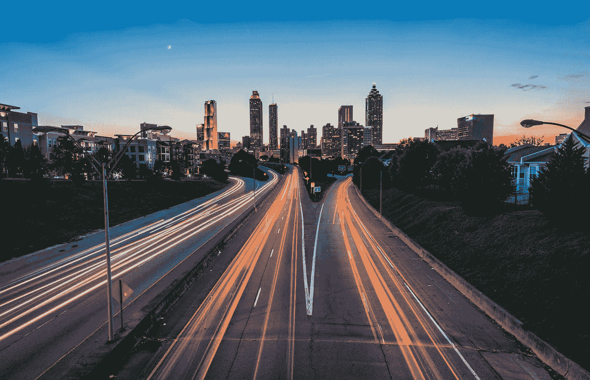

# 如何利用社交媒体增加网站流量

> 原文：<https://medium.com/swlh/how-to-increase-your-website-traffic-using-social-media-997b3757c54c>

*根据 2019 年的最新研究，估计全球将有约 27.7 亿社交媒体用户，高于 2017 年的 24.6 亿。作为一个网站所有者，这意味着什么？一个更大的池来吸引更多的观众和访问者，这反过来增加了你的网站的参与度。*