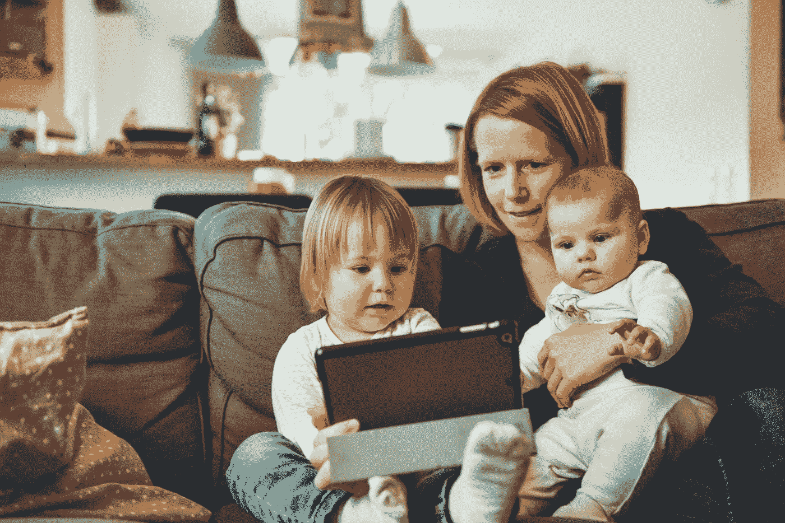

# 如何兼顾自由职业者和孩子

> 原文：<https://medium.com/swlh/how-to-juggle-a-freelancing-business-with-children-82fe0e0c08bd>

Photo by [Alexander Dummer](https://unsplash.com/photos/UH-xs-FizTk?utm_source=unsplash&utm_medium=referral&utm_content=creditCopyText) on [Unsplash](https://unsplash.com/search/photos/mom?utm_source=unsplash&utm_medium=referral&utm_content=creditCopyText)

你知道英国目前有 287，000 名自由职业母亲吗？职业妈妈现在占自由职业者总数的 15%,自 2008 年以来，这个数字上升了 70%。

随着越来越多的女性决定将自己职业生涯的命运掌握在自己手中，各地的“创业者”都在家里努力工作，既要照顾自己的孩子，又要照顾家人