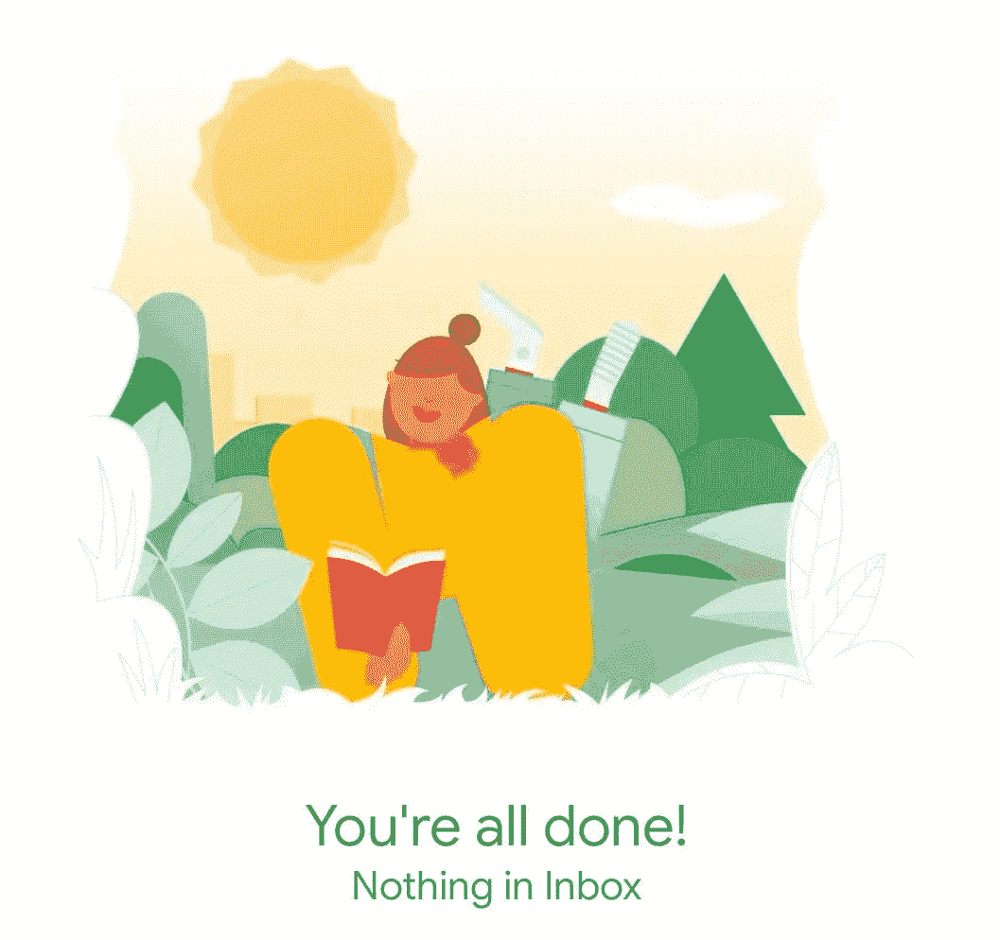

# 如何从不错过任何一封邮件

> 原文：<https://medium.com/swlh/how-to-keep-an-uncluttered-inbox-5ea018b4453e>

很少有人知道我在本文开头使用的图像是当你的收件箱中没有电子邮件时 Gmail 移动应用程序显示的图像。当每天有 100+封电子邮件到达收件箱时，看到这张图片感觉是一种成就。多巴胺流动，能量水平增加，生产力提高。

在这篇文章中，我将回顾我建立的帮助我掌握…