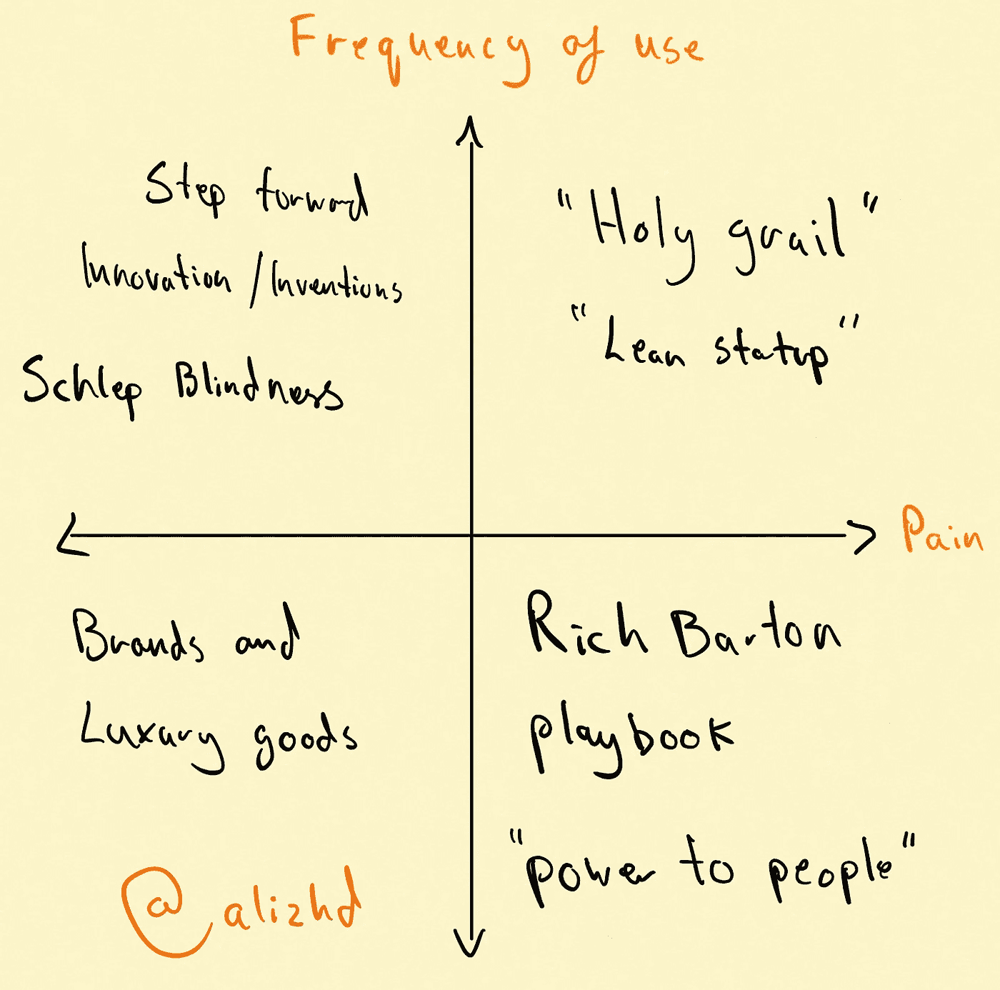

# 如何知道你的创业想法值 1 美元还是 1 美元 1B

> 原文：<https://medium.com/swlh/how-to-know-if-your-startup-idea-is-worth-1-or-1b-8fa4bbebbdae>

我喜欢思考新想法和评估新市场。这些是我用来帮助创业者思考他们的想法的一些框架。

## 痛苦，但不频繁= Rich Barton 剧本

像买房子、找工作、遗产规划或预订旅行这样的活动有时很痛苦，但不是经常性的…