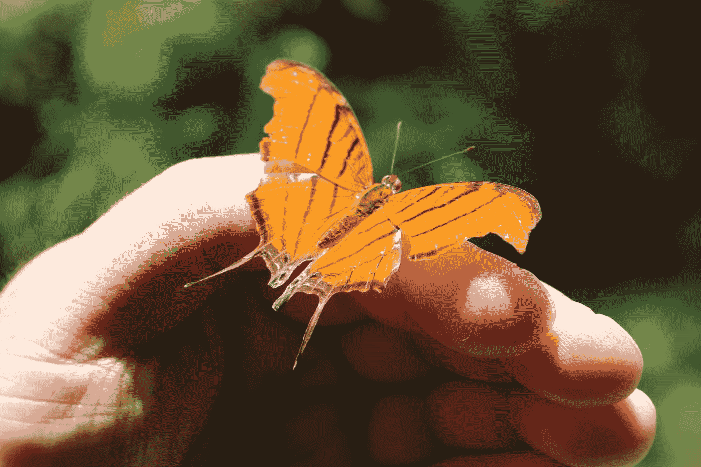

# 如何在准备好之前放下工作

> 原文：<https://medium.com/swlh/how-to-let-go-of-your-work-before-youre-ready-82da154b90d8>

Photo by [Jonathan Hoxmark](https://unsplash.com/@hoxmark?utm_source=medium&utm_medium=referral) on [Unsplash](https://unsplash.com?utm_source=medium&utm_medium=referral)

## 逃离完美陷阱

> 创造力最大的敌人是自我怀疑。西尔维亚·普拉斯

你怎么知道什么时候放下工作？

就像养孩子一样。有些父母从不放手，他们的孩子因此更糟。那些做了的人仍然没有完全准备好。

你怎么能把这些话，你内心的这一部分，送到一个残酷的世界里去呢？

你可能知道有人正在努力创作他们的创意宝贝——一部小说或电影剧本。你在网上阅读他们的评论，或者在活动中与他们聊天。他们告诉你他们已经为此努力了一段时间。

“多长时间？”你问。他们告诉你到目前为止已经过了好几年了*。这些完美主义者已经为这件作品努力了五年、七年、十年。而且他们也不知道什么时候能完成。*

*或者可能是你的工作一直在蹒跚前行。你被困住了，因为你不能弄清楚你的幻想帝国法院的结构，或者你对堪萨斯州春天天气模式的研究导致你进入越来越神秘的走廊。*

*总有一天你会发表或提交。但是还不完善。所以你伟大的作品就在你的硬盘上，全世界都看不到它。*

# *你害怕什么？*

> *创造力需要勇气。
> 亨利·马蒂斯。*

***完美主义者通常是拖延者。你相信如果一件事值得去做，就一定要做好，否则不行。所以你要么无休止地返工和编辑，要么你甚至不开始，因为你永远不能得到绝对正确的。你不能编辑空白页面。***

*你将这些感觉隐藏在强大的心理防御后面，并将其升华为无意义的活动。但是研究不是写作。在某种程度上，你知道这一点，你对自己很失望。*

## *完美主义的核心是恐惧。*

*害怕失败。*

*害怕*成功*，因为之后你又要重新做一遍，导致又回到害怕失败。*

*要克服完美主义，你需要了解自己的恐惧，并掌握它。勇气不是没有恐惧，而是不顾恐惧的行动。*

*勇气是深呼吸，无论如何都要去做，因为你对某件事的渴望大于对可能发生的事情的恐惧。*

*如果你从不挑战自己，克服恐惧，你就无法进步或成长。你真正想要的一切都在你的舒适区之外。*

*为了走出去并茁壮成长，你需要放弃一些想法，接受新的思维。*

# *每个人都很差劲——没人在乎*

> *我向你保证…除了你，没人关心你的生意。没人。
> [阿尔温德·古普塔](https://www.ted.com/speakers/arvind_gupta)*

*恐惧是我们都了解的一种基本情绪。你害怕因为做错事而受到羞辱和嘲笑。也许你会重现一些因为一个小错误而被嘲笑的旧记忆，这是你目前回避行为的基础。*

*以下是两个你应该把它留在过去的理由。*

1.  ***每个人都在开始时吮吸**。你现在崇拜的每一个作家、演员、艺术家或体育人士，在他们选择的学科上曾经都很糟糕。他们写了糟糕的散文，错过的镜头比得分的多，在舞台上忘了台词。但是他们继续并利用这些早期的失败随着时间的推移而改善。总的来说，没有人得分完美。*
2.  ***人们实际上并没有看得那么紧**。他们被他们的内心生活吞噬，就像你被你的内心生活吞噬一样。即使他们朝你这边看，他们下一刻也会忘记你，因为他们自己的戏剧会接管。虽然你可能会觉得好像每个人都在看着你，但事实并非如此。在心理学上，这被称为[聚光灯效应](https://www.verywellmind.com/what-is-the-spotlight-effect-3024470)。了解聚光灯效应是一种解放。它让你可以自由地做任何你需要做的事情，而不受所谓观众的压力。*

# *表现得像个婴儿*

> *没有错误和失败，学习永远不会成功。
> [弗拉基米尔·列宁](https://www.earlychildhoodeducationzone.com/quotes-about-education/)*

*婴儿是世界上学习最快的人。从零开始，他们在两年内学会了进食、行走、交谈和生活在一个社会单元中。他们做到这一点不是因为完美，而是相反。他们跌倒，跌倒，又站起来。*

*他们胡言乱语，鹦鹉学舌，起初并不理解。最终，他们达到了能够奔跑、跳跃和唱儿歌的能力水平。*

*他们不会自责，因为他们还不会背诵莎士比亚。他们只是聊天，听成年人纠正。每一次尝试，他们都更接近于可理解的演讲的目标。*

*你以同样的方式学会了说话、走路和无数其他复杂的技能。如果你一直等到自己变得完美才说话，那么很多年来你都不会说一句话。*

****培养初学者的思维。*** 要明白，假设的错误是回到正确道路上的路标，你就不会那么害怕你的结果。不要根据无法达到的完美程度来判断，而是根据你上次尝试的地方来判断。*

*您已经知道如何学习和提高。调整您的目标，然后重试。*

# *少即是多*

*当你埋头阅读一篇精心制作的博客文章，不知疲倦地寻找正确的图片和引文时，其他作者也在增加他们的产出。他们并不是在为完美的形象而苦恼，以此来配合他们完美的话语。*

*哦，你说，但是你喜欢质量胜于数量。人们重复这种低产出的理由，好像这是福音真理。这是完全错误的。*

## *数量导致质量*

*在一项实验中，陶艺班的学生被分成两组。一组被告知他们可以通过上交一份完美的作品来获得 A。另一组被告知，他们将只根据生产的任何质量的产品的总重量来评分。*

*结果令人惊讶。第二组创作了大量非常好的作品。他们从完美的束缚中解放出来，不受惩罚地自由试验。我敢打赌，他们对自己的工作也很满意。*

*反复练习增加了他们的技能和信心。他们没有被过度分析所麻痹，也不担心批评。他们不害怕不可能被闪电击中两次，因为他们知道如何制造风暴。他们能够复制好的作品，因为他们知道制作它需要什么。*

***赚得越多，得到的越多。***

# *不搭理*

**

*Photo by [Stefany Andrade](https://unsplash.com/@stefany_andrade?utm_source=medium&utm_medium=referral) on [Unsplash](https://unsplash.com?utm_source=medium&utm_medium=referral)*

> *艺术永远不会完结，只会被抛弃。
> 达芬奇。*

*想象一下，如果达利拒绝让任何人看他的画，或者如果米开朗基罗痴迷地雕刻和打磨他的大卫。我们会变得多穷啊！请记住，艺术家最著名的作品只占其总产量的一小部分。*

*作家从完成一个故事中学到的比从开始和放弃十个故事中学到的更多。你会知道你在哪里把自己逼入困境，以及如何找到出路。你会知道你能玩多少花样。你会学到什么是好的结局。最终，你会将所有这些技能结合起来，从有意识的能力转变为无意识的能力。*

*换句话说，你将**掌握你的技术**，并花更多的精力决定把球放在哪里，而不是如何踢球。*

*在某些时候，你必须宣布一件事情完成，然后让它过去。你的技术越精细，就越难。你总是觉得还有一件事你可以改进。*

*让它去吧。装运它。发布，提交，然后继续下一件事。这就是秘密；总是有下一件事。当每件作品在你的投资组合中所占的比例变小时，它就变得不那么珍贵了。你可能仍然有你最喜欢的和你不屑一顾的，但是整体才是最重要的。*

***自信来自于提升。你知道你可以再做一件，而且可能会比上一件更好。如果不是，也没关系。***

*这才是真正的创作自由。*

**

## *这篇文章发表在 [The Startup](https://medium.com/swlh) 上，这是 Medium 最大的创业刊物，拥有+429，678 名读者。*

## *在这里订阅接收[我们的头条新闻](https://growthsupply.com/the-startup-newsletter/)。*

**