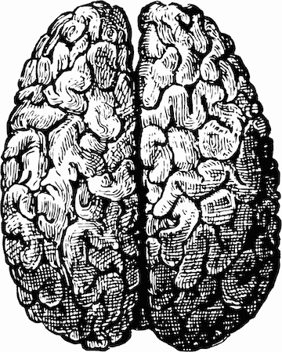

# 如何(从字面上)清洁你的大脑

> 原文：<https://medium.com/swlh/how-to-literally-clean-your-brain-834e905f1b0b>

过去十年的 glymphatic 研究告诉我们关于睡眠及其对大脑健康的重要影响

大脑:不管你是否相信，漂浮在你头骨中的柔软胶状物质对你所知的生命负有责任。此时此刻，你的大脑同时保持着你的呼吸和心率，同时将屏幕上的这些黑色曲线变成连贯的文字…