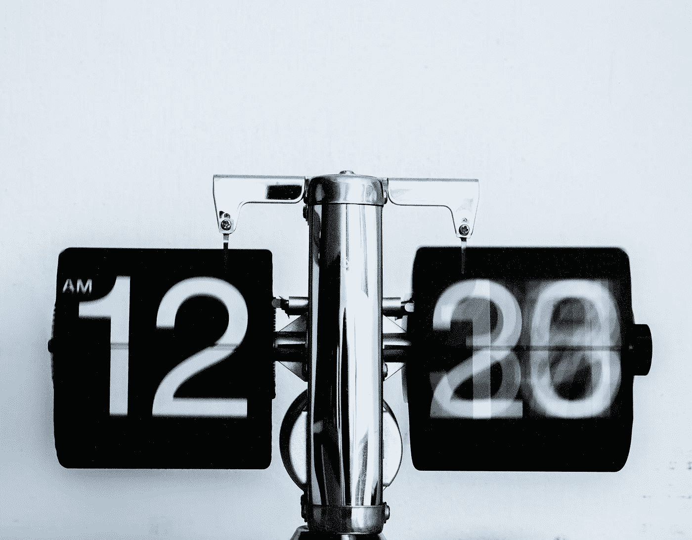

# 如何活在当下，让你的时间有价值

> 原文：<https://medium.com/swlh/how-to-live-in-the-present-and-make-your-time-count-830e670f3060>

如何充分利用一天中的时间？

当你今早醒来时，你还有一整天的时间。当你上床睡觉的时候，那一天就已经过去了。

时间就是这样运作的，不是吗？你每一秒都在浪费时间；无论你如何努力，你都无法让时光倒流。

时间是如此珍贵而有限的资源，然而我们经常忽视或滥用它，以为还有时间。我们有时过于关注错误的优先事项，以至于最终把宝贵的时间花在了长远来看无关紧要的事情上。而且，我们可能没有在重要的事情上花足够的时间。

你有没有反思过你醒着的时候是怎么度过的？

也许你可以在一天中用更多的时间来完成更多的工作。或者也许你渴望花更多的时间和家人在一起，但总是觉得自己被盘子里的东西压得喘不过气来。你可能一直想开始一个爱好，或者尝试一些新的东西，但是因为现有的责任而没有时间去做。

好吧，如果你现在不开始…你会吗？问问你自己，**‘我真的过着最好的生活吗？’**

下面是一些帮助你更清楚自己所花时间的技巧，以及如何真正让每一秒都有价值。

# 关注当下

正念有时可能是一个模糊的术语。人们经常试着保持正念，或者在当下，在假期，或者和他们爱的人在一起。但是，*关注当下*到底意味着什么呢？

嗯，它只是意味着让你意识到你在做什么。这是一种训练你的大脑更有效、更好地融入周围环境的做法，所以你更少分心，更专注。这也有助于减少压力，让你成为最好的自己。

那么你如何练习正念呢？

它不需要占用你的任何空闲时间。你可以在日常活动中练习正念，比如刷牙、洗澡、吃早餐或步行上班。放大这些活动的景象、声音、气味、味道和感觉，否则你会在自动驾驶仪上做这些事情。

早上醒来的第一件事就是练习，因为这有助于为一天的剩余时间设定神经系统的“基调”，增加其他正念时刻的可能性。

有一点要注意的是，当你在练习正念时，让你的思想开小差是没问题的。你并不总是需要意识到，因为*注意到你的思想已经走神*，然后将它带回到意识中的行为本身就是有益的。

我们的大脑对正念的爆发反应更好，所以最好一天几次正念，而不是一个小时的冗长会议，甚至是去周末静修。例如，当你步行去上班时，你可以专注于你穿着这双鞋的感觉，或者当你啜饮早晨的咖啡时，你的喉咙和舌头的感觉。这些只需要几分钟的意识。

最后，在日常生活中培养正念的最好方法是[训练自己冥想](https://www.lifehack.org/698403/how-meditation-can-change-your-life)。练习冥想是学习当下的语言，帮助我们不费吹灰之力就能进入正念。

# 欣赏此时此地

除了练习正念之外，欣赏此时此刻你在生活中所拥有的也是有益的。

无论你在做什么，无论是一个有趣的项目还是一个平凡的任务，欣赏它的每一刻，并努力找到其中令人愉快的方面。例如，当你走向你的车或去工作的时候，真切地感受你脚下的路面，空气中的微风，你周围的风景。

如果你训练自己以那种方式看待它，任何事情都是令人愉快的。这也可以适用于洗衣服，洗碗，或报税！

你不需要只对生活中像金钱或物质财富这样的大事心存感激。如果你能欣赏生活中的小事并从中找到意义，你就离真正活在当下更近了一步。

停止多任务处理

这是一个有争议的问题。过去的情况是，如果你能一心多用，你会被认为更有效率，在更短的时间内完成更多的工作。然而这些天来，大多数生产率专家都会同意[多任务处理是*而不是*提高效率的方式。震惊？](https://www.lifehack.org/articles/productivity/how-to-multitask.html)

向下滚动继续阅读文章

嗯，简单的解释是，当你一心多用的时候，你的注意力会被你要做的事情分散。结果，你实际上对每项任务都不太专注，这导致了更低的生产率，可能需要更多的时间或更低质量的结果。

所以，尽管你想节省时间，最好还是一次专注于一项任务。当你感到有转换到其他任务的冲动时，暂停一下，深呼吸，把自己拉回到你目前关注的单一任务中。

# 与他人相处时要完全在场

通常，当我们花时间和别人在一起时，我们并没有真正和他们在一起。身体上，我们可能是存在的，但很多时候我们会被手机或其他设备分散注意力。如果不是这些，我们可能会分心——想着我们需要做的事情，或者我们需要回复的邮件，或者我们第二天晚上的晚餐计划。

其他时候，我们可能会听，但我们实际上是在想我们自己和我们想对那个人说什么。这是我们大多数人都会犯的非常常见的人类行为，但好消息是，通过努力，你可以关闭外部世界，只与你共度时光的人在一起。

这能更有效地利用你的时间，帮助你与人交流，而不仅仅是和他们在一起。大多数人喜欢更深层次的联系，尤其是和他们重视的人，所以真的要花时间去实现。

# 用智能手机休息一下

这是一个常见的提示，你可能很熟悉。但是，这也很有帮助——尤其是当你发现自己在工作中或在家试图放松时经常分心。

与手机断开连接很有用，这样你就可以专注于其他事情。当然，一直保持联系的好处是，你可以随时获得新闻、信息和提醒。但是，这样做的不利之处也在于，这意味着你会受到那些到来的需求和警报的支配。你变得习惯于即时反应，有时是以牺牲其他经历为代价的。

哈佛商学院的莱斯利·帕洛教授在一项研究中发现，在 1600 名经理和专业人士中，70%的人说他们在起床后一小时内查看手机；56%的人在入睡前一小时内查看手机；51%的人在休假期间连续查看手机；44%的人说，如果他们的手机丢了，而且一个星期都不能更换，他们会感到“非常焦虑”。

你可能会辩称，你没有把时间花在玩游戏或上脸书，而是在做更有价值的事情。但是，重要的不是你在做什么，而是当你切换回一项任务时所损失的时间。

当被手机分散注意力时，采取行动，需要 23 分钟才能回到被打断前的注意力水平。所以，如果你让你的手机每 10 分钟打断你一次，想想你一天损失了多少时间和资源？

# 不要匆忙度过一生

归根结底，我们在地球上的时间都是有限的，所以我们应该努力充分利用它。

这并不意味着我们应该急于求成，试图一次做完所有的事情，以至于我们忘记了闻一闻玫瑰花香，忘记了和我们所爱的人在一起，忘记了欣赏生活中的小事。

更重要的是要知道你所花的时间是有意义的，并且你在优先考虑正确的事情。如果你没有活在当下，那就是现在！

开始实践我上面分享的一些建议，看着你的生活慢慢转变，你开始珍惜每一秒。

[照片由 Djim Loic 拍摄](https://unsplash.com/photos/ft0-Xu4nTvA)

*原载于 2019 年 5 月 30 日*[*【https://www.lifehack.org】*](https://www.lifehack.org/838452/live-in-present-make-time-count)*。* [*关注*](https://www.lifehack.org/subscribe) *获取更多更新！*