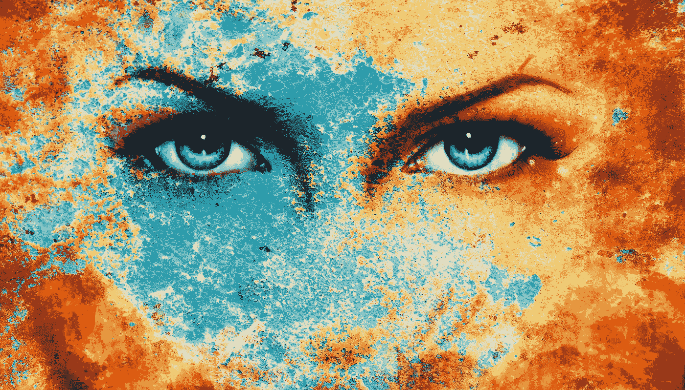

# 如何从破碎的过去创造美丽

> 原文：<https://medium.com/swlh/how-to-make-beauty-from-a-broken-past-9920aeda874e>

## 重新定义你的过去，重新开始

Copyright : [Jozef Klopacka](https://www.123rf.com/profile_jozefklopacka)

当我想到“家”这个词时，我百感交集。

我生长在一个破碎而充满暴力的家庭，父母经常虐待我。

我的环境变化无常，不可预测。

我确信我不会活着离开我父母的家。要么他们会…