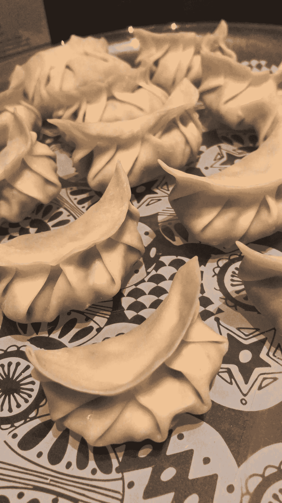
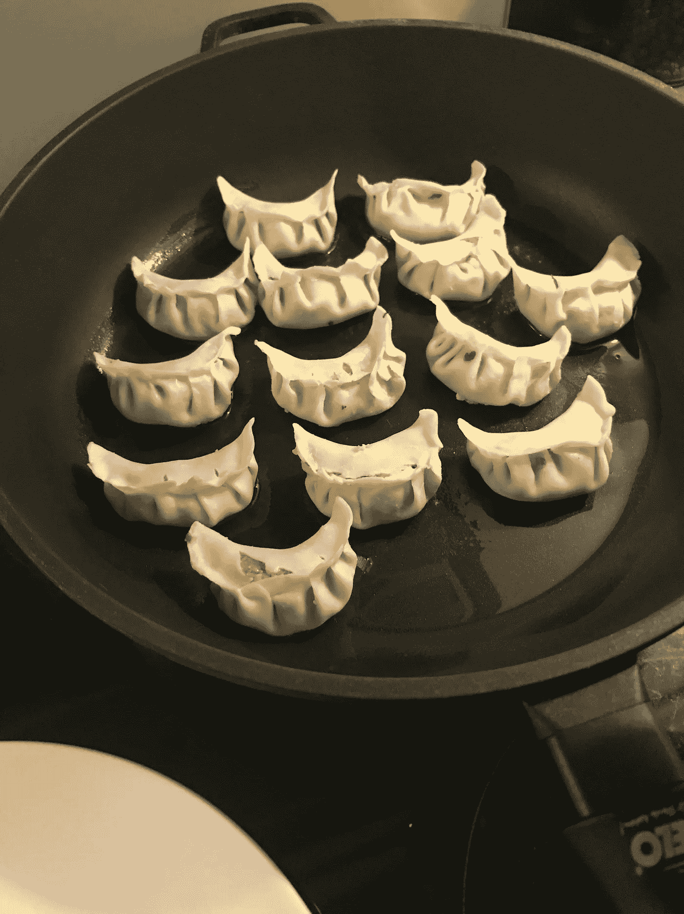
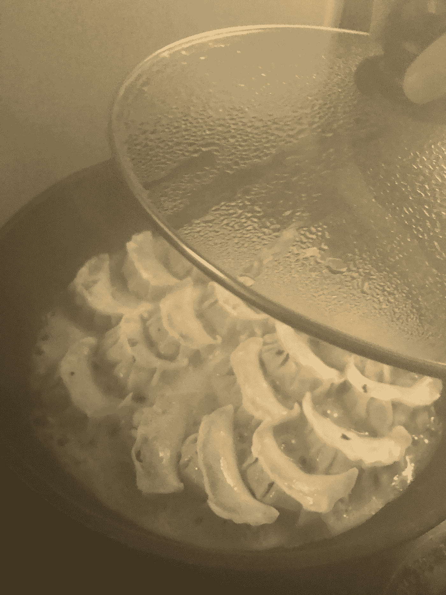
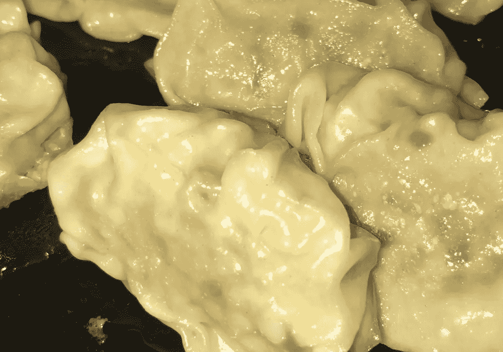
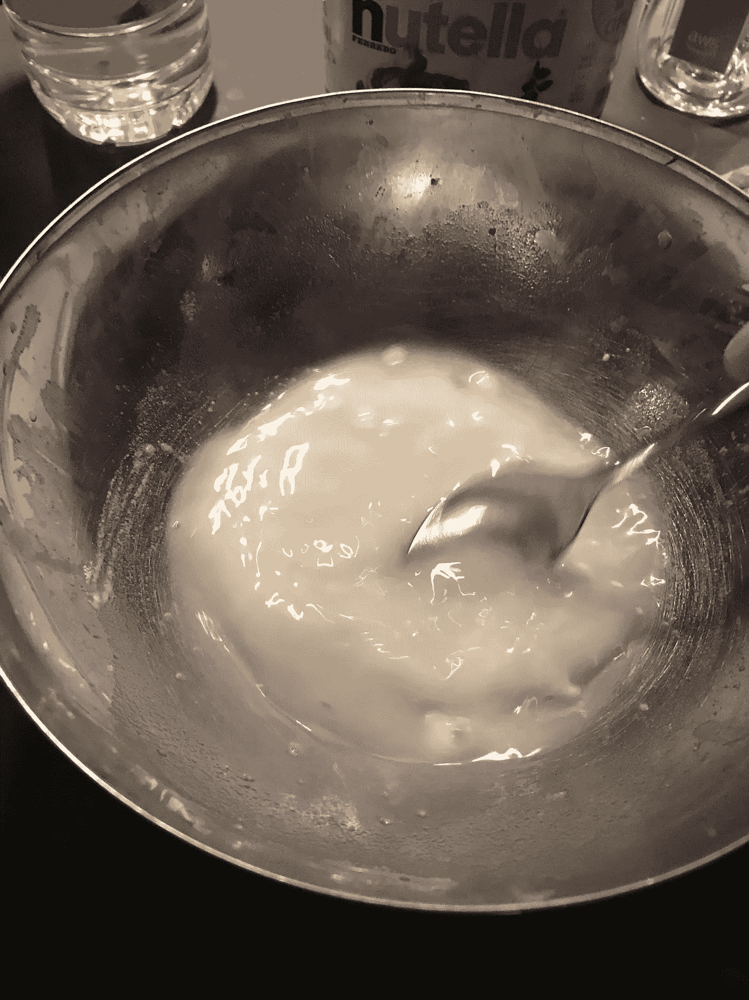
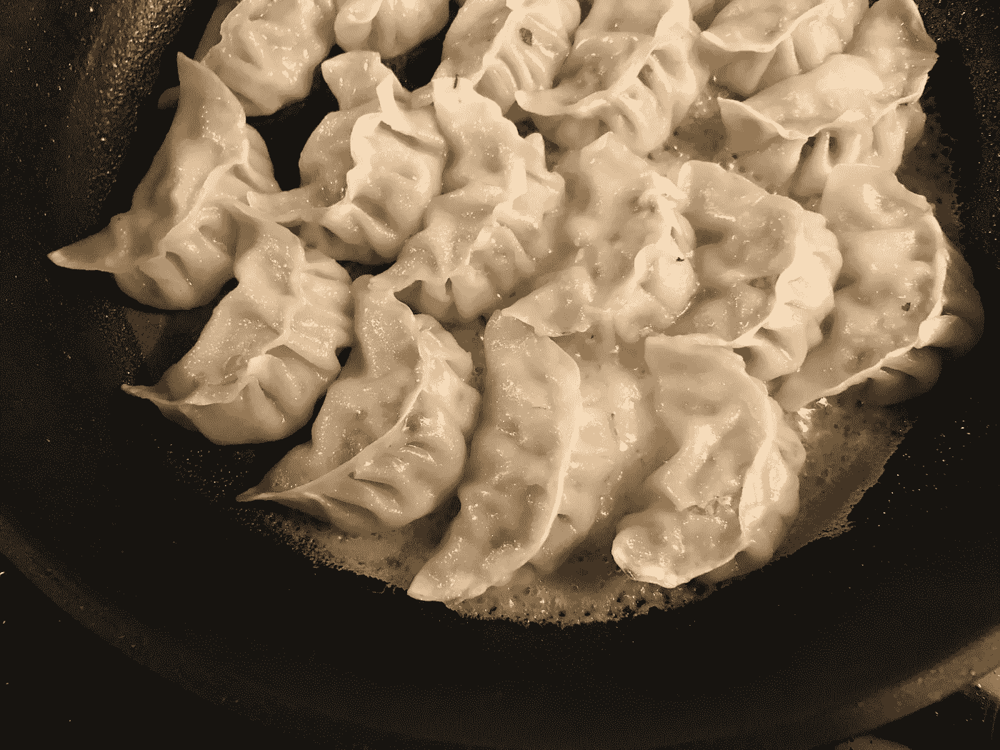
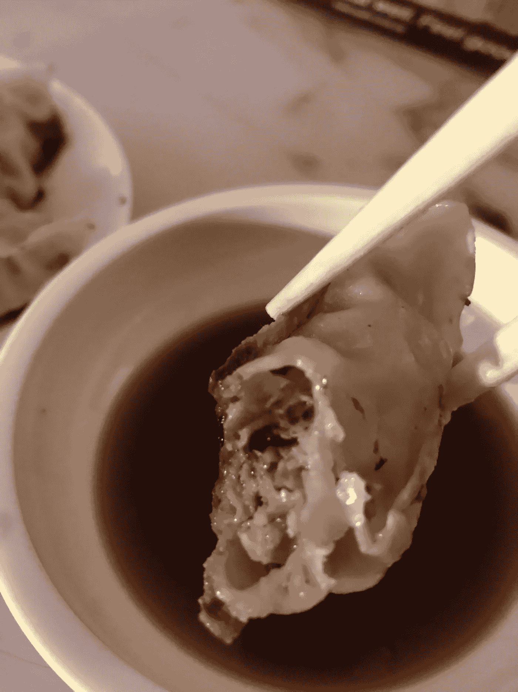

# 如何像产品设计师一样包饺子？

> 原文：<https://medium.com/swlh/how-to-make-dumplings-like-a-product-designer-a31baeaf51da>

当有人问我“如果你能在余生吃一份菜单，那会是什么？”我的第一个回答是“饺子”。

我对饺子的热爱是去年在办公室的同事中分享的，当时我在生日那天把饺子带到了办公室。我们的柏林办事处是分享我的饺子的最佳场所，因为它是一个拥有 10 多个国籍的跨国办事处。因此，我的饺子项目的反馈将是无偏见和分布式的。

Figure 1 Freshly made raw dumplings with pork and leeks stuffing.

不知道我的观众的喜好，我决定用传统的“日本饺子”方法，用中国的“猪肉和韭菜”馅制作第一套饺子。

**配料:**

**饺子皮:**面粉和水(2:1)

**馅料:**猪肉+韭菜/大葱+酱油

**方法:**

1.  用少量植物油在平底不沾锅里煎 2-3 分钟。
2.  将 2 杯水倒入锅中，盖上锅盖，直到水变干。

Step 1: Place your dumplings in the pan with plant-based oil.

Step 2: Pour water into the pan and close the lid for all dumplings to be fully cooked.

输出如下所示。饺子的底部看起来几乎是棕色的，酥脆的，但外面很柔软。我最喜欢的饺子蘸酱是简单的酱油+醋(2:1)加薄片姜。

Figure 2 After pan fried all dumplings

**测试 0 结果:**

喜欢

*   获得了 90%的好评。
*   馅料味道棒极了！
*   口感很好，蘸着吃味道很好。
*   饺子皮很薄，但足够结实，可以完整地包好馅而不破裂。

希望

*   一些人希望它不要太湿，更脆一些

问题

*   饺子需要监控温度，因为你想在不烧焦饺子皮的情况下烹饪馅料。
*   往锅里倒水的时候，你需要旋动锅，确保饺子不粘锅。

在收集了我生日的反馈后，我在我同事 3 周后的生日会上带来了我的第一个饺子原型。

**原型 1** :有什么不同？

1.  我们怎样才能在不烧糊的情况下让饺子不那么湿，更脆呢？

*   解决方法:1。用油增加油炸时间，减少水分。2.油炸前将折叠的饺子蘸上面粉。

**原型 1 的结果:**

*   饺子不太湿
*   像往常一样对味道有正面反馈。

**问题:**

*   目前的方法仍然停留在纸上谈兵，需要密切监测。
*   前一天晚上包饺子时，如果放得太近，它们会粘在一起。因此，当我把一些饺子带到办公室时，它们的形状被打破了，馅也露出来了。

在这一点上，我们知道这些饺子味道很好，质地可以接受多元文化的标准。我们的蘸酱没问题。然而，我们需要找到一种方法，在饺子送到办公室之前，把它包装好，而不破坏它的形状。

**原型 2:**

**我们怎样才能让饺子不粘锅，但外表足够柔软？**

**解决方案:**

1.  在把面粉倒进锅里之前，先把它们加入水中。(对此投了赞成票)
2.  加入肉汤而不是白开水。(这不会有太大的区别)
3.  把水倒掉，只在油里煎。(最后的结果会太脆。)

水里需要加多少面粉？

Flour and water mixture to add to the frying pan.

我用 3 茶匙面粉和 1 杯水开始测试原型 2.1。

**结果:**它在饺子的底部增加了一层巨大的面粉层，用了两倍的时间来油炸。

所以我决定将原型 2.2 的比例调整为 1 杯水和 1 茶匙水

因此，我们的饺子不再粘在底部，它在底部增加了一层薄而脆的层，足以感受到 gyoza 的正确纹理。

After the flour is bottom is cooked, it doesn’t stick to the pan and you can remove all dumplings at once.

瞧啊。

我们终于有了不粘底饺子的解决方案！

Dumplings prototype 2

**总结:**

饺子被认为是团队合作的象征。你需要做一层足够薄的皮，它可以在短时间内将肉煮熟，但又足够结实，可以将馅包在一起，这就是我喜欢在同事生日时带饺子的原因。它象征着我们强大的团队合作。

然而，作为一名产品设计师，最关键的部分是接收反馈和理解受众偏好的能力。你总是需要知道你在为哪些受众设计你的产品。由于这个原因，不同的文化有不同形式的饺子。它们带来了不同的用户体验，但都是由相似的组件组成的。

你最喜欢的菜单是什么？