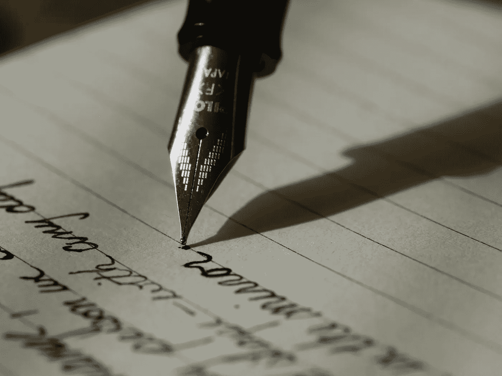

# 如何在自由写作中做到量大于质

> 原文：<https://medium.com/swlh/how-to-make-it-in-freelance-writing-with-quantity-over-quality-afe8b89a1677>

Photo by [Aaron Burden](https://unsplash.com/@aaronburden?utm_source=unsplash&utm_medium=referral&utm_content=creditCopyText) on [Unsplash](https://unsplash.com/search/photos/writing?utm_source=unsplash&utm_medium=referral&utm_content=creditCopyText)

读一读 highfliers 的自由职业指南，这些作者会告诉你他们是如何通过写一个相对简单的主题赚到每字 10 美分的。现实情况是，绝大多数自由撰稿人的收入远低于这个水平。

所以，如果你想在自由写作中取得成功，你该怎么做呢？