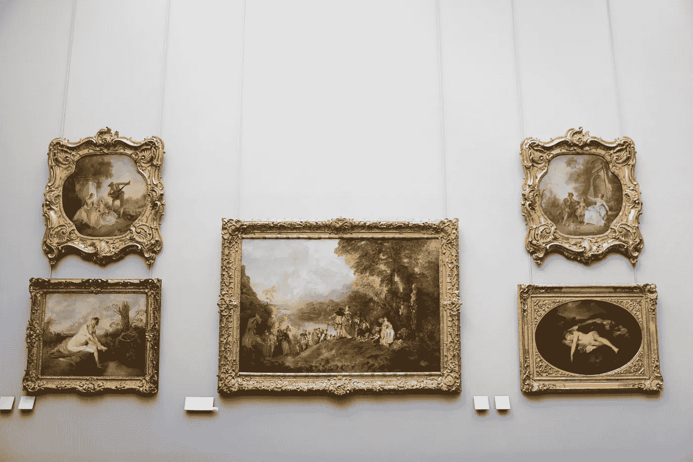

# 如何让缪斯摆脱让你恼火的约束

> 原文：<https://medium.com/swlh/how-to-make-muses-out-of-the-constraints-that-piss-you-off-305355bec15a>

## 你的时间、金钱和环境不一定会成为障碍。以下是如何利用它们的优势

故事从一个关于两所房子的寓言开始。第一个是哲学家路德维希·维特斯坦根的作品，因为他用他几乎无限的家庭资助了他的房子的设计和建造…