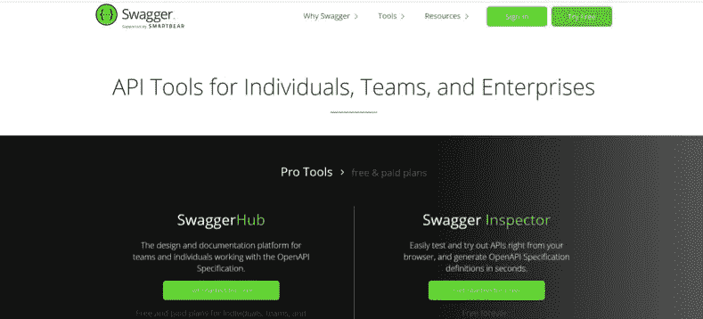

# 如何在软件开发中充分利用人员扩充

> 原文：<https://medium.com/swlh/how-to-make-the-most-of-staff-augmentation-in-software-development-fb4c0c63f3a4>

## 为了确保在软件开发中成功地增加员工，企业应该善于沟通，清晰地定义角色，拥抱技术，正确地记录编码，并具有灵活性。

人员扩充是一种常见的外包策略，组织使用它来快速扩展其内部团队以满足 IT 需求。通过雇佣外部开发人员在内部工作， [IT 员工扩充](https://www.bairesdev.com/software-development-services/it-staff-augmentation/)有助于弥合雇佣全职员工和与远程团队合作之间的差距。

在 BairesDev，我们帮助企业解决其 IT 员工问题。10 年来，我们一直在提供高质量的开发人才，并将他们无缝集成到内部开发团队中。我们已经在 850 多个项目上与大公司和初创公司成功合作。因此，我们非常适合讨论公司如何充分利用员工增强服务。

在过去的十年中，外包软件开发变得越来越流行。根据世界经济论坛的【2018 年未来工作报告，一半到三分之二的公司可能会使用外部承包商、临时员工和自由职业者来建立他们的团队。

IT 人员扩充提供了许多好处，包括快速的项目周转时间、按需扩展的灵活性，以及对熟练开发人员的经济高效的访问。通过鼓励清晰的交流、无缝的工作流程、管理工具的使用和文档化的代码，公司可以确保他们开发项目的成功。

然而，许多公司不知道如何充分利用他们使用的员工增强服务。以下是我们关于公司如何在软件开发中充分利用员工扩充的建议。

# 1.确保任何时候都有清晰的沟通

根据 [Salesforce](https://www.salesforce.com/blog/2012/09/nick-stein-work-post-2.html) 的一项研究，86%的员工和高管认为缺乏合作是工作场所失败的原因。

清晰的沟通是每个开发项目成功的关键。过程应该在开发生命周期的早期建立，以支持开放的交流。

项目管理工具，如消息应用程序 [Slack](https://slack.com/) 鼓励分享想法并帮助促进协作。

在外包过程中缺乏沟通也会导致误解，从而对项目的成功产生不利影响。根据 OSF 全球的报告，[克服外包过程中的文化差异](https://www.osf-global.com/assets/uploaded_files/de/overcome-cultural-differences-OSF-whitepaper.pdf)，在失败的项目中，70%是由于缺乏沟通。

扩充员工时，善于沟通是很重要的。

# 2.定义角色并评估工作流程

定义项目中每个人的角色可以确保责任得到履行。内部和外部开发人员都应该理解项目的基本原则，以及它们如何符合您的愿景。

应指派项目经理和团队领导来确保各项任务按时按预期标准完成。明确定义的角色还为开发人员提供了一个分享想法和提供反馈的联系点。

为了有效地扩充工作人员，需要实施开发工作流程。所有员工都应了解项目中涉及的各个步骤，包括何时安排会议、分配了哪些任务以及分配给谁。

拥有一个文档化的工作流程可以确保增加的员工无缝地融入团队。

# 3.拥抱管理工具和技术

根据项目管理协会(PMI) [的 2015 年行业脉搏](https://www.pmi.org/learning/thought-leadership/pulse/capturing-the-value-of-project-management)报告，使用任何类型的项目管理方法的组织在满足预算、如期完成、满足范围、坚持质量标准和满足预期收益方面表现更好。

为了充分利用扩充后的团队，公司需要采用项目管理工具和技术。像 [Asana](https://app.asana.com/) 、[吉拉](https://jira.atlassian.com/)和 [Basecamp](https://basecamp.com/) 这样的工具通过在开发生命周期的每个阶段监控项目的进展来帮助项目保持在正轨上。

# 4.确保记录所有编码

代码文档是每个软件应用程序的支柱。公司应该付出额外的努力来确保扩充后的团队在项目的每个阶段都保留他们代码的记录。

软件需要不断的更新和维护，让多个开发人员阅读代码可以更容易地发现错误或潜在的风险。

公司应该决定一种集体的方法来编写代码文档，这种方法适用于所有人，包括增加的员工。像 [Swagger](https://swagger.io/) 这样的工具有助于实现清晰的代码文档方法和其他基本实践，比如结对编程。

公司必须正确地记录他们的代码。

# 5.做好灵活应变的准备

如果公司鼓励灵活性，扩大的团队更容易整合。维持僵化的开发过程很少会产生预期的结果。

敏捷之类的开发方法使团队更加灵活，并取得积极的成果。普华永道在其[敏捷项目交付信心](https://www.pwc.com/gx/en/actuarial-insurance-services/assets/agile-project-delivery-confidence.pdf)研究中报告称，敏捷项目比传统项目成功 28%。

当与一个扩大的团队合作时，一定程度的妥协总是需要的。扩充的团队通常有很多与内部开发人员一起工作的经验，并且通常对工作流最佳实践有独特的见解。通过保持灵活和鼓励反馈，扩大的团队可以帮助确定更有效的工作方式。

# 成功扩充工作人员概述

总之，我们认为公司可以通过以下方式充分利用增强开发服务:

1.  **清晰沟通**:沟通是每个成功开发项目的核心。确保参与项目的每个人之间的沟通渠道是开放的。
2.  定义角色和流程:清晰定义的角色和流程使得扩充后的团队更容易整合。
3.  **使用管理工具** : Asana、Basecamp 和吉拉帮助团队保持正轨，确保项目按预期进行。
4.  **记录你的代码**:记录你的代码使得将来更新和维护软件更加容易。
5.  **保持灵活性**:灵活性有助于公司实现发展目标。采用敏捷方法可以创造更多积极的成果。

如果你遵循这些步骤，就有可能成功扩充员工。

[*原文发表于 2019 年 5 月 1 日 Damian Scalerandi 关于离合器。*](https://clutch.co/developers/resources/how-to-staff-augmentation-software-development)