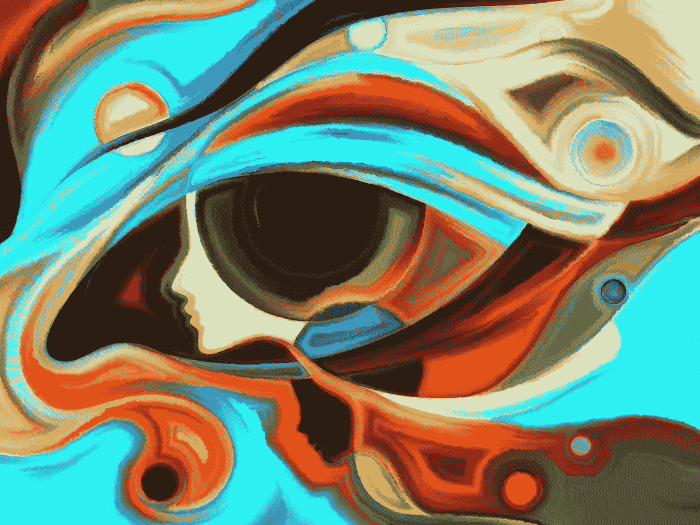

# 如何凭正确的直觉做出正确的决定

> 原文：<https://medium.com/swlh/how-to-make-the-right-decision-with-the-right-instinct-232692bc52a6>

## 你应该跟随你的直觉还是直觉？你可能会得到混淆的信息。

64415907 Intuition@agsandrew

> “你永远不会跟随自己内心的声音，直到你清除了头脑中的疑虑。”— **罗伊·t·贝内特**，作者，**心中的光**