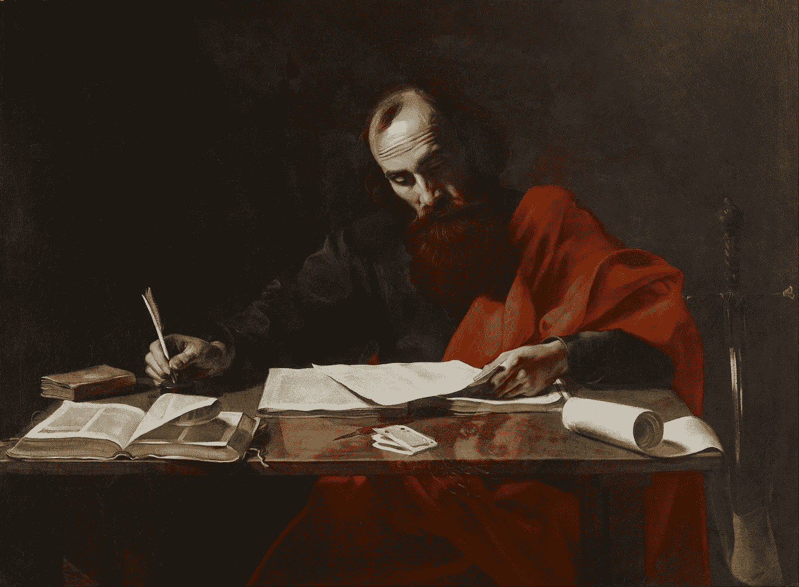

# 如何让工作变得重要

> 原文：<https://medium.com/swlh/how-to-make-work-that-matters-a8555bc92bc3>

[‘Saint Paul Writing His Epistles’](https://tjwithers.files.wordpress.com/2015/05/69-late-night-writing-painting-by-valentin-de-boulogne-of-saint-paul-writing-his-epistles-from-wikimedia-commons.jpg)

## 音乐制作和写作诱惑

我写作。我也制作音乐。但是我最终想做的是*移动*。

不仅仅是旋律，词和节奏(两者都适用)。它是关于移动另一个人的灵魂——朝着积极的方向。