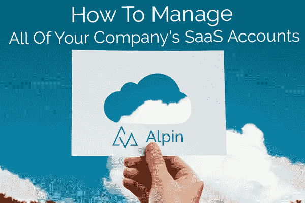

# 如何通过 5 个步骤管理您公司的所有 SaaS 帐户或套餐

> 原文：<https://medium.com/swlh/how-to-manage-all-of-your-companys-saas-accounts-or-subscriptions-in-5-steps-12ce1e51909>

越来越多公司的越来越多的人都在问这个问题——我们的云内部到底发生了什么？

有意或无意地，许多 IT 部门已经允许“分布式软件购买决策”员工已经独立注册、购买和支付软件费用。(当然，很多 SaaS 的订阅都是免费的。因此，SaaS 发展迅速，预计 2019 年将继续增长。然而，许多 IT 领导现在想知道是否有必要进行一些“协作监督”*以确保安全性、合规性和合理的成本。

本指南将引导您完成管理所有 SaaS 帐户或套餐的必要步骤。如果你正在寻找这样一个项目的内部支持，[看看我们的指南“影子 IT 清理倡议”。](https://alpin.io/blog/shadow-it-cleanup/)

虽然您可以尝试使用我们的[免费电子表格模板](https://alpin.io/blog/saas-management-spreadsheet/)手动遵循以下步骤，但本指南假设您宁愿避免令人麻木、浪费时间的手动工作，而是希望自动化管理这些 SaaS 账户。为此，我们使用 Alpin 描述这个过程——这就是我们构建 Alpin 的目的！

******* *我们的大多数客户都希望保留其公司在使用和购买云软件方面的分布式决策，并通过中央仪表盘进行监督。并且，Alpin 开辟了控制或管理的新方法。例如，G Suite 管理员在看到违规应用和受影响的用户后，可以直接在 Alpin 中将应用列入黑名单或撤销用户访问令牌。*

***目录—管理所有 SaaS 订阅***

**1。发现 SaaS 应用程序**

**2。添加更多信息—付款、续订等**

**3。组织数据——标记应用程序并分配所有者**

**4。举报和调查**

**5。引入其他部门**

*1。发现 SaaS 账户*

SaaS 监督以前是困难的或者不可能的。为什么？太多的数据隐藏在太多的地方。也没有工具来自动化和组织这些未被发现的数据。

现在，Alpin 提供了超过 12 种方法来发现 SaaS，包括与领先应用的 API 集成、与 SSO 平台的连接、从会计和费用系统中提取数据、浏览器插件、设备上的代理、防火墙日志分析、电子邮件扫描等等。

Alpin 不仅能发现应用，还能整理应用。我们的数据库拥有超过 40，000 个云应用程序的详细信息，这意味着在发现之后，我们会自动对您的订阅进行分类。初次发现后，您将能够按类别、每个用户等查看您拥有的应用数量。Apin 可以向你展示应用程序最近被使用的频率，甚至人们在这些应用程序中采取了什么行动。

除了正在访问的应用程序列表，您还可以查看用户授予应用程序的权限。有些权限会带来严重的安全性或合规性风险。

您还可以与云存储或电子邮件提供商集成，以确定您的组织外部正在共享什么，以及用户是否正在共享敏感信息。

*2。添加更多信息—付款、续订等*

将订阅与实际支付数据捆绑在一起，可以创建一个真正的仪表板来管理所有 SaaS 账户。另外，通过这种方式，财务或采购部门可以更好地了解用户想要采用什么，以及各部门在云软件上的支出。有许多方法可以让[优化云支出](https://alpin.io/blog/saas-financial-optimization/)。

Alpin 可以自动收集付款和续订信息，或者代表您快速组织和调整 SaaS 订阅的付款。同样，Alpin 为我们所有的客户创建了一个定制的续订日历，供应商管理或 FP&A 中的任何人都会喜欢。

合同、许可证类型、协议和其他信息等文档也可以添加到 Alpin 仪表板中。

*3。组织数据—标记应用并分配所有者*

[标记](https://alpin.io/blog/feature-tags-and-search/)可以对你能想到的任何变量进行定制报告。

您可以标记和报告任何订阅。公司根据成本范围、计费类型、合规性状态、合同类型、信息敏感度、法律实体、管理水平、地理位置等你能想到的任何东西来标记应用程序！

此外，您组织中的部门主管或任何用户都可以被指定为任何订阅的管理员或账单支付者。想知道谁处理特定的应用程序？没人会再怀疑了，Alpin 知道！

*4。调查并报告*

现在你有了大量的数据，开始研究吧。

你能找到什么样的黑幕应用或有风险的权限？很可能是时候为相关用户提供一些有用的指导，让他们知道敏感信息会如何暴露，比如说，让俄罗斯游戏网站[访问他们的整个电子邮件收件箱内容](https://alpin.io/blog/shadow-it-problems/)。

如果你在调查过程中标记了应用或用户，你可以在以后通过这些标记的报告轻松地检查他们。

您还可以使用其他报告选项。

Alpin 的自动应用程序分类使您能够生成报告，回答诸如“我们在视频会议应用程序上花了多少钱？”

除了 Alpin 自动生成的标准报告之外，您还可以根据您创建的标签提取报告。

*5。引入其他部门*

管理所有 SaaS 账户真的可以让你的组织*团结起来。*它为您在 It、财务、采购和合规部门的同事提供了一个共享的视图和工具，让他们更好地完成工作，并就共同的问题进行交流。

查看我们的其他一些博客帖子，其中我们介绍了 Alpin 如何帮助公司:

[削减 SaaS 成本](https://alpin.io/blog/saas-financial-optimization/)并优化支出

[提高安全性](https://alpin.io/blog/saas-improve-security/)

[改善或支持合规性](https://alpin.io/blog/saas-compliance-automation/)

[为采购人员或供应商经理](https://alpin.io/blog/saas-vendor-management/)提供强大的研究和管理工具

如果你想更认真地了解 SaaS，我们有十几种方法来发现 SaaS 应用，以及金融、合规和安全工具；联系我们观看 10 分钟的演示。你会看到 Alpin 如何为你工作。通过发送电子邮件 info@alpin.io 开始。

## 这篇文章发表在 [The Startup](https://medium.com/swlh) 上，这是 Medium 最大的创业刊物，拥有+411，714 名读者。

## 在此订阅接收[我们的头条新闻](http://growthsupply.com/the-startup-newsletter/)。

