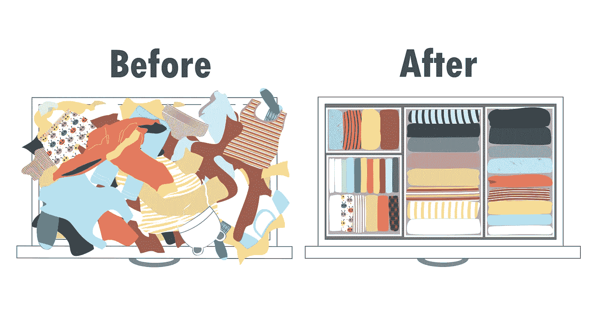

# 如何“玛丽·近藤”你的数字营销策略

> 原文：<https://medium.com/swlh/how-to-marie-kondo-your-digital-marketing-strategy-9d473d648a09>

在每年的这个时候，很容易说我们需要审查和更新我们的数字营销战略。尽管开始比我们想象的要难。以下是如何将 KonMari 方法应用到我们的数字营销策略中。

在一年中的这个时候，很容易说我们需要审查和更新我们的数字营销战略。尽管开始比我们想象的要难。

这就是为什么我们应该将 KonMari 方法应用到我们的数字营销策略中。

# 玛丽·近藤和市场营销有什么关系？

玛丽·近藤和她的整理技巧多年来一直很受欢迎，但最近她通过网飞的*和玛丽·近藤一起整理而获得了更多的观众。突然之间，我们中的许多人迷上了整理的艺术。*

我们意识到，如果你遵循一种结构，整理起来会更容易。当你整理出生活中真正需要的东西时，通过展示你对自己物品的欣赏，它甚至可以成为一种治疗。

一旦你试着遵循这个方法，即使只是在一个抽屉里，你会希望在你的生活中有更多这样的东西。这就是为什么是时候将她的技术应用到我们的数字营销策略中了。

# 创建一个你所有策略的“堆”

整理的第一步是对你所有的东西有一个直观的了解。在这种情况下，是时候写下你的数字营销策略的一部分了。

不要只关注‘内容营销’和‘社交媒体营销’这样的词。尽可能缩小范围。

例如:

*   **“内容营销”** →博客、电子书、时事通讯、入职内容、帮助指南、播客
*   **“付费社交”** →脸书的认知度广告、LinkedIn 的销售线索生成广告、Twitter 的参与度广告

开始规划你在数字营销策略中所涉及的一切。

这将有助于您全面了解您的数字营销策略，以及每种策略是如何影响您的策略的。它还可以帮助你发现可能会损害你的战略的战术。

# 决定你需要保留什么

下一步是清理杂物。一旦你设想了战略的所有要素，就该决定什么是你真正需要保留的了。

根据玛丽·近藤的说法，你可以从衣服、书籍和其他物品开始，直到对有情感价值的物品做出“最艰难”的决定。在这种情况下，你可以从基于当前结果的“最简单”的决定开始。

例如，如果你的博客文章是你数字战略的重要组成部分，那么保留它们是一个简单的决定。这同样适用于，例如，你的搜索引擎优化策略和更多关注搜索流量的计划。如果你已经决定要花更多的时间在这上面，那就意味着可能有你想探索的机会。

现在是时候对自己诚实了。有没有一个策略没有很好地发挥作用，但你仍然坚持把它保留在你的策略中？有什么事情是你一直计划尝试却从来没有做过的？

还有，有没有一个策略是你一直投钱却得不到想要的 ROI？例如，你可能在脸书很活跃，但是超过 6 个月都没有真正的投资回报。你不断创造更多的广告来提高你的影响力和流量，但结果仍然不是你想要的。你知道“脸书广告可能是有效的”和“你需要付费才能玩”，但是是时候改变你的优先事项了吗？

这是最困难的阶段，你需要和你的团队讨论优先事项和你真正需要关注的战术。

可能很难将其中的一些放在一边，但关注对你的企业最有利的事情总是更好的。注意，你不需要在一天内改变一切。这个想法是对自己诚实，知道你需要保留什么。

# 改变心态

“KonMari”方法是关于改变你的心态，保持你生活中的“快乐火花”。

说到营销，我们可以说“保留给你带来快乐的东西”可以变成“**保留让你的工作更容易的东西**”。

如果搜索营销让你更接近你的目标，那么你应该保持它。如果脸书营销只是占用了你预算的很大一部分，而没有看到预期的结果，那么也许是时候把它放在一边了。不，你不需要在不同的变化中测试它们之前就把不同的策略放在一边。但是，如果你没有时间或金钱让他们继续下去，那么你可以改变你的重点，更成功的战术。

我们可以从“KonMari”方法中学到的是，我们越是摆脱那些不起作用的策略，就越容易“整理”我们的策略。

我们想要的只是确保我们维持一个成功的数字营销策略。

带上战术的“堆”！

*该帖原载于* [*ClickZ*](https://www.clickz.com/marie-kondo-digital-marketing-strategy/225579/) *。*

## Tereza Litsa 是 Lightful 的社交媒体经理和培训师。在 Medium 和 Twitter 上关注她:@terezalitsa

## 这篇文章发表在 [The Startup](https://medium.com/swlh) 上，这是 Medium 最大的创业刊物，拥有+424，678 名读者。

## 在这里订阅接收[我们的头条新闻](https://growthsupply.com/the-startup-newsletter/)。

