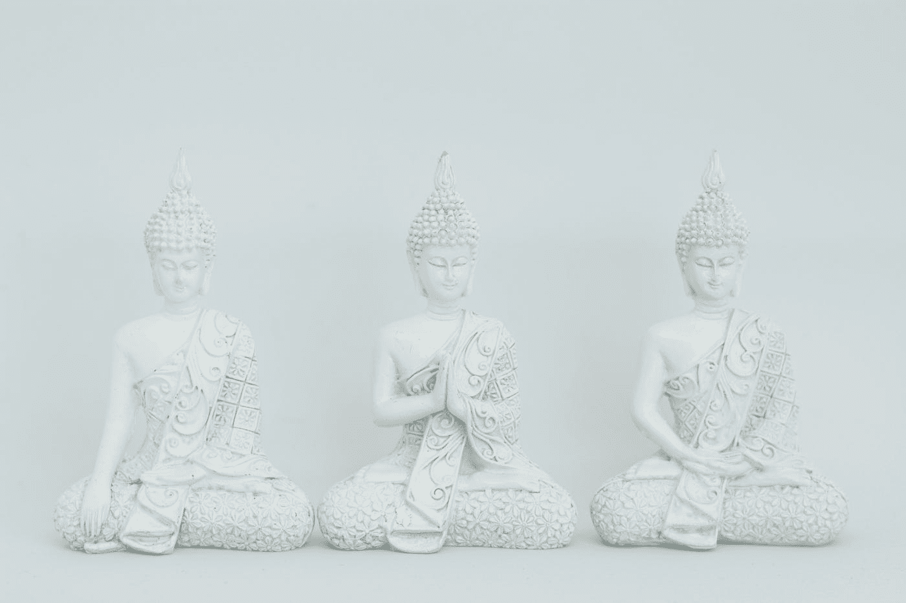

# 如何控制自己的情绪

> 原文：<https://medium.com/swlh/how-to-master-your-emotional-self-848987536e71>

## 每个人都生活在非理性的法则中

Photo by [Valentina Yoga](https://unsplash.com/@valentinayoga?utm_source=medium&utm_medium=referral) on [Unsplash](https://unsplash.com?utm_source=medium&utm_medium=referral)

# 我们每个人都喜欢想象自己掌握着自己的命运。

我们努力以尽可能好的方式有意识地规划我们的行动路线和生活规划。