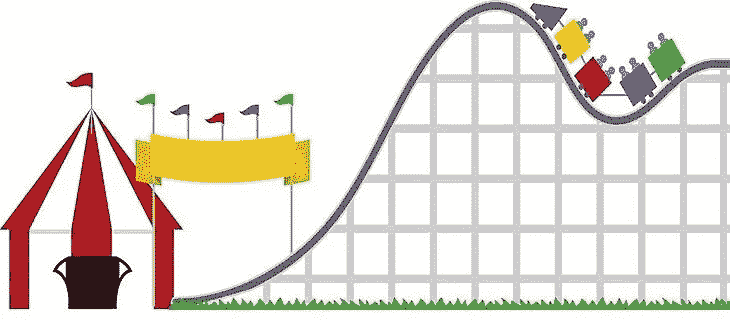

# 如何驾驭股票市场的过山车——尝试使用平均成本法

> 原文：<https://medium.com/swlh/how-to-navigate-the-stock-market-roller-coaster-try-using-dollar-cost-averaging-d33de3cc65d8>

股票市场有时会令人沮丧和失望。跌宕起伏。可以是过山车。你已经听了一百遍了……你不能对你的投资感情用事。虽然这是真的，我总是尽我所能消除投资时的任何情绪，但事实是，我还是人。当市场大幅下跌时，很难不畏缩。哦 *伙计……我上周刚买了这只股票的股票，它已经跌了 5%……我在想什么呢？*我们都有过这样的经历……大多数时候，把握市场时机或找到单只股票的底部是不可能的。

那么你怎么知道什么时候该买呢？一个人能做什么？我采用的策略是成本平均法。我通常会买一只股票 4-5 次。我会做我的研究，确定我觉得是一个好的切入点，然后购买我想拥有的总量的 20-25%。大多数时候，我会尽量将每只股票的持股比例控制在我总投资组合的 1%或更少。这有助于对冲风险。根据你正在处理的金额，这可能不是你最好的方法。

为了简单起见，假设你想拥有价值 4000 美元的股票。在这种情况下，我可能会以每次 1000 美元的价格分四次购买。我将确定我觉得合适的入口点，然后将其添加到我的观察列表中。大多数经纪公司允许你设置警报。当某只股票达到某个价格目标时，我会使用警报来通知我，然后一旦收到通知，我就会绘制这只股票的图表。如果我觉得股票会继续下跌，我会等待并密切关注股票。有时，我甚至会设置一个新的低金额通知。当时机成熟时，我会以确定的价格下限价单。另一种方法更简单，需要的时间更少，就是以你愿意支付的价格下限价单。这允许你立即设置购买订单，你不需要做任何其他事情。一旦达到您设定的价格，订单将自动执行。

不管你选择哪个选项，一旦获得了股票的第一个仓位，你就需要监控它来决定什么时候增加更多。有时股票会在你买入后上涨，你最终只会拥有你想要的一小部分股票。这是一个好问题。你总是可以决定以更高的价格买更多的东西；然而，我很少这样做。我只是让这些小仓位运行。如果出现重大调整，你可能会有机会在以后增加更多的股票。

我几乎总是在股价下跌至少 2.5%…有时是 5%的时候加仓。这让你可以慢慢买入你的头寸，理论上，这有助于确保你的投资获得最佳的成本基础。这看起来很简单，但是我总是惊讶于有多少人没有利用这个策略。我经常听到的一个反驳是，每次购买都要额外支付佣金。这是真的，但除非你是用非常小的金额，美元成本平均应该很容易支付你的额外佣金，并增加可观的利润几乎每一次。

如果你没有使用限价单和平均成本，你可以试一试。在过去的二十年里，这种方法让我受益匪浅。关键是要有纪律性，要有计划，时刻准备一些现金。祝你好运！

访问[www.FiredUpWealth.com](http://www.FiredUpWealth.com)获取更多文章和信息。