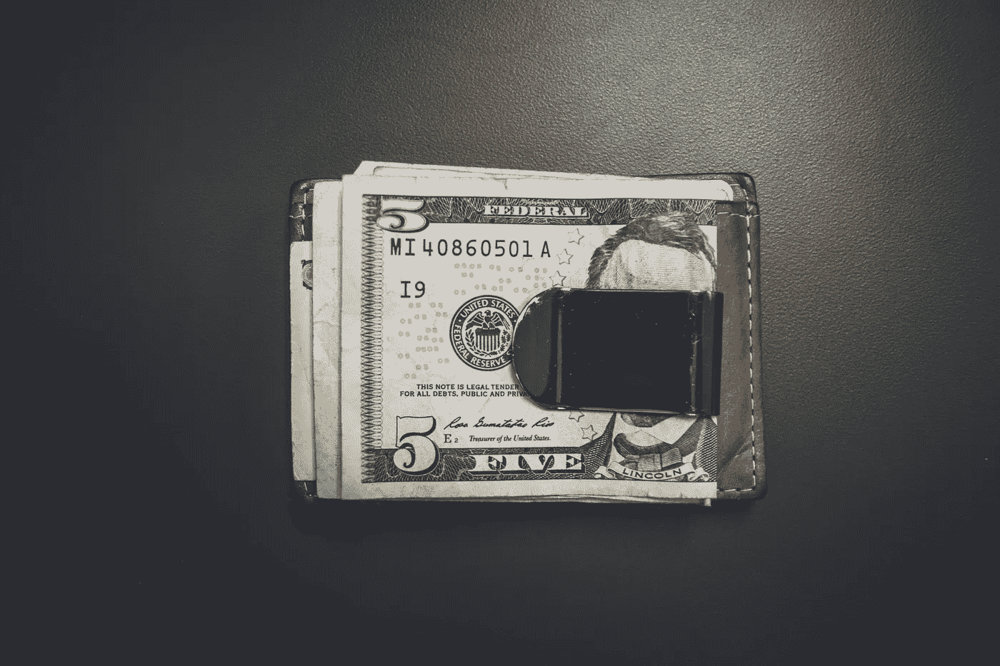

# 作为一名自由职业者，我是这样协商更多钱的

> 原文：<https://medium.com/swlh/how-to-negotiate-your-way-to-more-money-as-a-freelance-writer-76550da84481>

## 发票的来龙去脉。

Photo by [NeONBRAND](https://unsplash.com/@neonbrand?utm_source=unsplash&utm_medium=referral&utm_content=creditCopyText) on [Unsplash](https://unsplash.com/search/photos/dollars?utm_source=unsplash&utm_medium=referral&utm_content=creditCopyText)

当我 2015 年大学毕业时，我告诉自己，我要给自己一个月的时间去做投手和“自由职业者”我想，既然我还是学生时就为一家我实习过的出版物做过“自由撰稿人”，那我就已经把写作这件事收入囊中了。我不知道有这么多低…