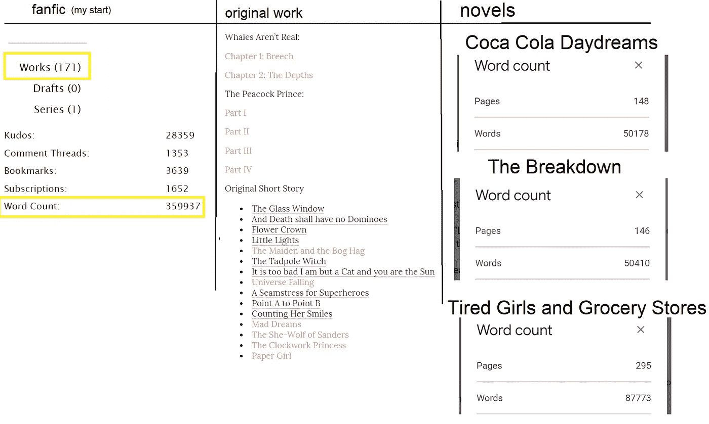

# 如何永不枯竭的写作想法:灵感机器

> 原文：<https://medium.com/swlh/how-to-never-run-out-of-writing-ideas-the-inspiration-machine-d10ff124aa5a>

你好，我是一名作家，我已经写了 170 多部基于其他小说的作品，40 多部原创短篇小说，数不清的诗歌，至少有 3 部不同的小说我完全没写过。

ShE’s a MANiac, mANiaC on the doc~

在过去的四五年里，我写了很多东西，除此之外，我还有很多想法。写了这么多之后，有时候有人问我:“你是怎么……