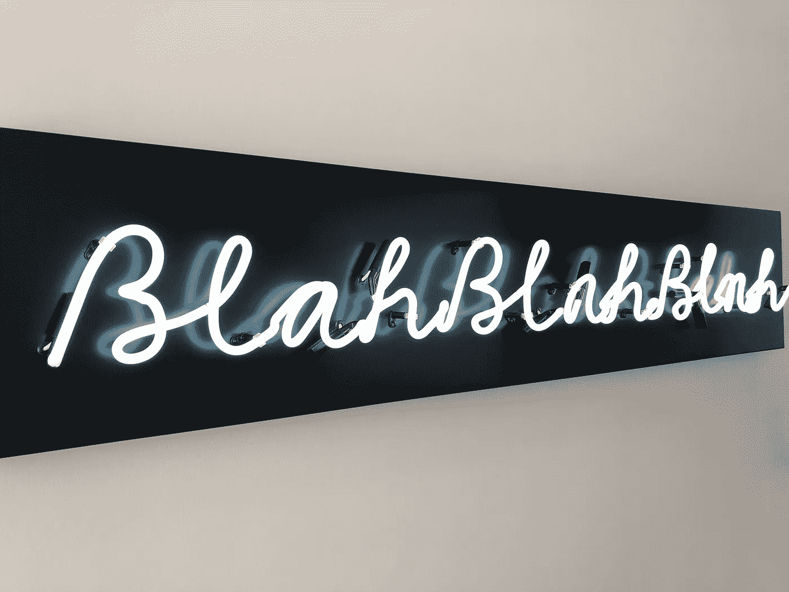

# 如何围绕学习完美组织自己的生活

> 原文：<https://medium.com/swlh/how-to-organize-your-life-perfectly-around-study-49e35f9c62bf>

## 摇滚语言学习入门指南—第一部分

Photo by [Nick Fewings](https://unsplash.com/@jannerboy62?utm_source=unsplash&utm_medium=referral&utm_content=creditCopyText) on [Unsplash](https://unsplash.com/search/photos/language?utm_source=unsplash&utm_medium=referral&utm_content=creditCopyText)

你已经决定认真学习一门新的语言。**恭喜**！🎉

很多人都想尝试一下，但你不是其中之一，对吗？你已经为长期的努力做好了准备，并且正在做你的**研究**，以确保你不会陷入其他人已经陷入的陷阱中…