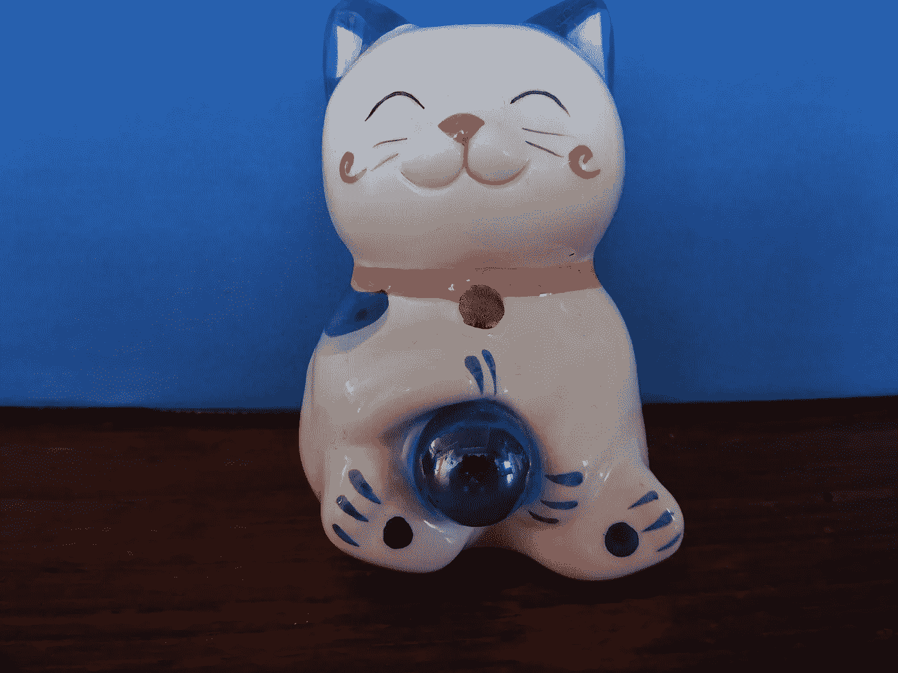

# 如何在一个种族歧视、性别歧视的世界里克服偏见

> 原文：<https://medium.com/swlh/how-to-overcome-bias-in-a-racist-sexist-world-1dbd159acd50>

## 我们都受到无意识偏见的困扰，但可以学会发现它

I am going to stereotype this kitty as Asian, based on my bias, Christyl Rivers

我们都受到无意识偏见的困扰。一旦你知道在人类行为中寻找什么，就不难发现。当我们天生需要对自己的积极肯定时，接受这一点要困难得多。