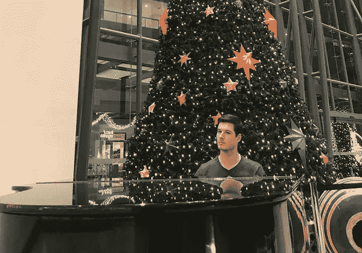

# 新的一年如何克服失望

> 原文：<https://medium.com/swlh/how-to-overcome-disappointment-for-a-new-year-64d8fc891c84>

Like in life, half of playing the piano is looking like you know how to play the piano.

我总是有点像梦想家。

> “安东尼！安东尼！安东尼！”
> 
> “嗯？”

当你有一个艰难的童年时，做梦是一种逃避。现在也许日子不好过，但总有一天…总有一天…

但是那个展望未来的男孩现在遇到了一个回头看他的男人。