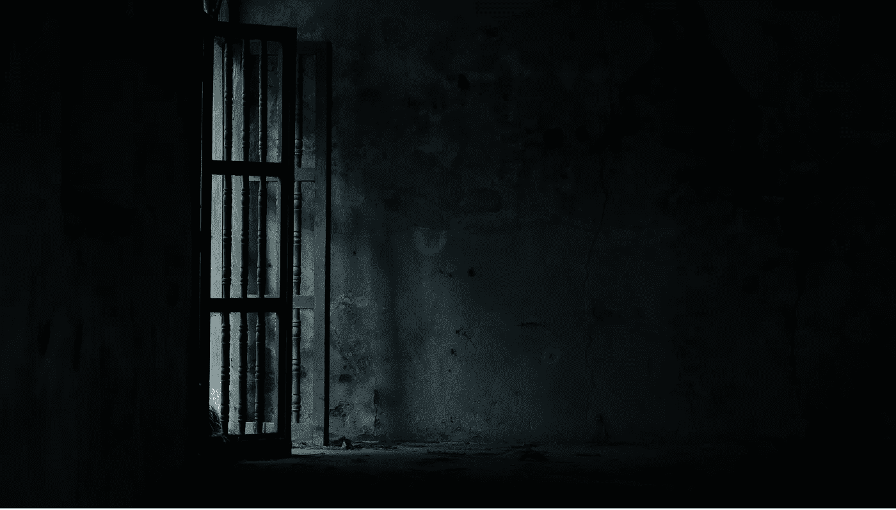

# 如何一步一步克服恐惧

> 原文：<https://medium.com/swlh/how-to-overcome-fear-one-step-at-a-time-ef1ba6db46fa>

## 冒险是每天都会发生的事情，所以走进去呼吸吧

Photo by [SHTTEFAN](https://unsplash.com/photos/B7XNN9uNAh8?utm_source=unsplash&utm_medium=referral&utm_content=creditCopyText) on [Unsplash](https://unsplash.com/search/photos/conquering-fear?utm_source=unsplash&utm_medium=referral&utm_content=creditCopyText)

最近，我有一个早晨，仅仅开车 16 分钟去上班就是一种勇气的锻炼。我不害怕工作、工作职责、与父母、学生、同事或管理人员的互动。我只是害怕了一会儿。