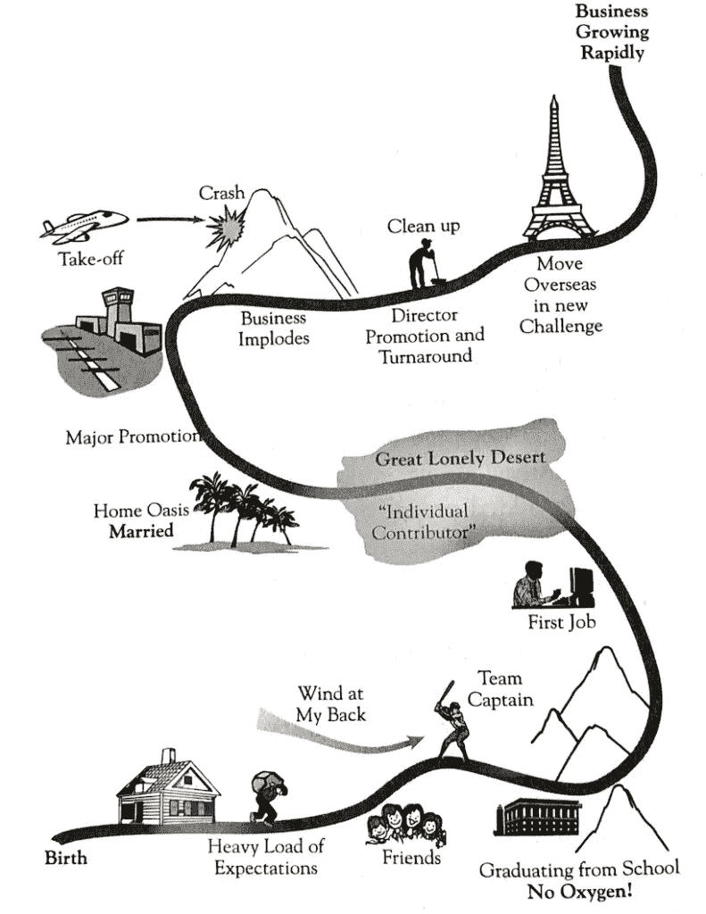

# 如何拥有你的故事，而不让它拥有你

> 原文：<https://medium.com/swlh/how-to-own-your-story-without-letting-it-own-you-84c7e7db82d7>

## 我们告诉自己的故事塑造了我们

你告诉自己的故事将塑造你是谁，你将成为谁，尤其是在困难时期和艰难的变革中。

# 成长中的领导者

在成长过程中，霍华德的父亲努力养家糊口。他的父亲一度因受伤而失业。整个家庭都很痛苦。

当回顾他的一生时，霍华德分享了他曾经如何怨恨他的父亲是一个失败者。这种与他父亲联系在一起的对失败的恐惧驱使他取得成就。

在他父亲去世后，他重新定义了这种怨恨。他开始承认他的成功很大程度上来自于他童年的经历——好的和坏的。

他没有看到父亲“失败”的一面，而是选择将父亲视为一个诚实、可敬、忠诚的人，一个陷入不公平体系的人。

通过重新构思他的故事，他能够克服他的怨恨，开始[创造他的目标](https://zacharend.com/stop-trying-to-find-your-purpose/)。他的目标是创建一家符合他价值观的公司。为员工提供最佳健康福利、工资和工作条件的公司。他想给别人提供他父亲从未有过的东西。

星巴克的创始人霍华德·舒尔茨用他的故事来定义他的目标、价值观和生活。他利用自己的过去做好事。这让他成为了一名影响力巨大的真正领导者。

# 你的故事塑造了你

你在给自己讲什么故事？它会如何影响你的人生轨迹？

想象一下，如果霍华德一直怨恨他的父亲，怨恨他给他们的生活带来的困难。他可能取得了物质上的成功，却没有追求自己价值观的意义和成就感。

当我们学会接受自己的故事，并用它来塑造我们的未来时，我们就找到了一种真实的生活和领导方式。

美国小说家约翰·巴斯曾经说过:“你生活的故事不是你的生活。这是你的故事。”你是那个故事的作者。它塑造了你如何看待世界和你的目标。

在他的书《真正的北方》中，比尔·乔治告诉我们，“重要的是你如何通过你的故事了解你自己，而不是你生活的事实。”

# 写你的故事

当你回顾你的人生时，会有哪些篇章？到目前为止，塑造你的里程碑是什么？

*练习:抓起笔和纸。在这一页的左下角贴上“出生”的标签，在右上角写上“今天”。现在如果你要写你的生活，会有哪些章节？把它们记在这里。*

通过观察这些章节，你可能会明白你的价值观、恐惧和信念来自哪里。

你可能会注意到如何应对逆境的主题。有些为你服务，有些不。

在你的生活中，有哪些时刻让你感到目标和满足？你什么时候最有活力？

这些时刻表明了你的价值观。他们对你来说很重要。每天更多地关注和参与这些价值观。

> 我常想，定义一个人性格的最佳方式是找出他最深刻、最强烈地感受到自己活跃和活着的特定精神或道德态度。在这样的时刻，内心会有一个声音说:“这才是真正的我！”
> 
> 威廉·詹姆斯

# 重构你的故事

我们的过去不能决定我们的未来。然而，它确实塑造了我们。

反思你的过去，把它重新组织成一个故事，为你渴望成为的人服务。

记住，你是写你的故事的人。每个伟大的故事都有张力。主角经常在一片混乱中开始。但这正是这个故事如此伟大的原因！

我们看到了弱者的转变，见证了他们如何用自己的故事改变世界。让那个人成为你，开始[的英雄之旅](https://zacharend.com/how-to-step-into-your-true-calling/)。

你给自己讲的故事是什么？你怎么能拥有它，而不是让它拥有你？

# 下载我的免费行政早晨计划！

[**点击这里**](https://www.createpurpose.net/executive-morning-plan) 下载**执行早晨计划:通过控制你的早晨来提高你的表现**(没有收件箱零和更多的任务列表)！