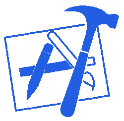

# 在硅谷搞定你的 iOS 面试

> 原文：<https://medium.com/swlh/how-to-prepare-for-an-ios-interview-in-silicon-valley-85a009cf8a4>

## 我最近为自己制定了一个学习计划，为脸书和苹果等公司的六次现场 iOS 面试做准备。以下是我为获得所有六份工作所做的研究。

# 介绍

如果你想为一份“典型的后端”工作(在这里被宽泛地定义为“不是我当时的目标”的 iOS 工作)学习，网上有大量的资源，但我发现网上的 iOS 学习材料很少。这从算法问题(特别是 Objective-C 中对它们的惯用解决方案)和系统设计问题延伸到一般的 iOS 知识问题。

你永远不应该带着只被问到你学过的东西的目标去学习。**但是你要提前知道自己知识的差距在哪里，适当的教育自己**。我想把我在面试前为自己收集的所有学习资料整理成一个帖子。虽然我不能透露关于我在采访中收到的问题的信息，但我可以给出一个基本的 iOS 概念，你可以用它来检查自己。

# 算法

下面我将展示一些我在练习的时候用 Objective-C 做的解决方案。请记住，我在面试前上传了这些解决方案，所以它们可能包括也可能不包括实际的面试问题。在看到我的可能次优的解决方案之前，你也应该至少花*15 分钟尝试解决这些问题。我在很多方面花了更长的时间，我做的很多实际学习都是在我试图弄清楚事情的那个时期。*

为了简单起见，我将只包括具有匹配 Leetcode 问题的链接问题，尽管这些问题几乎总是来自 Leetcode (CtCI/EPI)以外的资源。我在白板上做的更难的问题，所以我没有列出来。

*   [第八期**。字符串到整数(atoi)**](https://leetcode.com/problems/string-to-integer-atoi/description/) ( [我的目标-C 解](https://pastebin.com/yzPhgGiA))
*   [**15。3Sum**](https://leetcode.com/problems/3sum/description/) ( [我的目标-C 解决方案](https://pastebin.com/zsKrhXa4))
*   [17**17。电话号码的字母组合**](https://leetcode.com/problems/letter-combinations-of-a-phone-number/description/) ( [我的目标-C 解决方案](https://pastebin.com/Shj9Je5W))
*   [**21。合并两个排序列表**](https://leetcode.com/problems/merge-two-sorted-lists/description/) ( [我的目标-C 方案](https://pastebin.com/XT2KTWKD))
*   [**26。从排序后的数组**](https://leetcode.com/problems/remove-duplicates-from-sorted-array/description/)([my Objective-C solution](https://pastebin.com/AnTECwZN))中删除重复项
*   [**33。在旋转排序数组**中搜索](https://leetcode.com/problems/search-in-rotated-sorted-array/description/) ( [我的目标-C 解决方案](https://pastebin.com/fQsaKW1A)
*   [49**49。**群变位词](https://leetcode.com/problems/group-anagrams/description/) ( [我的目标——C 解](https://pastebin.com/tvXMA22P))
*   [**67。添加二进制**](https://leetcode.com/problems/add-binary/description/) ( [我的目标-C 解](https://pastebin.com/gj26j732))
*   [**100。同树**](https://leetcode.com/problems/same-tree/description/) ( [我的目标-C 方案](https://pastebin.com/Hg0tykaH))
*   [102**。二叉树层次顺序遍历**](https://leetcode.com/problems/binary-tree-level-order-traversal/description/) ( [我的目标-C 解](https://pastebin.com/4Fw9SJPa))
*   [**109。将排序列表转换为二叉查找树**](https://leetcode.com/problems/convert-sorted-list-to-binary-search-tree/description/) ( [我的目标-C 解决方案](https://pastebin.com/mAdM70fL))
*   [112**。路径和**](https://leetcode.com/problems/path-sum/description/) ( [我的目标-C 方案](https://pastebin.com/muD5eVcm))
*   [**121。买卖股票的最佳时机**](https://leetcode.com/problems/best-time-to-buy-and-sell-stock/description/) ( [我的目标-C 方案](https://pastebin.com/XfzZFDMR))
*   [**122。买卖股票的最佳时机二**](https://leetcode.com/problems/best-time-to-buy-and-sell-stock-ii/description/) ( [我的目标-C 方案](https://pastebin.com/WmT7P7zc))
*   [**123。买卖股票的最佳时机三**](https://leetcode.com/problems/best-time-to-buy-and-sell-stock-iii/description/) ( [我的目标-C 方案](https://pastebin.com/CED7tHMY))
*   [125**。有效回文**](https://leetcode.com/problems/valid-palindrome/description/) ( [我的目标——C 解](https://pastebin.com/MJtHbATF))
*   [**127。**字梯](https://leetcode.com/problems/word-ladder/description/) ( [我的目标——C 解](https://pastebin.com/t2V9nZPq))
*   [**133。克隆图**](https://leetcode.com/problems/clone-graph/description/) ( [我的目标-C 解决方案](https://pastebin.com/YxxqPwUZ))
*   [153**。在旋转排序数组**](https://leetcode.com/problems/find-minimum-in-rotated-sorted-array/description/) ( [我的目标-C 解决方案](https://pastebin.com/t0RVuVbp))中查找最小值
*   [**173。二叉查找树迭代器**](https://leetcode.com/problems/binary-search-tree-iterator/description/) ( [我的目标-C 解决方案](https://pastebin.com/Hup8ZzM0))
*   [236**。二叉树的最低共同祖先**](https://leetcode.com/problems/lowest-common-ancestor-of-a-binary-tree/description/) ( [我的目标-C 解](https://pastebin.com/Nxrbek6Q))
*   [**252。会议室**](https://leetcode.com/problems/meeting-rooms/description/) ( [我的目标-C 方案](https://pastebin.com/xGdzzBkF))
*   [**253。会议室二**](https://leetcode.com/problems/meeting-rooms-ii/description/) ( [我的目标-C 方案](https://pastebin.com/j5hmfjgx))
*   [**283。移动零点**](https://leetcode.com/problems/move-zeroes/description/) ( [我的目标-C 解决方案](https://pastebin.com/cm2HkifJ)
*   [309**。买卖有冷却期股票的最佳时机**](https://leetcode.com/problems/best-time-to-buy-and-sell-stock-with-cooldown/description/) ( [我的目标-C 方案](https://pastebin.com/j3ABpt2y))
*   [**339。嵌套列表权重总和**](https://leetcode.com/problems/nested-list-weight-sum/description/) ( [我的目标-C 解](https://pastebin.com/QnaPFFNa))
*   [416**。划分相等子集和**](https://leetcode.com/problems/partition-equal-subset-sum/description/) ( [我的目标-C 解](https://pastebin.com/2mt0BXiV))
*   [543**。二叉树直径**](https://leetcode.com/problems/diameter-of-binary-tree/description/) ( [我的目标-C 解](https://pastebin.com/W8DAFn9C))
*   [**572。另一棵树的子树**](https://leetcode.com/problems/subtree-of-another-tree/description/) ( [我的目标-C 解](https://pastebin.com/bJhdTmid))

虽然以上是一个很好的起点，但你的目标应该是自己建立一个类似上面的清单。发现类似问题。用 Objective-C(或您选择的语言)将它们编码出来。想想你自己的测试案例。尝试一下。使用 Java 在 Leetcode 上练习(假设你在为 iOS 面试做准备)和滥发“运行代码”不会像用你将要面试的语言系统地构建一个解决方案那样有效。

为了更清楚地了解我如何挑选和选择要做的问题，[见我以前的帖子](/@bayareabelletrist/i-interviewed-at-six-top-companies-in-silicon-valley-in-six-days-and-stumbled-into-six-job-offers-fe9cc7bbc996)，但是我上面已经为我做了很好的准备。

# 系统设计

iOS 中的系统设计问题本质上都是“在白板上设计这个 app”的变种。对他们来说没有什么诀窍；每个人都有不同水平的设计技能，通常随着经验的增加而增加。因此，在我看来，为系统设计面试而练习包括和另一个开发人员坐在一起，他会反复要求你证明你的设计的合理性/增加新功能/质疑某些设计决策。我或许也能抽出时间来帮助人们练习——看看 Discord 上的 [CS 职业黑客](https://www.cscareerhackers.org/)社区，因为我有时会去那里转转。如果我不在，其他人也会在。:)

只是翻翻我的手机，如果我在做采访，这里有几个我会问的问题，以及我会问的后续问题；请记住，我没有被明确问到这些问题中的任何一个:

*   **设计 iPhone 上的信息应用程序。你将如何更新信息？你的模特长什么样？你如何坚持它们(如果你坚持的话)？从 UIKit 的角度来看，你如何设计 UI？**
*   **设计 iPhone 上的 Gmail 应用程序。你将如何更新你的电子邮件列表？后端需要哪些 API？你能分页吗？为什么？你将如何保存数据？你需要吗？你的模型是什么？你的 UI 基础设施是什么样子的？**
*   **设计 iPhone 上的 Spotify 应用。**你的模特长什么样？需要哪些 API？对于您需要的所有部分，您的客户机基础结构/类图看起来像什么？你会持久化数据吗？为什么或为什么不？
*   **设计 iPhone 上的 Instagram app。**你会如何设置用户界面？你会缓存图片吗？怎么会？你会保留图像吗？怎么会？需要哪些 API？你如何确保你的应用程序是高性能的？
*   **设计 iPhone 上的 Pinterest 应用**。你将如何构建商标用户界面？你会采用什么样的毅力？坚持在哪里合适？什么样的 API 有意义？

我看着我的主屏幕，思考着我脑海中出现的第一个问题，就想到了所有这些问题。随意选择任意一个应用程序并做同样的事情，但是如果可能的话，我会和一个朋友一起练习。如果你自己练习，你就不会(根据定义)发现你通常不会思考的领域。

# iOS 知识

首先，我认为如果你学习了 Swift/Objective-C 中至少一个的基础知识，并对另一个有很多了解，这对各方都有好处。这更接近于模拟你将在这些公司中的一家所做的工作；你可能非常喜欢并了解一种语言，但你肯定会看到另一种语言。这可能是一个很大的要求，但它会让你更容易被雇佣，并成为一个更好的开发人员。

下面我列出了一些如果我采访他们，我希望他们知道的事情。如果你被要求详细说明，你应该能够用多个句子回答所有这些问题。如果你不知道其中一个，确保你知道。**这些不一定是我在采访中被问到的问题，但它们是我希望所有 iOS 受访者都知道的基本问题，并有一定的深度**。它们很大程度上摘自马特·加洛韦的 [*有效目标——C 2.0*](https://www.amazon.com/Effective-Objective-C-2-0-Specific-Development/dp/0321917014)*。*

*   **属性属性**:什么叫*强*？*弱*是什么意思？什么时候你会使用其中一个而不是另一个？*弱*常用在哪里？*非原子*是什么意思？那么*原子*呢？什么时候你会使用其中一个而不是另一个？
*   KVO:KVO 是什么？你什么时候使用它？你会在什么时候使用它？你怎么能做出符合 KVO 标准的东西？与 KVO 相关的陷阱有哪些？
*   **类解耦**:解耦代码单元有哪些不同的方法？各有什么优势？各有什么缺点？
*   运行时:与 C 相比，Objective-C 调用方法的独特之处是什么？如果一个子类没有覆盖 Objective-C 中的一个方法，那么如何调用超类的实现呢？如果你在没有实现方法的东西上调用一个方法会发生什么？如果你在 nil 上调用一个方法呢？
*   **UIKit**:uiview controller 的生命周期方法有哪些？如何添加一个视图作为子视图，如何使它适应大小的变化？
*   **内存管理**:iOS 中的内存管理是如何工作的？一定要把这个理解透彻，不要只背一句话！
*   **并发**:iOS 上处理并发有哪些不同的方式？有哪些常见的用例？有哪些陷阱？
*   **方块**:Objective-C 中方块有哪些陷阱？它们常用在哪里？如何避免保留周期？
*   **类别/扩展**:是什么？你什么时候使用它们？与它们相关的限制是什么？什么是补课类？它有什么特殊的规则？

# 关键资源

下面我要说的一切都是 iOS 面试的关键知识。我保证你知道*下面的每一个链接*。如果某样东西有点用处，我会把它从列表中删除。不需要把每个环节的东西都背下来，但是一定要把所有的要点都背下来。我在面试前研究了以下所有内容，我很高兴我做到了。

*   [NSFast 枚举/nsen enumerator](https://nshipster.com/enumerators/)(NSHipster)
*   [NSString 和 Unicode](https://www.objc.io/issues/9-strings/unicode/) (objc.io)
*   [线程安全类设计](https://www.objc.io/issues/2-concurrency/thread-safe-class-design/) (objc.io，比我的帖子深入多了)
*   [有效目标-C 2.0](https://www.amazon.com/Effective-Objective-C-2-0-Specific-Development/dp/0321917014) (这本书我这两年读了几遍；说到语言细节，这绝对是我最好的资源
*   [基础集合类](https://www.objc.io/issues/7-foundation/collections/) (objc.io)
*   [破解编码面试](https://www.amazon.com/Cracking-Coding-Interview-Programming-Questions/dp/098478280X)(算法准备)
*   [编程面试要素](https://www.amazon.com/gp/product/1479274836/ref=ox_sc_act_title_1?smid=ATVPDKIKX0DER&psc=1)(算法准备)

我还建议查看 objc.io 的[App Architecture:Swift 中的 iOS 应用程序设计模式](https://www.objc.io/books/app-architecture/)，但这不是必读内容。它只是有趣，可能会让你处于正确的思考状态。

# 总结

在我的指导中有一个反复出现的主题，因为它与面试有关:与朋友一起练习，并坚持练习。我会在适当的时候不断强调这一点，因为你通过模拟面试环境获得的优势是不可能被夸大的。我强烈建议使用以上所有问题，并采访一位朋友(如果他们不确定，可以提前查找答案)。

大家学习愉快！

## 这篇文章发表在 [The Startup](https://medium.com/swlh) 上，这是 Medium 最大的创业刊物，拥有+419，678 名读者。

## 订阅接收[我们的头条](http://growthsupply.com/the-startup-newsletter/)。

