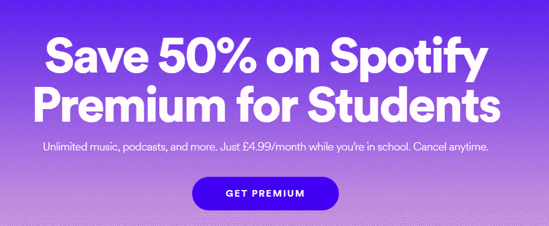

# 如何为你的产品定价以获得更高的利润和更满意的客户

> 原文：<https://medium.com/swlh/how-to-price-your-product-for-higher-profit-and-happier-customers-d1373477ec95>

## 定价包装介绍

Pricing packing — it’s all about the wrapping

# 定价摘要

在我上一篇[博客](/swlh/your-product-is-awesome-why-are-you-selling-it-so-cheap-pt-1-b18b9baec779)中，我浏览了定价的重要性(TL；博士，这真的非常非常重要💸)，以及向客户收取多少费用背后的一些方法和思路。

然而，我没有提到的是*如何*向客户收费——即包装🎁。包装基本上是定价页面上的所有内容。它可以对购买心理产生重大影响，推动从转化到追加销售、客户流失和客户行为的一切。正如我们从 Hubspot 定价页面看到的，**实际价格只是定价页面的一个非常小的组成部分。**

The actual price is only a small part of the puzzle

# 我们想达到什么目的？

对于包装，我们通常试图实现以下三个目标中的至少一个:

1.  提高转化率📈
2.  鼓励使用[👩‍💻](https://emojipedia.org/female-technologist/)
3.  利润最大化💰

## 1.增加转化率📈

提高转化率的最简单方法是**让期权和定价结构简单易懂**。

选择悖论是一种普遍现象——不管出于什么原因，太多的选择让人类不知所措，我们很难做出选择。避免这种情况的一种方法是只提供 3 或 4 个选项(或层级)。

Making a choice is HARD

为了让选择*更加容易*，可以用对客户有意义的方式描述选项(或层级),例如个人、SME、企业，甚至说明哪个层级适合谁——Slack 在这方面做得很好:

Slack pricing page (2019)

如何计算定价(或“定价单位”)是保持事情简单的一个重要部分，无论是每席位、每 GB 数据还是每 API 调用。定价单位应该是:

***a)容易理解***

复杂化增加了不必要的摩擦。单位应该与客户获得的价值明确一致，这样，如果他们购买更多，他们就会获得更多价值。

***b)简单估算总成本***

如果产品可以很容易地进行预算，它更有可能获得内部批准。

例如，如果一个买家知道每个座位的费用以及他们注册了多少用户，通过一些简单的计算，他们就知道这将花费他们多少钱。如果他们注册了一个基于使用量的计划，但不知道他们会使用多少，那么对他们来说有一个巨大的风险，他们可能会以巨额账单告终。

适应现有的预算计划或创建一个高度可预测的模型将会有所帮助。

***c)依据行业规范***

通常，公司会期望一个已经在他们的特定行业中使用的定价模型，除非有一个很好的理由，以同样的方式定价通常更容易。例如，Twilio 按每条短信收费，这是电信行业的标准。

Example Twilio pricing

## 2.鼓励使用[👩‍💻](https://emojipedia.org/female-technologist/)

增加产品的使用量非常重要，因为它可能会:

*   增加客户获得的价值(减少流失率并有助于未来的价格上涨——这是[你应该尽可能多做的事情](/swlh/your-product-is-awesome-why-are-you-selling-it-so-cheap-pt-1-b18b9baec779)！)
*   实际增加产品的价值(具有网络效应的产品)
*   在客户的运营/工作流程中巩固你的产品(使其更难转向竞争对手)；和
*   增加追加销售更多席位/GBs 数据/API 呼叫等的机会。

为了提高使用率，我们主要希望**确保我们的定价单位不会让客户不愿意使用产品**，或者产品的所有功能。例如，如果 Slack 按每条消息定价，用户可能会犹豫是否使用该平台，当然会发布更少的 gif。

再次使用 Amazon 的例子——他们真的接受了 Amazon Prime 的这种想法——它提供了作为捆绑包的一部分提供的大量功能。随着客户使用越来越多的功能，他们不太可能流失，并且更有可能接受未来的价格上涨。

Amazon Prime’s offering in the US

*按座位定价是一个很好的结构，可以消除使用产品的任何界限。根据商业模式的不同，也有类似的选择——例如，Clever(一个为学校集中学习软件的平台)按学校收费。在这种情况下，整个学校都可以尽情使用该产品。*

**

*Pricing from Clever, a School learning software platform*

*如果按用户收费很难让整个组织使用该产品，因为不愿意购买更多的席位，可以使用不同的定价，如固定费用。*(请注意，这可能会影响您追加销售的能力，除非您有其他功能可以销售！)*。*

****一种定价机制启动使用****

*一种可以鼓励使用的机制是“三部制关税”。这涉及到一个基本费用，包括一些座位(或单位)，再加上此后每单位的额外费用。*

*例如:100 美元/月，包括您的前 10 个客户，之后的其他用户每月 10 美元。*

*3 部分费率鼓励使用，因为最初添加更多座位(或同等座位)不会产生额外成本。客户还觉得这样更“公平”，因为他们以基本成本获得了一些东西，并且在收取实施费时特别有用。GitHub 将此用于他们的团队定价。*

**

*3-part tariff in action from Github*

## *3.利润最大化💰*

*最后，我们希望利润最大化。上面的三部分关税已经有效地证明了[利润最大化](https://papers.ssrn.com/sol3/papers.cfm?abstract_id=1587149)。此外，我们还可以使用[价格歧视](https://www.investopedia.com/terms/p/price_discrimination.asp)，即对基本相同的软件向不同的客户收取不同的费用。我们可以对愿意多付钱的客户多收费，对愿意少付钱的客户少收费。*

**

*Spotify using price discrimination while providing exactly the same service*

*对于 B2B 业务，这通常意味着分离出个人，中小企业和企业，因为企业通常有更大的支付能力。还有其他方法来划分这些群体，你能否做到这一点取决于你对你的[客户角色](/swlh/your-product-is-awesome-why-are-you-selling-it-so-cheap-pt-1-b18b9baec779)的理解。*

****好，更好，最好****

*从上面的许多例子中可以看出，分层方法倾向于采用“好”>“更好”>“最好”的形式，其中更高的层具有更多的特性。*

**

*Good > Better > Best pricing from Canva*

*当高付费用户需要低付费用户不需要的功能时，这种方法特别有效。示例功能包括 24/7 服务支持、额外的安全性、管理仪表板等。除了基本产品之外，中小企业或大客户通常还需要一些东西，所以如果你在倾听客户的意见，他们可能已经给了你答案。*

**

*Awesome enterprise features from GitHub*

*分级定价有一些变体，但是大多数公司([包括 70%的 SaaS 公司](https://openviewpartners.com/saas-pricing/))使用好的/更好的/最好的定价作为中间路线。更复杂是可能的，但最好是在与对所购产品有丰富经验的买家打交道时使用。*

# *总结🎁*

*没有完美的方法来打包定价，这应该是一个迭代和学习的周期。虽然定价总是需要在你自己的业务背景下进行，但我希望这篇文章有助于提出正确的问题。如果你正在考虑如何定价，你已经领先于绝大多数公司了！*

*最后，我要提醒你，你可能低估了自己的价值，因此[低估了你打造的这个令人敬畏的产品](/swlh/your-product-is-awesome-why-are-you-selling-it-so-cheap-pt-1-b18b9baec779):)。*

*我很想听听你的经历——请在下面评论或者在 [twitter](https://twitter.com/cookaj1) 上联系我！*

*每月更新您的收件箱获得 Airtree 的新闻简报[在这里](https://airtree.us9.list-manage.com/subscribe?u=21f70fe0c7febe608ac895ed9&id=ea0956f43e)。*

**

## *这篇文章发表在[《创业](https://medium.com/swlh)》上，这是 Medium 最大的创业刊物，有+441，678 人关注。*

## *在这里订阅接收[我们的头条新闻](https://growthsupply.com/the-startup-newsletter/)。*

**