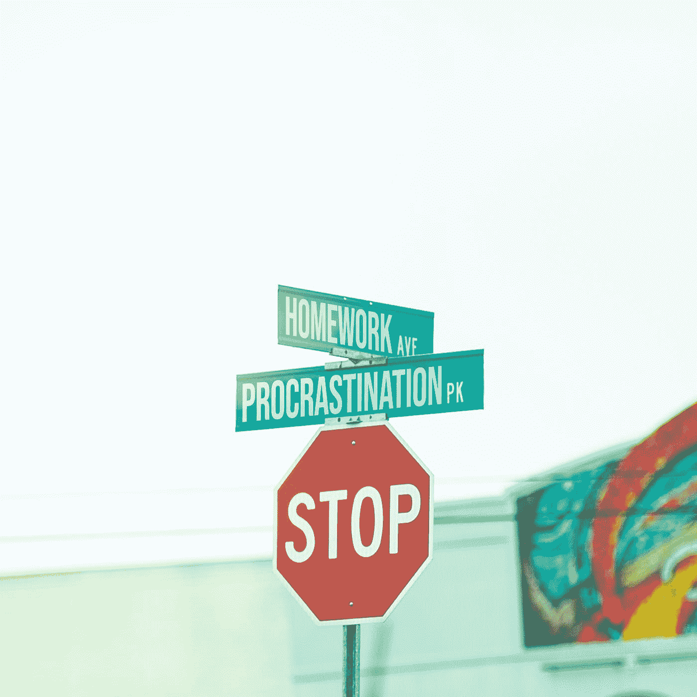

# 如何像专业人士一样拖延，找到自己的激情

> 原文：<https://medium.com/swlh/how-to-procrastinate-like-a-pro-and-find-your-passion-4743cabed151>

## 认识到你自己的拖延技巧可能会帮助你更有效率——如果你曾经在第一时间考虑过它的话。

Photo by [Pedro da Silva](https://unsplash.com/@pedroplus?utm_source=medium&utm_medium=referral) on [Unsplash](https://unsplash.com?utm_source=medium&utm_medium=referral)

最近我一直在思考拖延症，可能是因为这是我最擅长的一件事。是的，我通常完成我需要做的事情，但是我觉得我可以做得更多。对我来说，它通常包括完成下一个写作项目，对其他人来说，它可能是最终把房子整理好，开始节食或健身计划，或者只是总体上让一个人的行动起来，最终接管并做出重大的生活改变。不管一个人的目标是个人的还是职业的，拖延症总是存在，我没有否认它的存在，而是决定挖掘和探索，也许在某些方面接受和分析我的一些最好的拖延战术。通过认识到我们拖延的不同方式，我们可以开始明白为什么我们把事情放在第一位，这种认识可以成为重新调整优先事项和目标的有力组成部分。

**掌握拖延症**

在我们进入为什么我们拖延之前，我们需要看看我们是如何拖延的，为了做到这一点，我们需要分解最常见的技术。就像花生酱和果冻或豆子和米饭一样，拖延症经常与借口联系在一起，两者紧密相连。《牛津英语词典》将拖延症定义为“拖延或推迟行动；推迟做某事”和借口作为“减轻对(过失或冒犯)的责备”；试图自圆其说。”考虑到这一点，纯粹的、未经过滤的有机拖延就像是，“我去商店和星巴克停下来后，我会继续写作。”另一个纯粹拖延症的例子可能是用这样的想法推迟你的待办事项清单上的紧迫事项，“我今天睡懒觉，但明天和周末花双倍时间。”那么纯粹的不折不扣的拖延和借口有什么区别呢？把拖延想成是通过使用随机和快速构思的拖延策略来推迟某事，把借口想成是一种更复杂的辩解形式。

**借口:故意拖延**

我喜欢在精心制作的借口中发现的复杂性，我们制造借口的专业知识随着时间的推移而发展。这可以追溯到我们最早的祖先，他们使用简单的技术，“是的，我知道有一只迅猛龙在那边看着我，但我必须在逃跑之前磨完我的石器——我有足够的时间。”尽管自然选择对拖延者并不友好，但这种特性继续存在，并随着时间的推移变得更加复杂。在我自己的写作和研究世界里，各种借口层出不穷，从存在主义的“我今天的精神状态不适合写作”，到物质主义的和身体上的“除非我从宜家拿到新的办公椅，否则我无法在工作上取得进展。”

**物理借口:找到完美的铅笔**

身体上的借口，我称之为“完美铅笔”综合症的一部分，来自于一种旧观念，即如果我只有完美的铅笔，那么我就真的可以写了。这是营销人员多年来惯用的幻想方式，“如果你有一把超级办公椅，你会更有效率。”这种技术可以采取多种不同的形式，比如在我真正开始工作之前，我需要一台新的笔记本电脑，但是其他形式也会效仿。“如果我有一个不同的程序或应用程序，我真的可以取得进展，哦，也许一个我也可以在手机上工作的应用程序，没错，我需要在手机上工作才能取得进展。然后我就可以把事情做好了！”这个借口的更极端的版本是整个办公室的改造，比如，“如果我能把我的工作空间布置好，我就能真正地写作并完成它。”

身体上的借口不是研究或学术工作所独有的，而是在大多数其他领域众所周知的。那些决心减肥的人通常会购买新的跑步鞋和健身器材，认为体重会自己减轻——这被称为“如果我有”策略。大多数自助书籍的购买都是基于同样的想法，例如，如果我想摆脱债务，我真正需要的是摆脱债务书，我真的不需要改变我的习惯。无论哪种方式，写作和生活一样，你必须在某个时候投入实际工作，所以找到完美的宜家办公桌，例如“The Workenharden”，或者最昂贵的 MacBook Pro 和耳机，都不会解决任何基本问题，例如动机、冷漠或无法专注于完成工作的明确目标。学会识别这些借口，因为它们是拖延最昂贵的形式。

在我们不断连接的基于云的世界中，有成千上万的选项和建议需要帮助，这对那些真正需要完成项目的人来说是一个巨大的负担。更糟糕的是，有成千上万的博客告诉你，你应该使用一些软件或其他东西来最大限度地提高你的生产力。我认识许多人(我可能是其中之一)，他们花更多的时间和金钱去买东西，让自己更有效率，而他们本可以做研究、锻炼或其他有利于他们长期目标的工作。决定你需要使用不同的在线组织者或需要新的跑步鞋才能减肥可能是一个巧妙地披着合法性外衣的隐秘的形而上学借口；总是问自己，这是借口吗？我可以花时间直接投入工作吗？

这些身体上的或“寻找完美”的借口不仅仅发生在项目开始的时候，它们也可能在项目进行到一半的时候出现。我见过不少人在项目进行到一半时决定改变他们的软件、文件保存系统或工具，因为他们认为这些东西阻碍了他们完成一些出色的工作。这是一件特别危险的事情，如果它发生在你的项目中，很可能是一个动机或热情的问题，而不是你的软件、工具、设备或鞋子的问题。

存在主义借口:“我今天就是不太想工作。”

当物理借口涉及物体或有形物品时，例如，“我需要一本新日记、一支万宝龙钢笔和一盏台灯才能写作”，存在主义借口与无形物品有关，通常涉及时间。最好的拖延者很早就掌握了存在主义借口的艺术。有两种形式。第一个表现在你有足够的时间去完成任务，所以你把它拖到最后一分钟，第二个表现在你没有时间去做工作，因为你需要先做一些无关紧要的事情。就我个人而言，我发现做一个最后一分钟的拖延者既舒服又不舒服。杰出的漫画家比尔·沃特森曾经说过:“你不能像打开水龙头一样打开创造力。你必须有好心情。那是什么心情？最后一刻的恐慌。“我完全支持沃特森阵营——我一直都是这样，我也不知道为什么。成为最后一分钟实干家的好处在于，它表明你也可以在需要的时候激励自己——这只是一个廉价的问题，但自发的激励者总是比邋遢的、最后一分钟找借口的人更受重视。

存在主义借口的另一种形式与情绪或动机有关，“我只是现在没有正确的心态去做这件事。”你很容易说服自己在任何时候都不在正确的精神空间。另一个经典的存在主义借口是“我现在有太多事情要做”，这真的不是传统意义上的借口，因为它充其量是推迟某事的一周理由。这里的悲剧是，其他正在发生的事情可能完全无关紧要，毫无意义，例如，“我必须在一个小时内完成论文之前洗车”或“我必须在逃离迅猛龙之前磨快我的石斧”，这是我们在这项工作开始时首次了解到的。第二种形式的存在性拖延与优先级紧密相关，这是设定目标和完成任务时的一个重要考虑因素。

**我们为什么拖延**

既然你认识到你是如何拖延的，考虑一下为什么。我们拖延是因为我们没有那么投入到我们想要做的事情中，这就是为什么识别拖延并从中获得乐趣是有益的。如果你在一个既定的目标或任务上多次推迟取得进展，那么动力不是问题，而是激情。当你把大的改变推迟了好几年，比如“有一天我会减掉 20 磅”或者“我真的想跑马拉松”或者“我想搬到西部去写小说”，那么你就知道问题是真正的渴望。经常和持续的借口来解释你为什么没有开始或在某件事情上取得进展，这是一个明确的信号，表明你认为你想做的事情并没有真正实现。在这种情况下，你可能要重新评估你的人生目标是什么。没有什么比认识到你多年来一直创造性地拖延相同的目标和任务更好的个人调整了。

**激情是拖延症的克星。**

我们所有人都曾有过精力小爆发的时候，我们专注于完成我们真正感兴趣的事情，那些时候你夜以继日地工作来完成粉刷房间，或者坚持多年的研究来最终完成你的论文，或者每天早上 5 点起床为马拉松训练。想想上一次你被一项任务或目标吸引住的时候，通常，你被激励是因为你厌倦了一种情况，你不得不改变它(内在激励)，或者你想向某人证明什么(外在激励)。记住，完成事情或做出改变的关键是一个愿望的问题，不是时间、天赋或环境，而是纯粹的愿望或激情。

具有讽刺意味的是，我已经推迟写这篇文章有一段时间了，但是我真的开始接受我的拖延症了，而且我真的很擅长这个。话虽如此，然而，我知道有拖延症大师可以教我很多，我很想听听他们的意见。与此同时，我，我确信还有其他人，一直在为同样的项目找同样的借口，我们应该尝试去了解为什么。最终，找到你的激情会大大消除拖延，所以当你找到时间的时候，考虑一下。